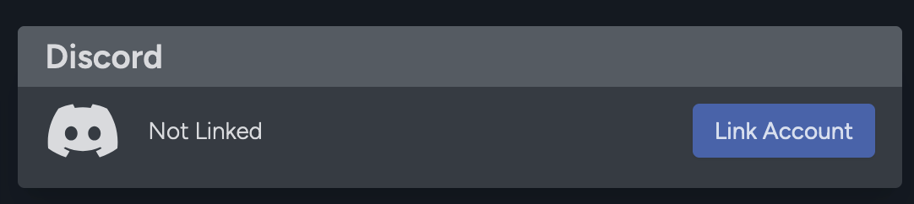

Connecting your RPG Sessions account to your Discord account is how the RPG Sessions Discord Bot knows your characters, the games you're in, your Patreon status, and even your preferred dice shorthand (color or name systems). 

This connection is what brings the most amount of value to using the RPG Sessions bot, even allowing you to do things like rolling character skills directly without having memorized them.

## Connecting your account
1. Go to [https://app.rpgsessions.com](https://app.rpgsessions.com) and sign in.
2. Go to [your profile page](https://app.rpgsessions.com/user/profile).
3. In the Discord section of your profile page, hit `Link Account`.

4. Sign in to Discord if required and then accept the account link
   
After signed in, you can verify that you're successfully linked by running [`/debug info`](/docs/misc/debug#debug-info) in a server with the bot and seeing if the User ID is set. If everything is right, you should be good to go!

## Disconnecting your account
If for some reason you need to disconnect your RPG Sessions account from your Discord account, you can follow the above steps to get to your profile page and hit the `Unlink Account` button in your profile.

Alternatively, you can run the command [`/debug disconnect`](/docs/misc/debug#debug-disconnect) from a server with the bot in it and the bot will break the connection for you.
