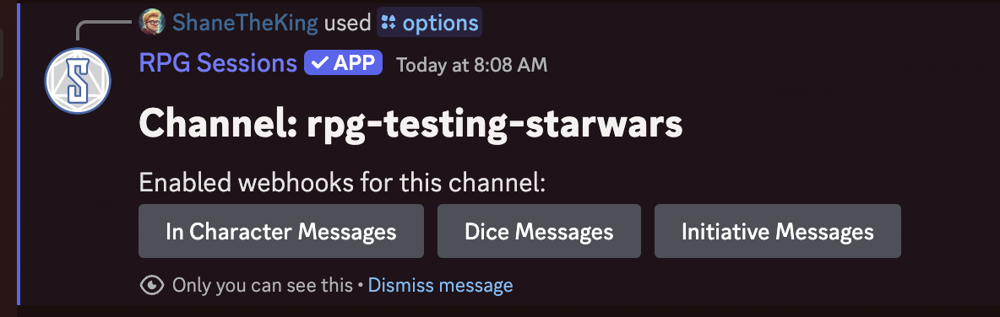

You can connect a game table to your Discord server using the RPG Sessions bot. This lets you manage your game right in your server's channels. Follow these simple steps to get everything set up.

## Steps to Connect a Game Table

1. **Pair the Game Table to the Server**   
First, link your Discord server with a game table. Use the [`/game pair`](/docs/reference/game#game-pair) command to connect your server with either a new or an existing game table.

2. **Set up data synchronization** (Optional)   
After linking the game, you can decide which channels will be used for synchronizing different game event types, like character messages or dice rolls. Use the [`/options set:channel`](/docs/reference/options#options) command to do this.  

After running this command, buttons will appear that allow you to enable syncing dice rolls, initiative, and game messages between the game table and current channel. For them to be enabled, you need to press the buttons so they turn blue.  
  
Learn more on the [sync with game table guide](sync-game-table-events)

3. **Check the Pairing**   
After connecting the game and setting up the channels, the bot will send a message confirming which channels are linked to which game tables. To see these settings anytime, use the [`/game view`](/docs/reference/game#game-view) command to check the details of the current connections.  

By following these steps, you can easily link your game table to your Discord server. Let us know if you have any questions in our [Discord server](https://discord.gg/DfEkRzUbjk)!

