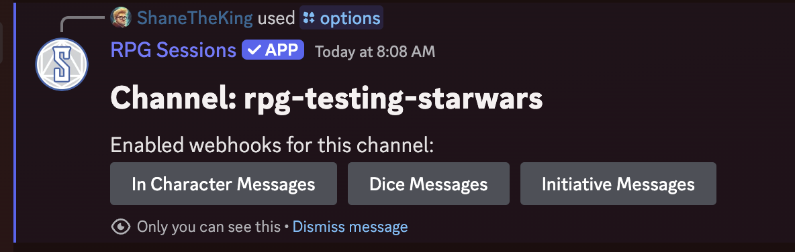
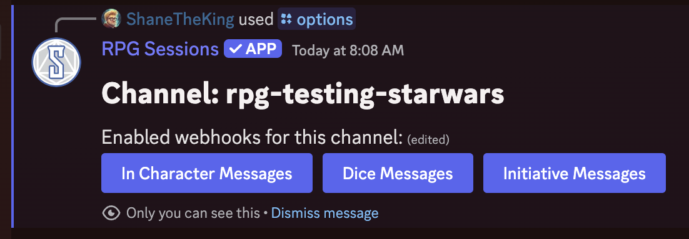
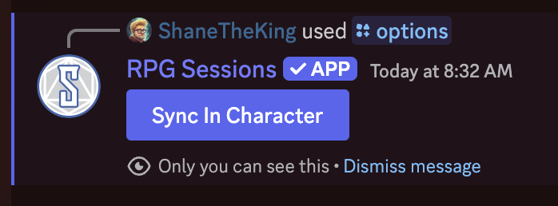

By default, everything that happens with your game from the Discord Bot, except for in-character messages, gets synchronized to the Game Table. However, nothing that happens on the Game Table gets synchronized back to the Discord Bot. This has to be the default because setting this up requires action on the user's part to create the required webhooks the bot needs for the channels it needs to send events to.

In this guide, we'll walk through how to set up the Discord Bot so that it can receive these messages from your Game Table and keep everything in sync.

## Prerequisites
- You'll need to have the Discord Bot [connected to your server](connecting-to-game-table)
- You'll need to be a GM of the game, and if you need to give the bot more permissions you may need to be an admin of the server or at least have manage server permissions

## Sync your Game Table to your Discord Server

Events from game tables can be set up either to specific channels for each event type or all events to the same channel. Go to the channel you want an event to be sent to and use the [`/options set:channel`](/discord-bot-docs/reference/options/#options) command.

After running this command, buttons will appear that allow you to enable syncing dice rolls, initiative, and game messages between the game table and current channel. For them to be enabled, you need to press the buttons so they turn blue.  

If you only want one type of event to go to the current channel, only turn the button for that event blue.

## Sync your in-character messages to your Game Table

You can also synchronize messages sent with the [`/ic`](/discord-bot-docs/reference/in-character) command back to the messages in your Game Table. This is great for role playing or asynchronous game play.

To do this, use the [`/options`](/discord-bot-docs/reference/options/) command (note: no `set:channel` on this one). A button will show up that controls whether the bot can synchronize these messages. To enable it, the button should be blue.

## Troubleshooting

The most common problems that occur from this process are a result of the bot lacking the required permissions either in the server or the channel specifically. Use the [`/debug info`](/discord-bot-docs/misc/debug/#debug-info) command to identify if the bot has all of the permissions it needs. The output from the command describes each permission and why it needs it, make sure they all have green checkmarks to indicate they are properly enabled.

If you still need help, [join our Discord server](https://discord.com/invite/DfEkRzUbjk). We're here to help!
