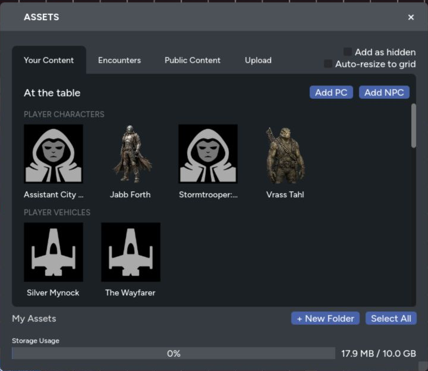

The Asset panel holds the images, actors, encounters, and public content you can place on a map. Uploaded content belongs to your account, so it stays available when you move between games.

## Asset Panel Sections

The panel includes these tabs:

- **Your Content** for characters and vehicles in the current game, plus your uploaded images and folders
- **Encounters** for the game's saved encounters
- **Public Content** for shared RPG Sessions assets
- **Upload** for new images and spritesheets

GMs also get **Add as hidden** and **Auto-resize to grid** controls before placing content.

## Upload Images

1. Open **Assets**.
2. Select **Upload**.
3. Drop images into the upload area or choose them from your device.
4. Choose the destination folder.
5. Select **Upload Assets**.

You can upload several images together. Each asset is limited to 20 MB, and the panel shows your current storage usage.

Maps supports common image formats and animated GIFs. GIF assets keep their animation when placed on the map.

## Organize Your Library

Create folders for maps, tokens, terrain, spell effects, or any other grouping that fits how you run games. You can:

- Create and rename folders
- Move assets between folders
- Select several assets
- Add several selected assets to the map
- Delete selected images from your library

Deleting an uploaded image removes it from your library. Check any maps that use it before confirming.

## Place Actors

The **Your Content** tab lists characters and vehicles already attached to the game above your uploaded assets. Select one to place a linked token.

If an actor isn't listed, add it to the RPG Sessions game table first, then return to **Your Content**.

See [Character and Vehicle Tokens](/docs/maps/features/character-tokens) for stats, visibility, and movement rules.

## Import a Spritesheet

Use the Spritesheet upload tab when one image contains a grid of tiles or tokens. Set the tile dimensions, spacing, and destination folder, then preview the split before uploading.

The [Spritesheet Import guide](/docs/maps/features/spritesheet-import) covers the full workflow.

## Choose a Background Workflow

### Full Map Image

Place a complete battle map as a normal asset when you need to move, resize, rotate, crop, or layer it.

After positioning it:

1. Move it to a background layer.
2. Lock the layer or asset.
3. Restrict it if players should see it but never interact with it.

### Repeating Background Image

Use **Settings > General > Background Image** for a texture that should repeat across the whole canvas, such as water, stars, grass, or paper.

1. Choose an image from your library.
2. Adjust the scale.
3. Save Settings.

Background images must be 1024 by 1024 pixels or smaller. Use a normal placed asset for a larger full map.

### Background Color

The page background color fills any area that doesn't have map art. Set it under **Settings > General**.

## Clear Cached Images

Maps caches downloaded images on your device to make return visits faster. If an old or broken image keeps appearing:

1. Open **Settings > Advanced**.
2. Find **Cache Storage**.
3. Select **Clear Cache**.
4. Confirm the action.

This removes local cached copies. It doesn't delete anything from your asset library or map.
