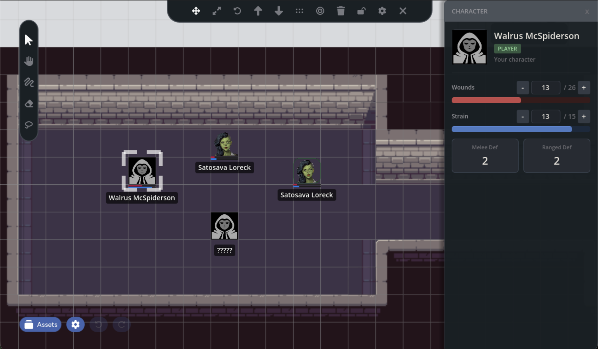

:::caution[Beta Feature]
The Quick Character Sheet is currently in beta. Enable it in **Settings > General > Quick Character Sheet (BETA)**. It's disabled by default.
:::

The Quick Character Sheet is a slide-in panel that appears on the right side of
the screen when you select a character token. It gives you a focused view of a
character's stats without leaving the map, and lets you edit wounds and strain
directly from the panel. Click a token, adjust its wounds, and keep going.

## Enabling the Character Sheet

The feature is off by default. To turn it on:

1. Open the **Settings** panel (gear icon in the bottom-left)
2. Under the **General** tab, check **Quick Character Sheet (BETA)**

This is a local preference. It only affects your view. Other players at the
table can independently enable or disable it without affecting each other.

## Using the Panel

Once enabled, select any character token on the map. The panel slides in from
the right edge showing:

- **Character portrait** pulled from the character's profile image
- **Character name** and role badge (Player or NPC)
- **Wounds** with current value, threshold, and a progress bar
- **Strain** with current value, threshold, and a progress bar
- **Defense** values for melee and ranged
- **Minion counter** (for minion groups only)

To close the panel, click the **x** button in the top-right corner, click on
empty space on the map to deselect the token, or select a non-character asset.

## Editing Wounds and Strain

If you have permission to edit a character (see [Who Can Edit](#who-can-edit)
below), the wounds and strain rows show edit controls instead of read-only
values:

- **[-] and [+] buttons**: Step the value down or up by 1
- **Direct input**: Click the number field, type a new value, and press Enter

Changes sync immediately to the token's health bars, the web character sheet,
and every other player at the table.

### Rapid Edits

If you click [+] or [-] several times quickly, the panel batches your changes.
It waits briefly after you stop clicking, then saves the final value to the
database in a single write. This keeps the interface responsive even when
applying large amounts of damage.

## Who Can Edit

Not everyone can modify stats through the panel:

| You are... | Your own character | Other players' characters | NPCs |
|---|---|---|---|
| **Player** | Can edit | View only | View only |
| **GM** | Can edit | View only | Can edit |

- **Players** can always edit their own character's wounds and strain
- **GMs** can edit any NPC's wounds and strain, but not player characters
  (to avoid accidentally changing a player's stats)
- Everyone else sees read-only values

When you don't have edit permission, the panel shows the stat values as plain
text instead of the stepper controls.

## Visibility Rules

The panel respects the same [visibility levels](/docs/maps/features/character-tokens#visibility-levels)
as character tokens. What you see in the panel depends on the character's
visibility setting:

| Visibility Level | What the Panel Shows |
|---|---|
| **Complete** | Full stats, portrait, and name |
| **Known** | Name and portrait only, with "Stats hidden" notice |
| **Visible** | Name shows as "?????" with no other details |
| **GM-only** | Panel doesn't open for players |

GMs always see full information regardless of visibility settings.

## Minion Groups

When you select a minion group token, the panel shows an additional section
below the defense values with the current minion count:

> 3 / 5 alive

The wounds and strain bars scale to the group's total capacity. A group of 5
minions with wound threshold 5 shows wounds out of 25.

As you increase wounds through the panel, the minion counter updates to match.

## Real-time Updates

The panel stays current with changes from any source, you never need to 
close and reopen the panel to see fresh data. If someone else edits the 
same character you're viewing, their changes appear immediately.

## Related Features

- **[Character Tokens](/docs/maps/features/character-tokens)**: How tokens link
  to characters and display stats on the map
- **[GM Controls](/docs/maps/features/gm-controls)**: Visibility settings and
  other GM-only features
