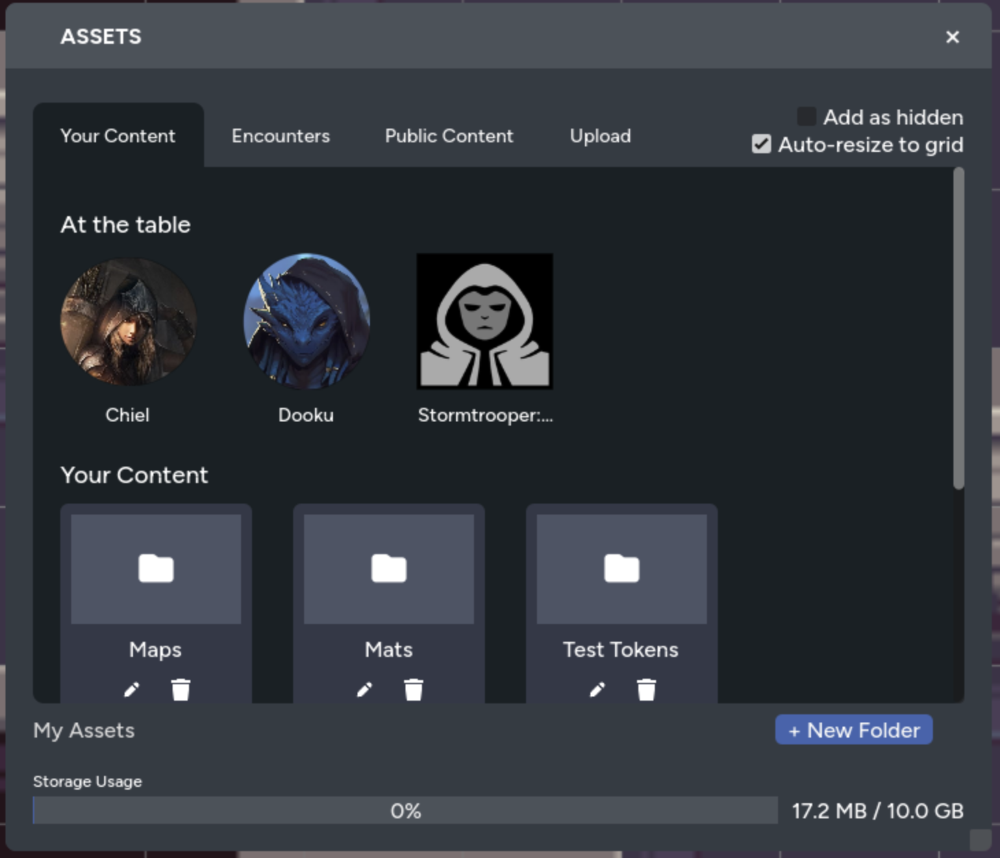
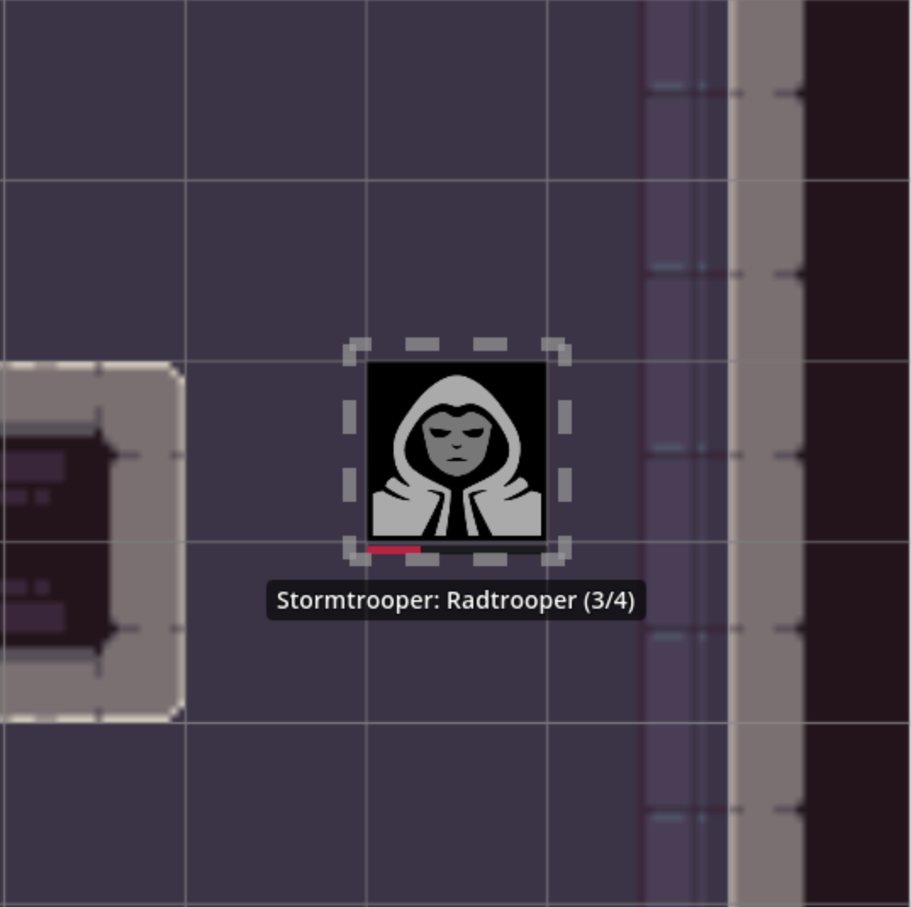

Tokens on the map can be linked to characters from your RPG Sessions game, turning
simple images into living representations of your PCs, NPCs, and adversaries. When
a token is linked to a character, it displays health bars, shows character names,
and automatically updates as the character takes wounds or strain during play.

This connection means you never need to manually track which token belongs to which
character; the map does it for you.

## Adding Character Tokens from the Asset Manager

Character tokens are added through the **At the Table** section of the asset manager,
which automatically displays all characters from your RPG Sessions game.

To add a character token to the map:

1. Open the asset manager
2. Find the **At the Table** section, this shows all characters in the current game
   player characters)
3. Click on the character you want to add to the map

The token is created already linked to the character. Its name label appears immediately,
and if the character has wounds or strain, the health bars display automatically.



Once placed, the token stays linked to the character. Changes to wounds, strain, or
visibility sync automatically. If you update the character through the bot or web
interface, the token updates in real-time for everyone at the table.

## Stats Display

Linked tokens show two health bars directly below the token image:

- **Wounds Bar (Red)**: Shows current wounds as a proportion of wound threshold
- **Strain Bar (Blue)**: Shows current strain as a proportion of strain threshold


The bars scale proportionally with the token size. Larger tokens get larger bars.
When wounds or strain change, the bars animate smoothly rather than jumping to the
new value, making it easy to see damage being applied during combat.

## Minion Groups

Linked tokens can represent multiple minions as a single visible asset. The
system tracks how many minions remain active based on wounds dealt.

### The Elimination Counter

When a token is linked to a minion group with more than one character, the name
label shows an elimination counter in the format **(remaining/total)**:

> Stormtroopers (3/5)

This tells you 3 of the original 5 stormtroopers are still standing.



### How Elimination Works

Minions are eliminated when wounds **exceed** their wound threshold, not when they
equal it. The calculation is:

```
Minions eliminated = floor((current wounds - 1) / wound threshold)
Remaining minions = total count - minions eliminated
```

With a wound threshold of 5 and a group of 5 minions:

| Wounds | Minions Remaining | Why                                                |
|--------|-------------------|----------------------------------------------------|
| 0–5    | 5                 | No minion eliminated until wounds exceed threshold |
| 6–10   | 4                 | First minion eliminated at 6 wounds                |
| 11–15  | 3                 | Second minion eliminated at 11 wounds              |
| 16–20  | 2                 | Third minion eliminated at 16 wounds               |
| 21–25  | 1                 | Fourth minion eliminated at 21 wounds              |

The wounds and strain bars also scale for minion groups. A group of 5 minions with
threshold 5 has a total wounds capacity of 25, so the bar represents wounds out of 25.

## Visibility Levels

Not every character should be fully visible to players. Maybe the party hasn't
identified an NPC yet, or the GM wants to track an enemy without revealing its
exact health. Visibility levels control what players can see about each character.

| Visibility Level | Token               | Name          | Stats Bars |
|------------------|---------------------|---------------|------------|
| **Visible**      | ✓ Visible           | Shows "?????" | Hidden     |
| **Known**        | ✓ Visible           | ✓ Visible     | Hidden     |
| **Complete**     | ✓ Visible           | ✓ Visible     | ✓ Visible  |
| **GM-only**      | Hidden from players | Hidden        | Hidden     |

The GM always sees all tokens and names, with hidden names displayed in gold to
indicate players can't see them.

## Character Name Labels

Linked tokens display the character's name in a label floating below the token.
Labels are:

- Centered horizontally beneath the token
- Displayed in white text with a dark background for readability
- Updated automatically when character names change
- Positioned in screen space, so they maintain consistent size regardless of zoom

Labels respect visibility settings. If a character is set to "Visible" level, players
see "?????" instead of the actual name. Labels also hide when:

- The token is under fog of war (for players)
- The token is on a hidden layer

## Flipping Tokens

Sometimes you need a token to face the other direction. Maybe your archer token
faces left but you want them facing the enemy on the right. Rather than uploading
a mirrored image, you can flip tokens directly on the map.

**Keyboard shortcuts:**

- **Shift+F**: Flip horizontally (mirror left-right)
- **Shift+V**: Flip vertically (mirror up-down)

These work on the currently selected token. If you have multiple tokens selected,
all of them flip at once, mirroring around the center of the selection. This is
useful for arranging formations: select a row of soldiers and flip them all to
face the opposite direction in one action. This is also extremely useful 
for tiling maps, especially when creating repeating patterns or formations.
