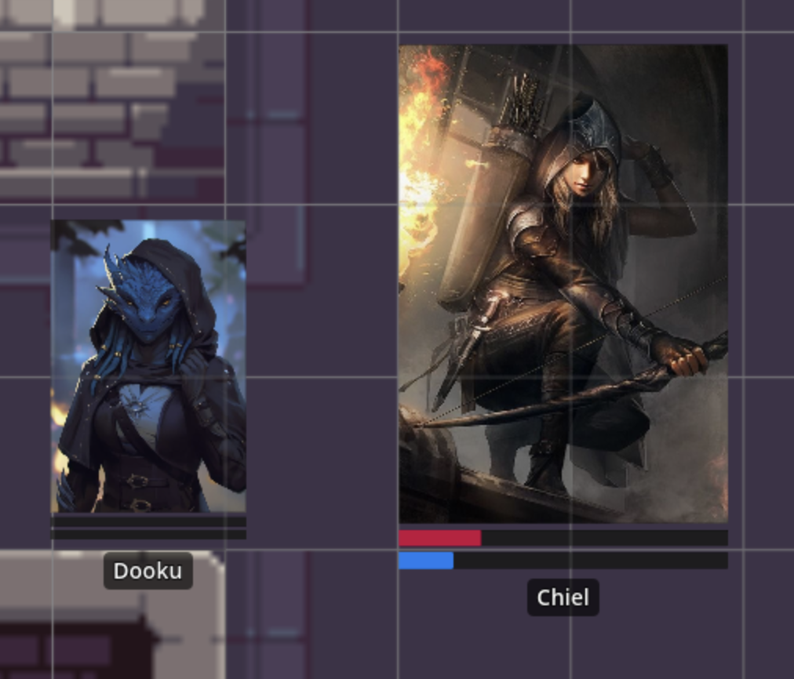
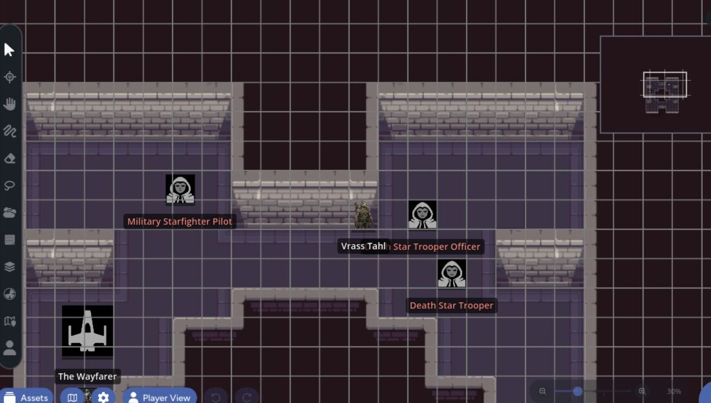
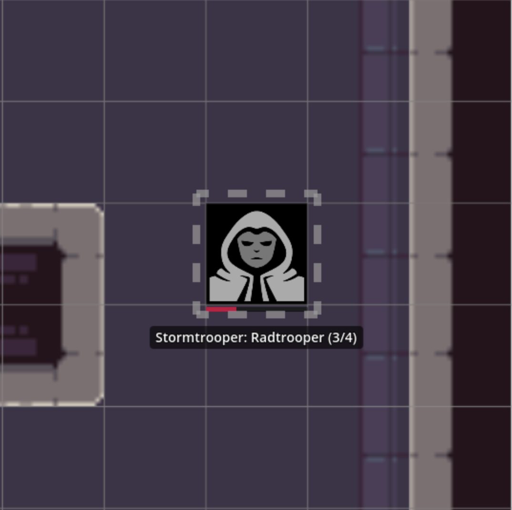

A linked token represents a character or vehicle from your RPG Sessions game. Its name, visibility, stats, sheet, and other actor details stay connected to the game table, so you don't need to update the map separately when something changes.

## Place an Actor from the Game

Open **Assets** and select **Your Content**. Characters and vehicles already in the game appear above your uploaded assets, grouped into:

- Player Characters
- Player Vehicles
- NPCs
- NPC Vehicles

Select an actor to place it on the current map page. The token uses the actor's image when one is available and starts with its character or vehicle link already set.

## Add an Actor to the Game

If an actor isn't listed in **Your Content**:

1. Return to the RPG Sessions game table.
2. Add the character or vehicle to the game.
3. Return to **Map Editor** and select **Assets > Your Content**.
4. Select the actor to place its token.

Only actors already in the game appear in Maps. Placing one creates a linked map token without adding another copy to the game table.

## Token Stats

Character tokens can show:

- Current wounds and wound threshold
- Current strain and strain threshold
- Character name
- Minion group count

Vehicle tokens can show:

- Current hull trauma and threshold
- Current system strain and threshold
- Vehicle name
- Crew portraits when crew assignments are available

These values update when someone changes the linked sheet through Maps, the game table, or the Discord bot.

## Minion Groups

A single token can represent a group of minions. The label shows the remaining count in the form `3/5`, and the wound bar scales to the group's full capacity.

A minion is defeated when wounds exceed its individual wound threshold. For a five-minion group with a threshold of 5:

| Wounds | Minions Remaining |
|--------|-------------------|
| 0 to 5 | 5 |
| 6 to 10 | 4 |
| 11 to 15 | 3 |
| 16 to 20 | 2 |
| 21 to 25 | 1 |

If defeated-token greyscale is enabled in [Settings](/docs/maps/features/settings-and-performance), the token image also changes as the group is eliminated.

## Visibility Levels

The game table's actor visibility controls what players can learn from a linked token.

| Visibility | Token | Name | Stats and Sheet |
|------------|-------|------|-----------------|
| Visible | Shown | `?????` | Hidden |
| Known | Shown | Shown | Hidden |
| Full | Shown | Shown | Shown |
| Hidden | Hidden | Hidden | Hidden |

The GM always sees the real actor and can edit its visibility. A GM using [Player Preview](/docs/maps/features/gm-controls#preview-the-player-view) sees the player-facing result instead.

Map visibility still applies on top of actor visibility. A token can also be hidden by:

- The asset's hidden toggle
- A GM-only layer
- Fog of war
- Lighting concealment

## Movement Permissions

GMs can enable **Restrict Token Movement to Owners** in Settings. When it is on, players can move their own character tokens but can't move another player's token.

The setting doesn't limit the GM. Asset locking, layer locking, and wall collision can still prevent movement for other reasons.

## Open the Quick Sheet

Select a linked character or vehicle token to open its [quick sheet](/docs/maps/features/sheets). The selected-asset action bar also has a Sheet button, so you can reopen a sheet after closing it without selecting another token.

## Flip a Token

- `Shift` + `F` flips the current selection horizontally.
- `Shift` + `V` flips the current selection vertically.

With several assets selected, Maps mirrors the full group around its center and flips each image. This works well for formations and repeated map tiles.
