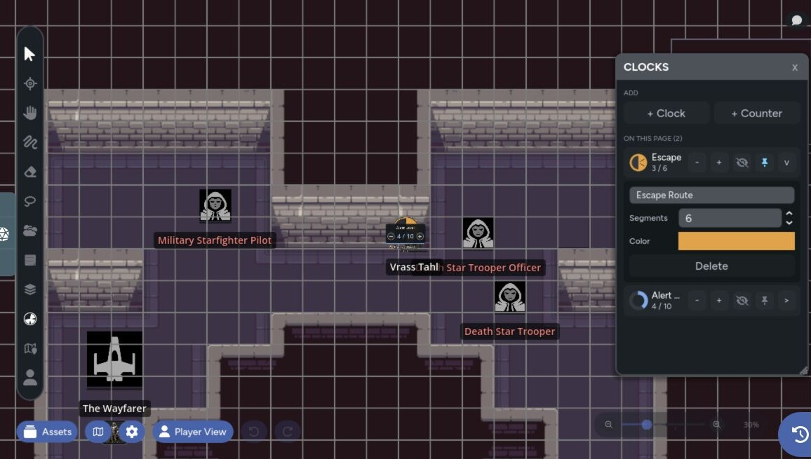
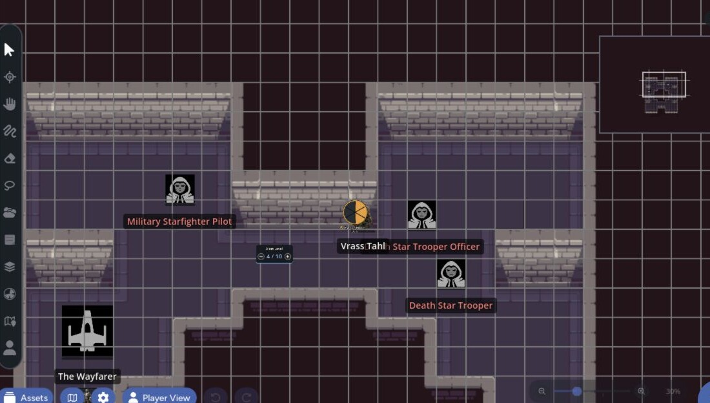
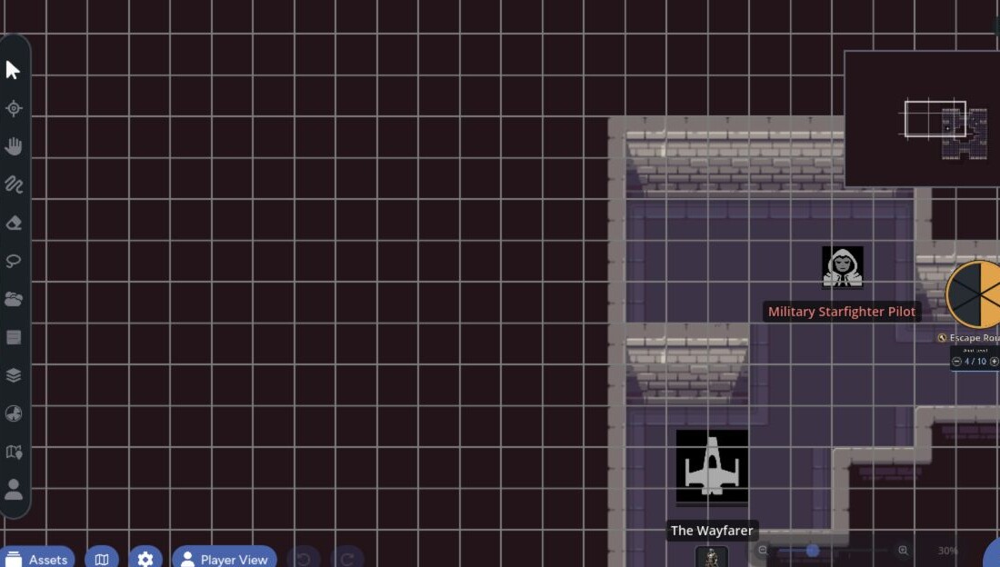

Clocks and counters put shared progress directly on the map. Use a segmented clock for something moving toward completion, or a numeric counter for a changing total.

Only GMs can create, edit, and advance them. Players can see clocks the GM has revealed.

## Add a Clock

1. Open **Clocks** from the toolbar.
2. Move the camera near the place where the clock should appear.
3. Select **+ Clock**.
4. Reveal it when players should see it.

A new clock starts with six segments and is hidden from players.

Use clocks for:

- Alert levels
- Research progress
- Ritual completion
- Reinforcement arrival
- Social pressure
- Ongoing hazards

## Add a Counter

Select **+ Counter** instead of **+ Clock**. A counter starts with a maximum of 10 and is hidden from players.

Use counters for:

- Remaining rounds
- Available supplies
- Objective totals
- Waves of enemies
- Reputation or heat

## Advance a Clock

With the Pointer tool active, select a clock segment to fill through that segment. Select the last filled segment again to remove it.

Counters use their plus and minus controls instead.

Changes appear for connected players in real time.

## Edit a Widget

Open the Clocks panel and expand a row to change:

- Name
- Segment count or counter maximum
- Color
- Player visibility
- Pinned state

A pie clock can use 2 to 16 segments. A counter can use a maximum from 1 to 9,999.

Select the widget on the map to move or resize it with the normal asset controls.

## Hide and Reveal

New clocks are GM-only. Use the eye control in the dashboard or selected-widget toolbar to reveal one.

Hidden clocks appear dimmed with a GM label in the GM view. They disappear in Player Preview and aren't sent to player clients until revealed.

## Pin a Clock

A pinned clock stays visible at the edge of the screen when its map position moves outside the viewport. Everyone sees the pinned behavior.

Pin a clock when the group should keep watching it while moving around a large page. Leave it unpinned when the widget belongs to one specific room or location.

| Normal position | Pinned after moving the camera |
| --- | --- |
|  |  |

## Delete a Clock

Expand the clock row, select **Delete**, then confirm. Deleting removes the widget from the current page for everyone.

Clocks are stored per map page and are included when you save the page to the [Map Library](/docs/maps/features/map-library).
