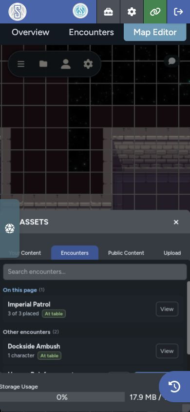
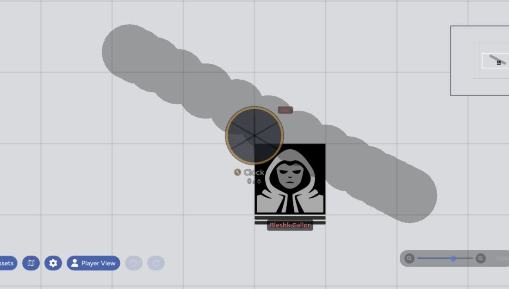

The Encounters tab connects Maps to encounters built in RPG Sessions. A GM can add encounter actors to the game table, place their tokens, and return to the same encounter later without uploading separate token images.

## Open Encounters

1. Open **Assets**.
2. Select the **Encounters** tab.
3. Search by encounter name if needed.

The list separates encounters already connected to the current page from other encounters in the game.

## Read Encounter Status

An encounter card can show:

- **Activate** when its actors still need to be added to the table
- **Add missing** when part of the encounter is already active
- **At table** when the required actors are already present
- **No actors** when the encounter doesn't contain placeable characters or vehicles
- A placed count showing how much of the encounter is already on the page

## Activate an Encounter

1. Select **Activate** or **Add missing**.
2. Review the RPG Sessions confirmation dialog.

Maps keeps the encounter locked until both character and vehicle updates finish, so a second click won't create duplicates.

## Place Encounter Tokens

Open an encounter to see its actors, then choose one of these placement options:

- Select one or more actors, then select **Add Selected**.
- Select **Add All to Map** to place every actor in the encounter.

Maps waits for the token images to load, sizes them consistently, and places the group around the center of your current view.

Tokens created before the actor reaches the table use staged data, including the encounter name and portrait. After activation finishes, the token switches to the live character or vehicle sheet.

| Before activation | After activation |
| --- | --- |
|  |  |

## Resolve an Ambiguous Staged Token

Older staged tokens may not include a unique encounter source. If more than one encounter could match, Maps asks you to choose the correct one before activation.

After you choose and activate the encounter, the token links to the live actor when the roster refresh completes.

## Visibility and Player Access

Only GMs can browse and activate encounters from Maps. Once the actors are at the table, normal [actor visibility](/docs/maps/features/character-tokens#visibility-levels) controls what players see.

Use **Add as hidden** before placement if the encounter should stay concealed until combat starts.

## Encounter Prep Workflow

1. Build the encounter in RPG Sessions.
2. Open the destination map page.
3. Enable **Add as hidden** if needed.
4. Activate the encounter.
5. Place its actors.
6. Move them to the right layer and positions.
7. Check the scene in Player Preview.
