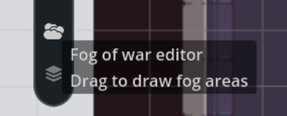
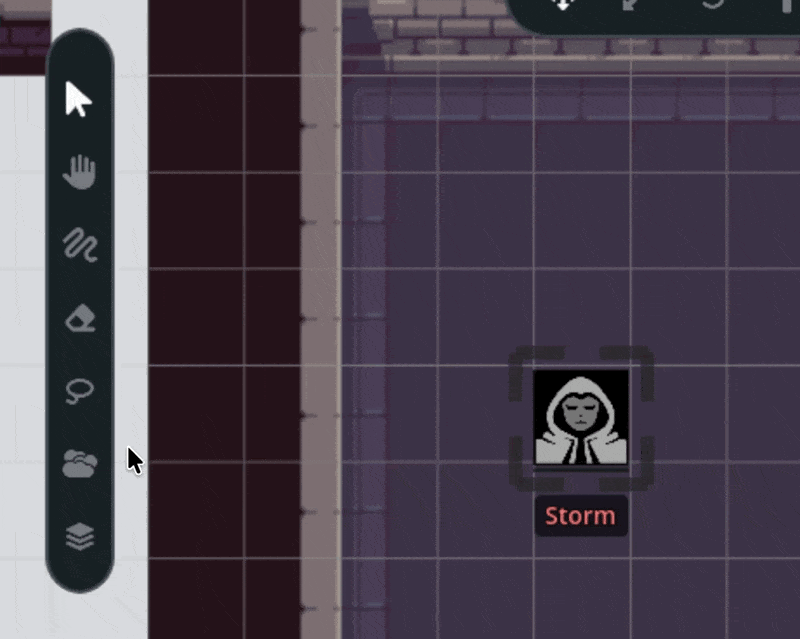
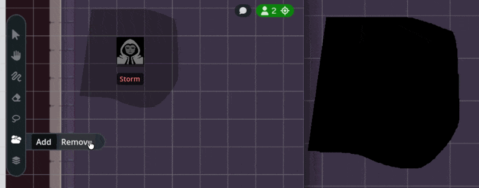
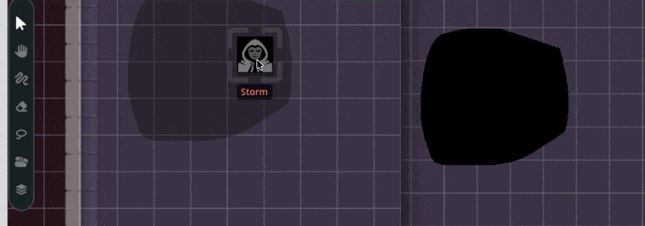

Fog of war lets GMs hide portions of the map from players by drawing opaque black
areas over the parts they shouldn't see yet. This is essential for dungeon crawls,
exploration scenarios, or any time you want to control what the party can see: revealing
rooms, corridors, and secrets only when the moment is right.

Only GMs can draw and erase fog. Players see fog as completely opaque black areas,
while GMs see fog as a semi-transparent overlay so they can still see what's hidden
underneath.

## Activating the Fog Tool

The fog of war tool is located in the left-side toolbar. Click the fog icon to
activate it.

When the fog tool is active, a small panel appears with two mode buttons:

- **Add Fog**: draw new fog areas (selected by default)
- **Remove Fog**: click on existing fog to erase it

The fog tool always resets to Add mode when you select it, so you start in drawing
mode each time.

## Drawing Fog

With the fog tool active and Add mode selected:

1. **Click and drag** on the map to draw a fog area
2. The shape follows your mouse movement, creating a freeform polygon
3. **Release the mouse** to finish the fog area

The fog area needs at least three points to be valid. If you release too early
(fewer than three points), the fog area is discarded.

You can draw as many fog areas as you need. Each one is saved independently, so
you can remove them individually later. Cover an entire dungeon with fog by drawing
multiple overlapping areas, then reveal it piece by piece as the party explores.

## Erasing Fog

There are two ways to erase fog:

### Using Remove Mode

1. Click the **Remove Fog** button in the fog settings panel
2. Click on any fog area to delete it
3. The tool icon turns light red to indicate you're in Remove mode

### Right-Click Shortcut

**Right-click** removes fog regardless of which mode you're in. This is a
convenient shortcut. You can stay in Add mode and right-click to quickly erase a
fog area without switching modes.

When you click to remove fog, **all** fog areas under your cursor at that position
are removed at once. If you've drawn multiple overlapping fog areas, a single click
clears all of them at that spot.

## What GMs See vs. What Players See

Fog of war looks different depending on your role:

| Role       | Fog Appearance                                      |
|------------|-----------------------------------------------------|
| **GM**     | Semi-transparent (30% opacity), can see through fog |
| **Player** | Fully opaque black. Completely hides the map        |

This means GMs can always see the full map layout while managing fog areas.
Players only see what you've intentionally revealed.

## How Fog Affects Tokens and Labels

Fog doesn't just hide the map, it also affects how tokens and character information
appear to players:

- **Character name labels** are hidden when a token is under fog. Players won't
  see the name of a character that's in a fogged area, preventing them from knowing
  who or what is hidden there.
- **Token interactions are blocked** for players when the token is under fog.
  Players can't click on, select, or interact with assets that are covered by fog.
- **GMs are unaffected**, they can always see labels and interact with tokens
  regardless of fog coverage.

When you move a token out from under fog (or erase the fog covering it), the
character's name label and interactability are restored automatically.

## Fog Loading Order

When a map page loads, fog areas are loaded **before** assets and tokens. This
prevents a brief flash where players might see hidden content before the fog
renders on top. By the time tokens and map assets appear, the fog is already in
place.

## Real-Time Sync

Fog changes are broadcast to all connected players instantly. When a GM draws or
erases fog:

1. The change appears on the GM's map immediately
2. The fog area is saved to the database
3. All connected players receive the update and see the change in real-time

There's no need to refresh or reload. Players see fog appear and disappear the
moment the GM makes the change.

## Tips for Using Fog of War

- **Pre-fog your maps**. Before a session, cover the entire dungeon or area with
  fog. Draw broad strokes over regions you want hidden. It's easier to erase fog
  as players explore than to draw it around them during play.
- **Reveal room by room**. Use the right-click shortcut to quickly remove fog
  from individual rooms as the party moves through. Since each fog area is
  independent, you can uncover one room without affecting adjacent ones.
- **Overlap for safety**. When covering large areas, draw overlapping fog polygons
  rather than trying to cover everything in a single stroke. Remember that 
  overlapping areas remove all fog underneath them, though.
- **Use fog for dramatic reveals**. Hide a boss room, a treasure hoard, or a
  plot-critical location behind fog. Erasing it at just the right moment creates
  a visual reveal that text descriptions alone can't match.
