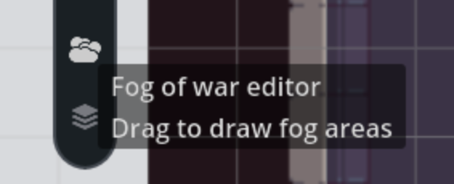
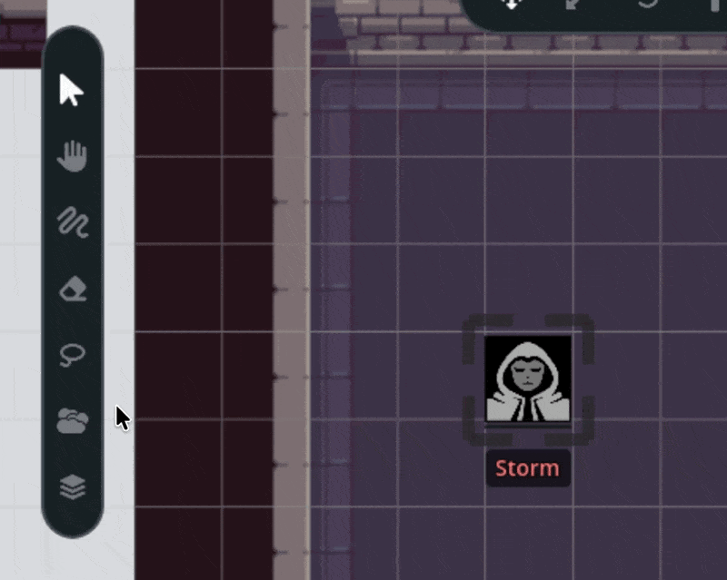
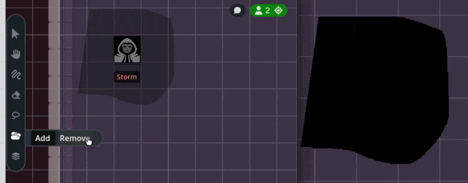
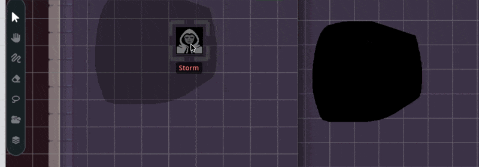

Fog of war lets a GM hide rooms, paths, tokens, and other map details until the group reaches them. Players see covered areas as opaque darkness. The GM sees a translucent overlay and can keep editing what is underneath it.

Fog is separate from dynamic lighting. Use fog when you want direct control over what is covered. Use [Lighting and Walls](/docs/maps/features/lighting-and-walls) when you want token movement and line of sight to reveal explored areas automatically.

## Open the Fog Tool

Select the Fog tool from the left toolbar. The fog controls show:

- **Cover** to paint fog onto the page
- **Reveal** to erase part of the covered area
- **Small**, **Medium**, and **Large** brush sizes

Only GMs can edit fog.

## Cover an Area

1. Select **Cover**.
2. Choose a brush size.
3. Click and drag across the map.
4. Release to save the stroke.

The live preview shows the area that will be covered. Overlapping strokes join together, so you can fill a large room without leaving small gaps between separate shapes.

Use a large brush for the first pass, then switch to a smaller brush around doors, narrow corridors, and irregular edges.

## Reveal an Area

1. Select **Reveal**.
2. Choose a brush size.
3. Click and drag through the fog.
4. Release to save the revealed area.

Reveal cuts through existing fog instead of deleting a whole fog shape. This lets you uncover part of a room, create a narrow line of sight, or correct an edge without redrawing everything around it.

Right-click also reveals fog at the cursor. It works even while Cover mode is selected, which is useful for quick corrections.

## What Players Can See

Fog affects more than the background:

- Covered character labels are hidden from players.
- Players can't select or interact with covered assets.
- GMs can still see and edit covered content.
- A GM using [Player Preview](/docs/maps/features/gm-controls#preview-the-player-view) sees the same fog result as a player.

Fog loads before map assets when a page opens, so hidden tokens don't flash on screen before the cover appears.

## Real-Time Changes

Every completed brush stroke saves to the map and appears for connected players. Maps waits for one fog replacement to finish saving before it accepts another stroke, so very fast back-to-back strokes may pause briefly.

## Practical Setup

For a dungeon or interior map:

1. Cover the full playable area before the session.
2. Switch to Reveal mode during play.
3. Use a large brush for rooms and a small brush for doors or corners.
4. Check the result with Player Preview before the group arrives.

If you also use dynamic lighting, fog remains in control until you reveal it. Lighting won't remove a manually covered area.
