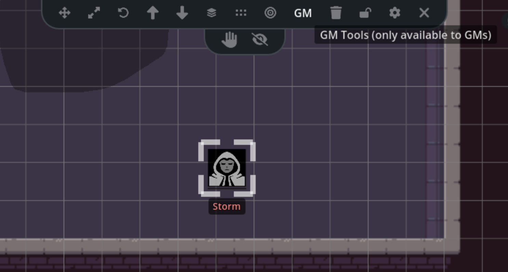
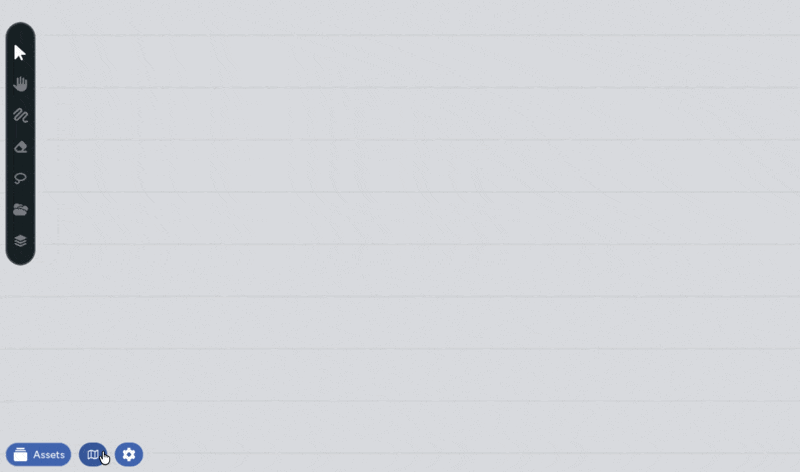

As the Game Master, you have access to a set of controls that players don't see.
These let you manage what's visible on the map, move players between pages,
and keep things running smoothly behind the scenes. Everything here syncs in
real-time: when you hide an asset or summon your players, they see the result
instantly.

## Asset Visibility

The GM panel gives you two tools for controlling how players can see and interact
with individual assets on the map: **Hide** and **Restrict**. These work on any
selected asset: tokens, images, map tiles, anything.

To access these controls:

1. Select one or more assets on the map
2. In the toolbar that appears at the top, click the **GM** button
3. A sub-panel slides down with the **Restrict** and **Hide** buttons

### Hiding Assets

Hiding an asset makes it completely invisible to players. They can't see it,
click on it, or interact with it in any way. As far as they're concerned, it
doesn't exist.

You still see hidden assets, but they're shown at reduced opacity so you can
tell at a glance which assets are hidden and which aren't.

This is useful for:

- **Pre-placing enemies** before the party reaches a room
- **Staging map elements** you want to reveal at a dramatic moment
- **Keeping GM reference markers** on the map that players shouldn't see

To hide or reveal an asset, select it, open the GM panel, and toggle the
**Hide** button.

### Restricting Assets

Restricting an asset prevents players from selecting or modifying it. The asset
is still visible to everyone, but only GMs can click on it, move it, resize it,
or otherwise interact with it.

This is useful for:

- **Locking down map backgrounds** so players can't accidentally drag the
  terrain, though this is better done with locked layers now
- **Preventing players from moving NPC tokens** that the GM is managing

To restrict or unrestrict an asset, select it, open the GM panel, and toggle the
**Restrict** button.

### Adding Assets as Hidden by Default

If you're setting up a map before a session and want everything you place to
start hidden, there's a shortcut. In the asset manager panel, GMs see an
**Add as hidden** checkbox. When this is checked, every new asset you add to the
map is automatically hidden from players.

This allows you to sneak NPCs into your scenes and position them before 
players can see.
Place all your assets with the checkbox on, then selectively reveal things as
the party explores.

## Summoning Players

When players are viewing a different map page than you, or you want everyone
looking at the same spot, you can summon them to your current view.

### The Summon Alert

When one or more players are on a different map page than you, an alert banner
appears at the top of your screen telling you how many players are elsewhere.
The banner includes a **Bring Them Here** button.

<!-- IMAGE: The summon alert banner at the top of the screen with the "Bring Them Here" button and player count message -->

Clicking **Bring Them Here**:

1. Switches all players to your current map page (if they're on a different one)
2. Moves their camera to match your exact position and zoom level
3. Saves your current view as the default view for this page

The alert automatically dismisses after a couple of minutes if you don't act
on it. You can also close it manually with the X button, and it won't reappear
until players move between pages again.

### The Presence Indicator

At the top-right of the screen, the presence indicator shows how many users are
connected. As a GM, you also see a location button here that works the same way
as the summon alert; click it to bring everyone to your current view. When 
players
are on different maps, this button pulses to get your attention. You can 
use it in place of the summon alert button if you've already dismissed the 
popup.

## Setting the Default View

The default view is the camera position and zoom level that players see when they
first load a map page. As a GM, you can set this to make sure everyone starts
looking at the right spot.

1. Open the **Settings** panel (gear icon in the bottom-left)
2. Navigate your camera to the position and zoom you want as the default
3. Click **Set current view as default**

This saves both the camera position and zoom level. It also marks this page as
the starting page for the game. When someone joins the map, this is where they
land.

## Map Management

Map management lets you organize your maps into multiple pages and folders.
This is how you run campaigns with different locations. A tavern, a dungeon, an
overworld map, all within the same game.

To open the map management panel, click the **map management** button in the
bottom-left of the screen. From here you can:

- **Create new map pages** to add locations to your game
- **Create folders** to organize pages into groups (e.g., "Chapter 1",
  "Town", "Dungeons")
- **Switch between pages** by clicking on a map card
- **Rename** maps and folders
- **Delete** maps and folders you no longer need
- **Drag and drop** map pages between folders to reorganize

When you switch to a different map page, players stay on whatever page they
were viewing. Use the [summon feature](#summoning-players) to bring them along
when you're ready.

## Encounters

The asset manager has an **Encounters** tab that's only visible to GMs. This
tab lists encounters from your RPG Sessions game, letting you browse and add
encounter assets directly to the map without uploading images manually.

You can search and filter encounters by name, then click into an encounter to
see its available assets and add them to the map.

The encounter system is a powerful way to setup a collection of NPCs on 
your game table and quickly add them to your map and the table when it's 
time fro them to jump into action. Combine encounters with multiple maps 
for excellent pre-planning.

## Related Features

Some GM-specific features have their own dedicated pages:

- **[Fog of War](/docs/maps/features/fog-of-war)**: draw and erase fog areas
  to control what players can see on the map
- **[Layers](/docs/maps/features/layers)**: organize assets into layers with
  per-layer visibility and locking
