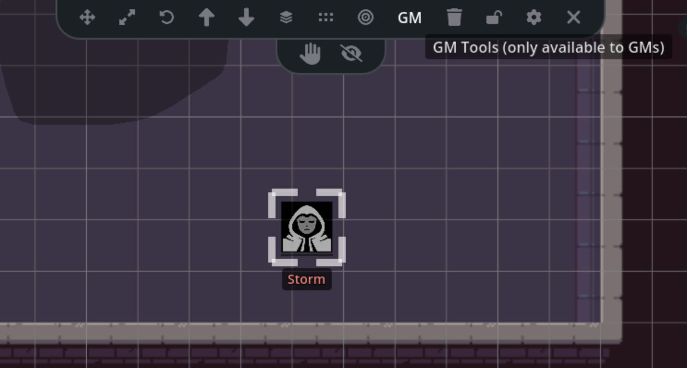
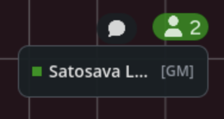
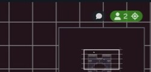
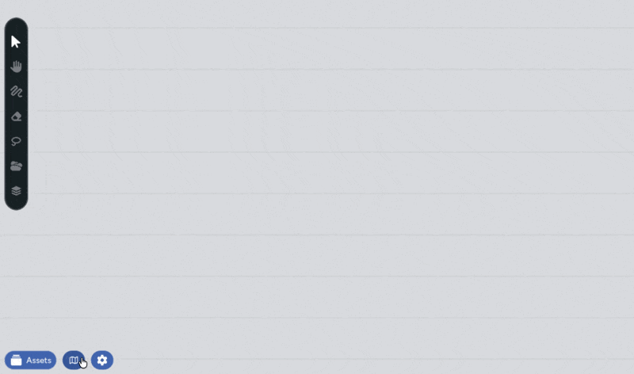

GMs can prepare hidden content, control actor permissions, manage map pages, and move players to the part of the map where the session is happening.

## Preview the Player View

Use **Player View** to switch from the GM view to the same visibility rules a player receives. While preview is active:

- Hidden assets and GM-only layers disappear.
- Fog becomes opaque.
- Lighting uses the player view.
- Actor names and sheets follow player visibility.
- GM-only door and portal controls are hidden.
- Editing controls that would reveal private information are unavailable.

Select **GM View** to return to normal authoring. Player Preview changes only your view. It doesn't change the map for connected players.

Use it before a session and after changing visibility, fog, lighting, doors, loot, or portals.

## Hide an Asset

Select an asset and use the visibility action to hide it from players. Hidden assets remain visible to the GM, with a visual indicator showing that players can't see them.

Good uses include:

- Enemies waiting off-screen
- Trap markers
- Secret doors
- Notes or reminders for the GM
- Loot that hasn't been revealed

You can also hide several named tokens at once from the [Map Assets panel](/docs/maps/features/map-assets-and-players).

## Restrict an Asset

Restriction keeps an asset visible but prevents players from selecting, moving, resizing, or rotating it. Use this for map backgrounds, furniture, terrain, and other objects players should see without editing.

Locking is a local authoring protection. Restriction is the player permission control.

## Add New Assets as Hidden

Enable **Add as hidden** in the Asset panel before placing content. Each newly placed asset starts hidden until you reveal it.

This is useful when preparing encounter tokens or scenery while players are already connected.

## Restrict Token Movement to Owners

Open **Settings > General** and enable **Restrict Token Movement to Owners**. Players can then move only character tokens they own.

The GM can still move every token. Layer locks, asset locks, and wall collision continue to apply.

## Control Actor Visibility

NPC and vehicle visibility comes from the game table. From the quick sheet, a GM can choose:

- **Hidden**: Players don't receive the actor.
- **Visible**: Players see a masked name and no stats.
- **Known**: Players see the real name but no stats.
- **Full**: Players see the available stats and sheet.

See [Character and Vehicle Tokens](/docs/maps/features/character-tokens#visibility-levels) for how these levels appear on the map.

## Summon Players

The presence indicator shows who is connected and whether they are on your current map page. Use its summon action to bring connected players to your current page, camera position, and zoom.

Players receive a summon notice before their view moves. If someone is on another map page, the summon changes their page first.

For more control, use the [Map Assets and Players panel](/docs/maps/features/map-assets-and-players). It can jump to one player, summon selected players, or bring their tokens to your current view.

## Set the Default View

1. Move and zoom the camera to the starting view.
2. Open **Settings**.
3. Select **Set default map & view**.

This saves the page as the game's starting map and records its default camera position.

## Manage Maps and Encounters

Use [Map Management](/docs/maps/features/map-management) to create pages, organize folders, review thumbnails, import a library map, or delete an old page.

Use [Encounters](/docs/maps/features/encounters) to add encounter actors, activate missing table actors, and place staged tokens on the current page.

## Prepare a Session Safely

A useful prep order is:

1. Create or import the map page.
2. Lock the background layer.
3. Add hidden NPCs, loot, notes, and portals.
4. Draw fog and configure lighting.
5. Set the default view.
6. Turn on Player Preview and check the full map.
7. Return to GM View before players join.
