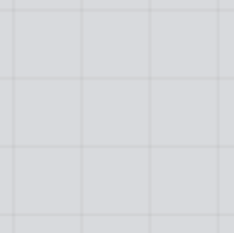
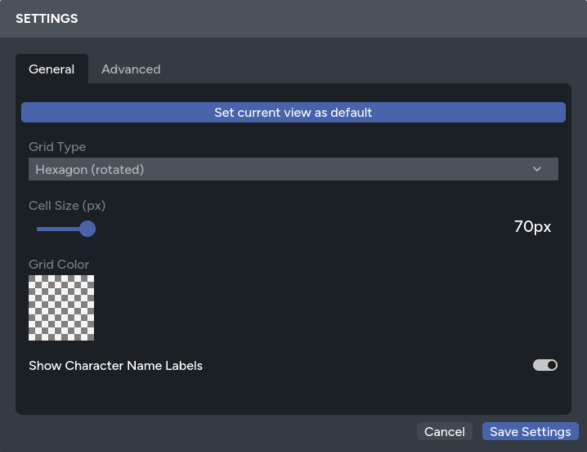
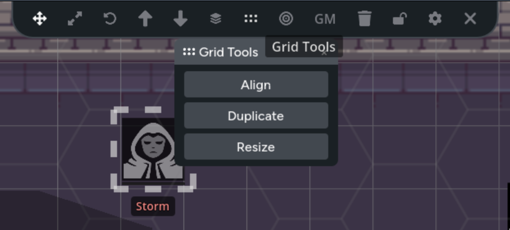
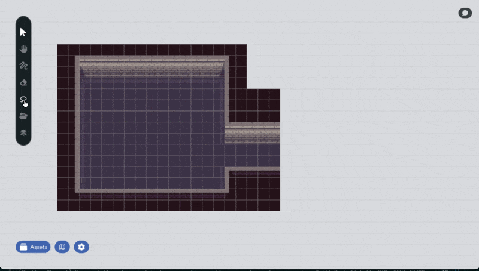

Grids overlay your map with a repeating pattern of cells that tokens and assets can
snap to. Whether you're running tactical combat on a square battlemap or navigating
hex-based overworld terrain, the grid keeps everything aligned and makes distance
easy to judge at a glance.

Grid settings are per-page, so each page in your map can have its own grid type,
cell size, and color, or no grid at all.

## Grid Types

The grid system supports three grid types, plus the option to disable the grid
entirely. You can switch between them at any time from the settings panel.

### Square

A standard rectangular grid. Cells are equal-width squares, and movement follows
the four cardinal directions (up, down, left, right). This is the most common
choice for tactical battlemaps in systems like D&D or Pathfinder.

### Hexagon (Pointy-Top)

A hexagonal grid with the pointed end of each hex facing up. This is the default
grid type. Hex grids offer six directions of movement instead of four, which
can feel more natural for overland travel and exploration.

### Hexagon Rotated (Flat-Top)

A hexagonal grid rotated so the flat edge faces up. Functionally identical to the
pointy-top hex grid, just oriented differently. Choose whichever orientation
matches your map art or game system's convention.

### None

Disables the grid entirely. Assets can be positioned freely with no snapping, and
grid-related tools are hidden. Use this for theater-of-the-mind maps, artistic
overworld views, or any situation where precise positioning isn't needed.

## Configuring the Grid

Open the **Settings** panel to adjust grid settings for the current page. Changes
are saved per-page and sync to all connected players in real time.

### Grid Type

Select the grid type from the dropdown: **Hexagon**, **Hexagon (rotated)**,
**Square**, or **None**. Changing the grid type immediately updates the overlay and
snapping behavior for everyone at the table.

### Cell Size

The cell size slider controls how large each grid cell is. Smaller values create a
finer grid with more cells; larger values create a coarser grid with fewer, bigger
cells. Adjust this to match the scale of your map image.

When you're working with tiled map art, set the cell size to match your tile
dimensions so that each tile fits exactly into one cell.

### Grid Color

Click the color picker to choose a custom grid line color. You can also adjust the
opacity using the alpha channel. This is useful for keeping grid lines visible
without obscuring your map art. The default is a subtle, semi-transparent dark
color that works well on most maps.

## Snapping to the Grid

When the grid is enabled, assets snap to grid cells in two ways: while dragging and
with arrow keys.

### Shift+Drag Snapping

Hold **Shift** while dragging an asset to snap it to the nearest grid cell. The
asset's center aligns to the center of the closest cell, keeping everything
neatly positioned on the grid.

This works with single assets and multi-selections alike. If you drag without
holding Shift, the asset moves freely without snapping, even when the grid is
visible.

Assets that span multiple cells are handled intelligently. A large token that
covers a 2x2 area snaps so that its edges align to cell boundaries, while a
token that covers a single cell snaps to the cell center.

### Arrow Key Movement

Press the **arrow keys** to move selected assets exactly one grid cell in that
direction. This gives you precise, cell-by-cell control that's especially useful
for moving tokens during combat.

- **Arrow keys**: Move one cell in the pressed direction
- **Shift + Arrow keys**: Move five cells at once for faster repositioning

On hex grids, the arrow keys map to the nearest hex direction, so pressing
left or right moves along the hex row and pressing up or down moves
diagonally between rows in the way you'd expect.

## Grid Tools

When you have assets selected and the grid is enabled, the **Grid Tools** panel
provides quick actions for aligning and resizing assets to the grid.

### Align to Grid

Snaps each selected asset's center to the nearest grid cell center. Use this to
clean up asset positions after free-placing them, or after changing the grid size
or type.

When aligning multiple assets at once, the system avoids placing two assets in the
same cell. If assets would overlap, they're spread into nearby cells instead.

### Resize to Grid

Scales each selected asset so it fits neatly within a single grid cell. The asset
is resized proportionally (maintaining its aspect ratio) and then snapped to the
nearest cell center.

This is useful when you've added tokens or props at arbitrary sizes and want them
to match the grid scale consistently.

### Duplicate in Direction

Creates copies of the selected assets in a chosen direction (right, left, down, or
up), spaced exactly one grid cell apart. You choose the direction and how many
copies to create.

This is invaluable for building tiled maps. Select a map tile, duplicate it 10
times to the right, and you've got a row. Select the row and duplicate it
downward to fill out a full grid of tiles.

## Auto-Resize to Grid

When enabled, every new asset added to the map is automatically resized to fit
within a single grid cell. You can toggle this setting from the asset manager.

This saves time when building maps tile by tile, since you don't need to manually
resize each piece after placing it. Assets are scaled proportionally to fit the
current cell size, maintaining their aspect ratio.

Auto-resize only applies to newly placed assets. Existing assets on the map aren't
affected when you toggle this setting.

## Building Tiled Maps

The grid system is designed to work well with tiled map art. Individual image
tiles that snap together to form a larger map. Here's a typical workflow:

1. **Set your cell size** to match the dimensions of your map tiles
2. **Enable auto-resize to grid** so tiles fit cells automatically as you place
   them
3. **Place your first tile** from the asset manager
4. **Use Duplicate in Direction** to quickly fill out rows and columns
5. **Use Shift+F and Shift+V** to [flip tiles](/docs/maps/features/character-tokens#flipping-tokens)
   horizontally or vertically for variety

Since each tile snaps perfectly to the grid, you can build large, complex maps
quickly without fiddly manual alignment.

## Tips

- **Match cell size to your content**: If you're using pre-made battlemaps with
  a built-in grid, adjust the cell size until the overlay lines up with the grid
  in the image. This way, token snapping matches the map's grid.
- **Use hex grids for overland maps**: Hex grids handle diagonal movement more
  naturally than square grids, making them a good fit for exploration and travel
  maps.
- **Adjust opacity for readability**: If the grid is hard to see, increase the
  color's opacity. If it's too distracting, lower it. You can also change the
  color to contrast with your map's palette.
- **Different grids for different pages** — Since grid settings are per-page, you
  can use a square grid for your dungeon maps and a hex grid for the overworld,
  all within the same session.
- **Lock your background layer**: When building tiled maps, [lock the layer](/docs/maps/features/layers#locking-layers)
  holding your tiles once you're done arranging them. This prevents accidental
  moves while you place tokens and props on layers above.
