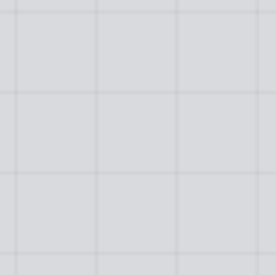
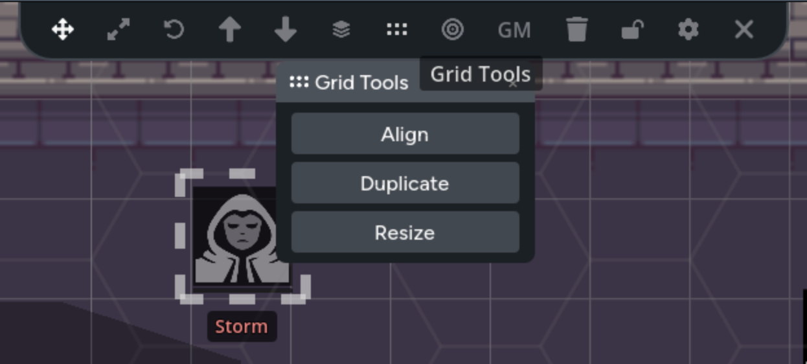
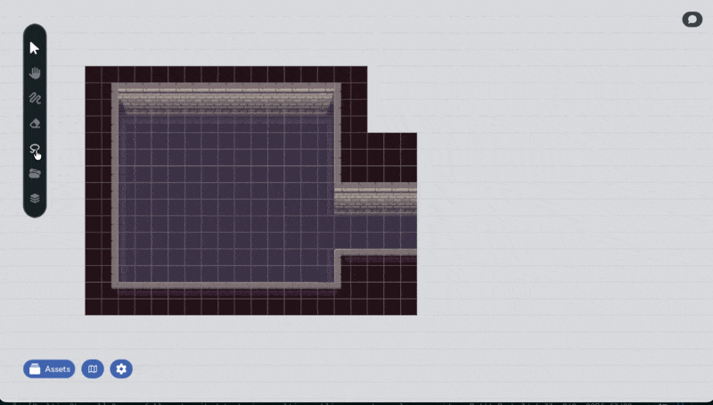

The grid keeps tokens, props, and map tiles aligned. Each map page has its own grid type, cell size, and color, so a game can mix tactical maps, hex maps, and freeform scenes.

## Choose a Grid

Open **Settings** and choose one of these grid types:

- **Square** for square-cell tactical maps
- **Hexagon** for pointy-top hexes
- **Hexagon (rotated)** for flat-top hexes
- **None** for free placement without grid snapping

Set the cell size to match the scale of the background or map tiles. Use the color picker and opacity control to keep the lines visible without covering the art.

Changing the grid updates the current page for everyone at the table.

## Move Assets on the Grid

Hold `Shift` while dragging an asset to snap it to the nearest cell. Assets that cover several cells align to the grid based on their footprint.

With an asset selected:

- Press an arrow key to move it by one cell.
- Hold `Shift` and press an arrow key to move it by five cells.
- Hold `Shift` while resizing to snap its size to grid increments.

Without `Shift`, dragging and resizing stay freeform even while the grid is visible.

## Use Grid Tools

Select one or more assets to open the Grid Tools actions.

### Align to Grid

Moves each selected asset to the nearest cell. When several selected assets would land in the same cell, Maps spreads them into nearby cells.

### Resize to Grid

Scales each selected asset proportionally to fit one cell, then centers it in the nearest cell.

### Duplicate in a Direction

Creates copies above, below, left, or right of the selected assets at one-cell intervals. Choose a direction and the number of copies.

This is useful for repeated floor tiles, walls, trees, seats, or other regular map elements.

## Auto-Resize New Assets

Enable auto-resize in the Asset Library to fit newly placed assets into one grid cell. Existing assets aren't changed when you turn the setting on.

## Build a Tiled Map

1. Set the cell size to match the tiles.
2. Enable auto-resize to grid.
3. Place the first tile from the Asset Library.
4. Use **Duplicate in a Direction** to build rows and columns.
5. Flip repeated tiles with `Shift+F` or `Shift+V` for variation.
6. Move the finished background pieces onto a locked layer.

You can split a packed tile image before building. See [Spritesheet Import](/docs/maps/features/spritesheet-import).

## Fix a Misaligned Grid

- If a printed grid is part of the background image, adjust the cell size until both grids match.
- If tokens don't land where expected, check whether the page uses square, pointy-top hex, or flat-top hex cells.
- If the grid hides the art, lower its opacity or choose a closer color.
- If background pieces keep moving during play, put them on a [locked layer](/docs/maps/features/layers#lock-a-layer).
