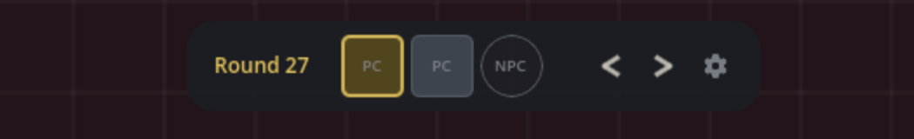
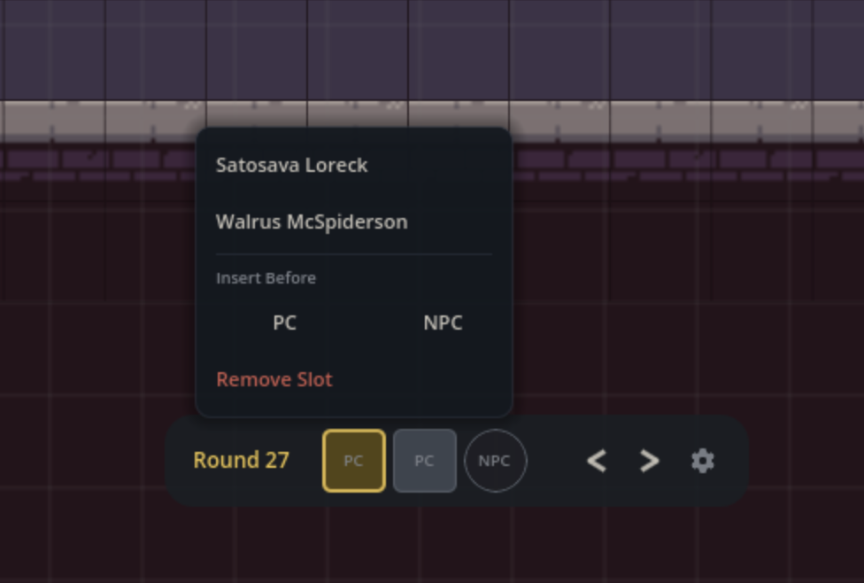
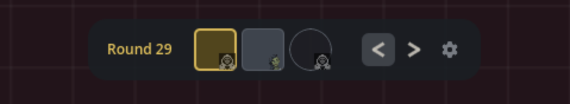
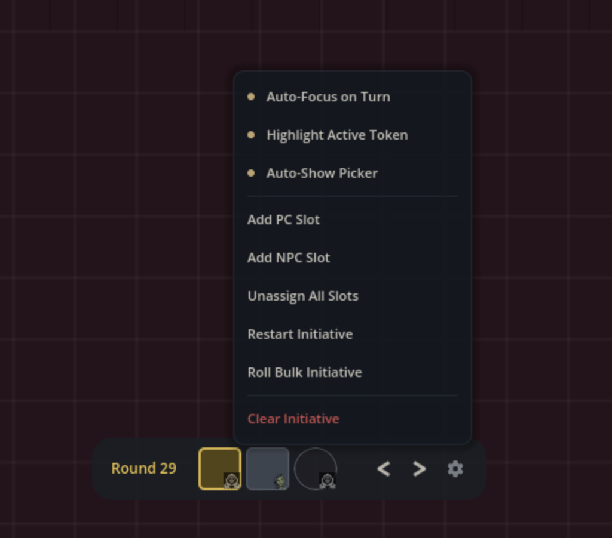
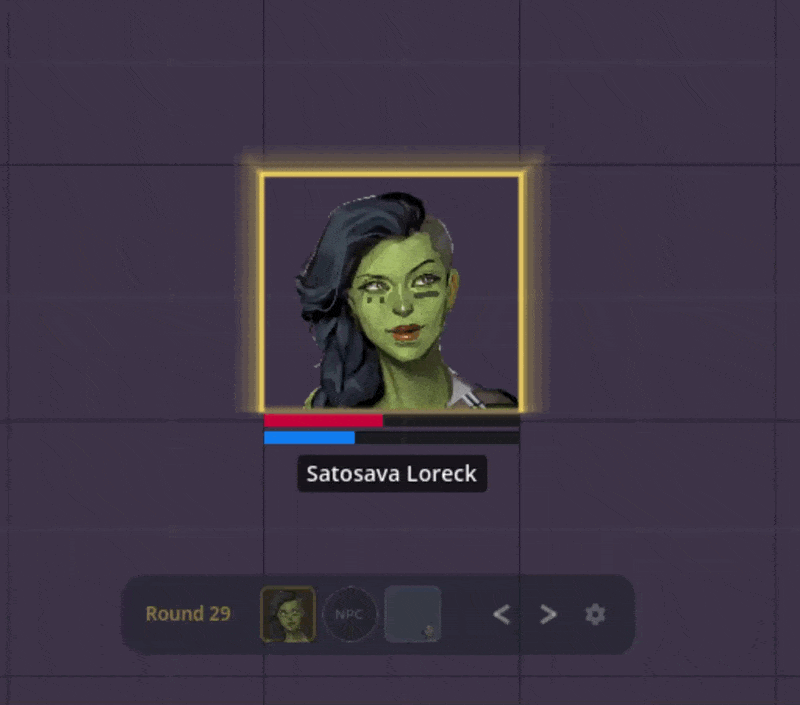

When combat starts, you need to know whose turn it is. The initiative tracker
puts that information right on the map as a visual bar at the bottom of the
screen, showing the full turn order, the current round, and whose slot is
active. It stays in sync with your game table, so changes from the bot or
the web app show up on the map automatically, and changes from the map flow
back to the table.

If you're setting up initiative for the first time, you'll want to start from
your game table using the bot's [`/initiative` commands](/docs/reference/initiative)
or the web interface. Once slots exist, the tracker appears on the map for
everyone in the session.

## The Initiative Bar

The initiative bar sits at the bottom center of the screen. From left to right,
it shows:

1. **Round counter** displaying the current round number
2. **Slot strip** showing each initiative slot in order
3. **Previous and Next buttons** to step through turns
4. **Settings button** (gear icon) to access tracker options

The bar fades to a lower opacity when you're not hovering over it, keeping it
out of the way until you need it. Hover over it to bring it back to full
visibility.

### Reading the Slots

Each slot in the strip represents one turn in the initiative order. The shape
tells you what type of slot it is:

- **Square corners** for PC slots
- **Rounded corners** for NPC slots

The active slot is highlighted and inactive slots are dimmed.
Slots that have already passed this round have a green dot in the
top-right corner.

## Assigning Characters to Slots

Slot assignment is entirely optional. In a typical game, you don't assign
specific characters to initiative slots. The slot type (PC or NPC) tells you
whose turn it is, and your group decides at the table who acts in each slot.
That's the normal flow, and the tracker supports it without any extra setup.

Where slot assignment becomes useful is in larger battles or encounters that
stretch across multiple sessions. When you have eight NPCs and five PCs on
the map, remembering who already went this round gets harder. Assigning
characters to slots lets the tracker do that bookkeeping for you, and it
unlocks features like camera auto-focus and the active token highlight that
tie the bar directly to tokens on the map.

If your table doesn't need that, skip this section and just use the bar to
track whose turn type is up.

To assign a character, click on any slot to open the character
picker. The picker shows eligible characters filtered by slot type: PCs for
PC slots, NPCs for NPC slots. Characters who have already been assigned to a
slot this round are filtered out so you don't accidentally double-book someone.

If a character is currently assigned to the slot, the picker highlights them
and shows an **Unassign** option at the top.

When a character is assigned, their portrait appears inside the slot on the
bar. Unassigned slots show a "PC" or "NPC" text label instead.

### Ghost Portraits

If you're using slot assignments, you'll notice that when a new round begins,
slots carry over whoever was assigned to them last round, but they aren't
confirmed yet. You'll see a small, faded portrait in the corner of the slot
instead of a full-size one. This is a reminder of who was there last round.
Once you assign a character to the slot (even the same one), the portrait
fills in fully. If you skip assigning a character, the slot will be unassigned 
after its turn is over.

### Slot Management from the Picker

When you click a slot to open the picker, you'll also see options to
**Insert Before** (with separate PC and NPC buttons) and **Remove Slot** at
the bottom. These let you adjust the turn order on the fly without going
through the settings menu.

## Advancing Turns

Use the **Next** (right arrow) and **Previous** (left arrow) buttons on the
bar to step through the initiative order. When you advance past the last slot
in a round, the round counter increments and the tracker wraps back to the
first slot.

## Settings Menu

Click the gear icon on the right side of the bar to open the settings menu.
This menu has both toggle settings and action buttons.

### Toggle Settings

- **Auto-Focus on Turn**: If you're using slot assignments, the camera
  smoothly pans to center on the assigned character's token when the active
  slot changes. Useful for large maps where combat is spread across multiple
  areas.
- **Highlight Active Token**: If you're using slot assignments, this draws a
  pulsing golden glow around the assigned character's token on the map,
  making it easy to spot whose turn it is at a glance.
- **Auto-Show Picker**: Automatically opens the character picker when the
  turn advances to an unassigned or unconfirmed slot. Saves you a click
  each turn if you're assigning characters as you go.

### Actions

- **Add PC Slot** / **Add NPC Slot**: Append a new empty slot to the end of
  the initiative order.
- **Unassign All Slots**: Clear all character assignments without removing
  the slots themselves. The slot order stays intact.
- **Restart Initiative**: Reset back to round 1, slot 1 without changing the
  slot layout.
- **Roll Bulk Initiative** (GM only): Opens the bulk initiative roller, which
  lets you roll initiative for multiple characters at once rather than one at
  a time.
- **Clear Initiative**: Removes all slots entirely, wiping the initiative
  order. This asks for confirmation before proceeding since it can't be undone.

## Active Token Highlight

If you're using slot assignments and have **Highlight Active Token** turned
on in the settings menu, the map draws a layered golden glow around the token
belonging to the active slot's character. The glow pulses gently so it catches
your eye without being distracting. It only appears when the slot has a
confirmed character assigned to it.

## Camera Auto-Focus

If you're using slot assignments and have **Auto-Focus on Turn** enabled, the
camera pans smoothly to center on the active character's token each time the
turn advances. The pan takes about half a second, so it feels responsive
without being jarring. This is especially helpful on maps where combat is
happening in multiple areas and you'd otherwise need to scroll around to find
the next character.

## Showing and Hiding the Tracker

The initiative tracker is a per-user setting. Each person at the table can
choose whether to display it or not.

To toggle the tracker:

1. Open the **Settings** panel (gear icon in the bottom-left of the screen)
2. Under the **General** tab, check or uncheck **Initiative Tracker**

When you hide the tracker, it slides off the bottom of the screen. Showing it
again slides it back up. This doesn't affect anyone else's view.

## Tips

- **Keep it simple**. The tracker works fine without assigning characters to
  slots. If your group just needs to know "it's a PC turn" or "it's an NPC
  turn," that's all you need.
- **Assign as you go**. If you are using assignments, turn on Auto-Show Picker
  so the character picker opens automatically each turn. This keeps things
  moving without extra clicks.
- **Use the highlight for large groups**. When you have a dozen tokens on the
  map, the golden glow makes it obvious whose turn it is without scanning the
  bar.
- **Auto-focus for big maps**. If combat spans multiple rooms or areas, camera
  auto-focus keeps everyone oriented without manual scrolling.
- **Manage slots from the picker**. Rather than going to the gear menu, click
  a slot and use the Insert Before or Remove Slot options to adjust the order
  mid-combat.
