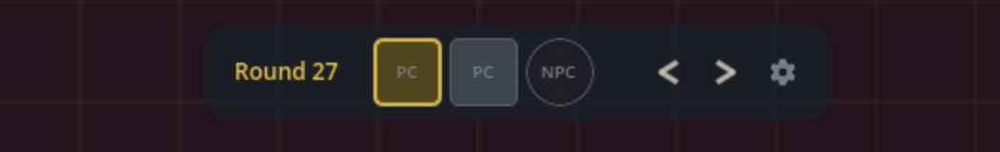
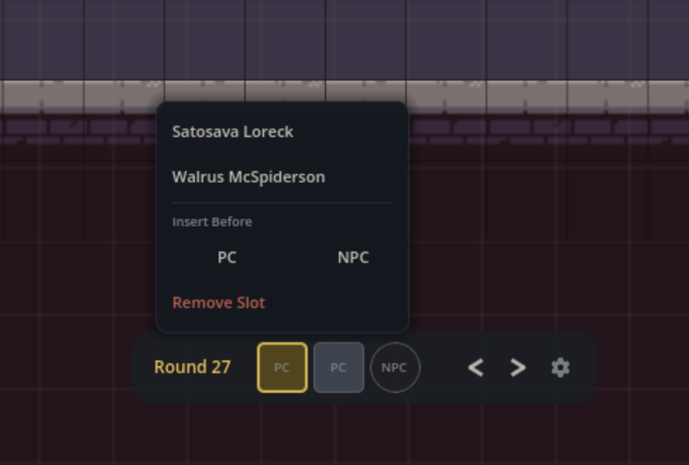
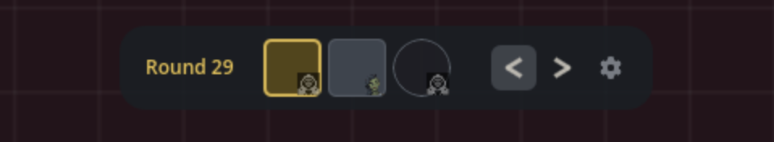
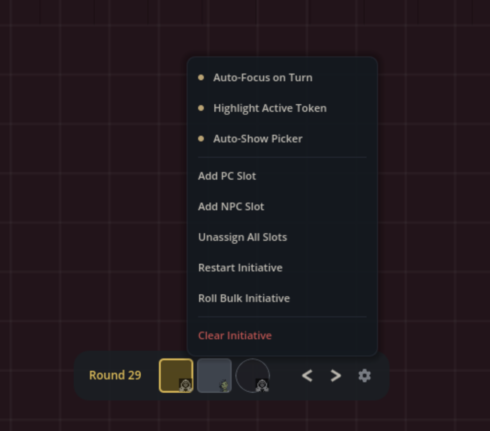
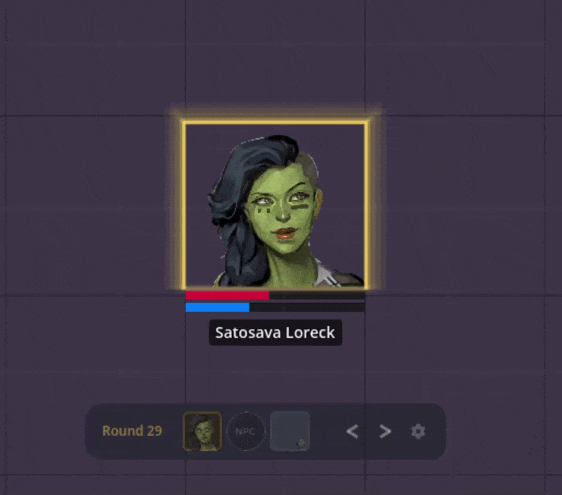

The initiative tracker mirrors your game table's current turn order on the map. Everyone can see the round, slot order, and active turn without switching pages.

Create the initial initiative order from the game table or the Discord bot's [`/initiative` commands](/docs/reference/initiative). Once an order exists, the map tracker appears and can modify it. Changes stay in sync across the table, bot, and map.

## Read the Initiative Bar

The bar shows:

- The current round
- PC and NPC slots in order
- The active slot
- Slots that have already acted this round
- Previous and next controls
- Initiative settings

PC slots use square corners. NPC slots use rounded corners. The active slot is highlighted, and completed slots get a marker.

## Assign an Actor to a Slot

Assignments are optional. You can leave the order as PC and NPC slots and decide at the table who uses each one.

To track a specific actor:

1. Select a slot.
2. Choose an eligible character from the picker.

PC slots list PCs, and NPC slots list NPCs. An assigned actor's portrait appears in the slot. Use **Unassign** when the slot should return to its normal type.

At the start of a new round, a faded portrait can show who used the slot last round. Confirm that actor again or choose someone else. If the slot finishes without confirmation, it returns to an unassigned slot.

## Change the Turn Order

Use the previous and next controls to move through the order. Advancing past the last slot starts the next round.

Open a slot's picker to:

- Insert a PC or NPC slot before it
- Remove the slot
- Change or clear its actor assignment

Open initiative settings to:

- Add a PC or NPC slot at the end
- Unassign all actors without deleting slots
- Restart at round 1, slot 1
- Open **Roll Bulk Initiative**
- Clear the full initiative order

Clearing initiative removes every slot and asks for confirmation first.

## Focus the Active Actor

The tracker has three optional actor-assignment helpers:

- **Auto-Focus on Turn** moves your camera to the assigned token.
- **Highlight Active Token** adds a visible pulse around the assigned token.
- **Auto-Show Picker** opens the actor picker when an unassigned slot becomes active.

These options only add value when actors are assigned to slots. Leave them off if your group uses flexible PC and NPC turns.

## Show or Hide the Tracker

Open **Settings**, select **General**, and toggle **Initiative Tracker**. This is a per-user display choice and doesn't hide the tracker for anyone else.

If a slot points to an actor on another page, use the [Players tab](/docs/maps/features/map-assets-and-players#manage-connected-players) or Maps panel to move to the relevant scene.
