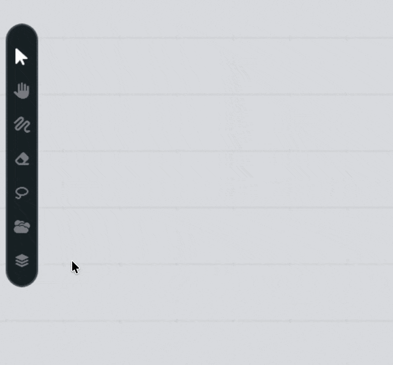
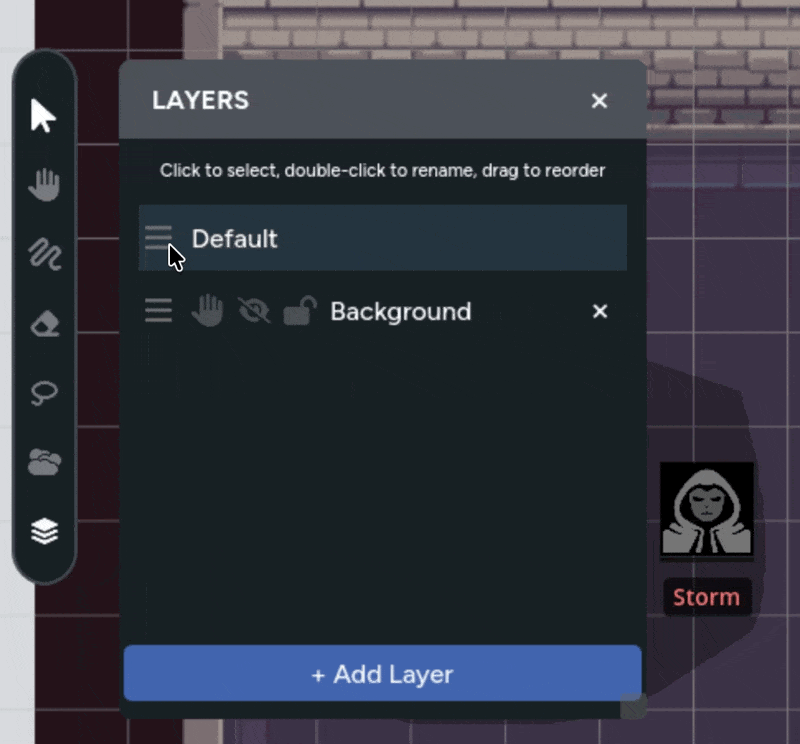

Layers let you organize assets on your map into separate groups that you can show,
hide, lock, and reorder independently. Think of them like transparent sheets stacked
on top of each other: each one holds its own set of assets and drawings, 
and you
control how they interact with the rest of the map.

This is a GM-only feature. Players never see the layer panel or know how your map
is organized behind the scenes—they just see the final result. Player-added 
assets are always added to the "Default" layer, which cannot be hidden or 
restricted.

## The Layer Panel

To open the layer panel, click the **Layers** button in the toolbar. A panel appears
on the right side of the screen listing all layers for the current map page.

Every map page starts with a single **Default Layer**. This is a permanent layer
that can't be deleted, hidden, or locked. It's always there as your baseline.
Any
asset placed without a specific layer assignment goes here.

## Creating and Deleting Layers

Click the **+ Add Layer** button at the bottom of the layer panel to create a 
new layer. It appears at the top of the list (meaning it renders above everything else) with a default name like "Layer 2".

To delete a layer, click the **X** button on the layer's row. Deleting a layer
also deletes all assets and drawings on it, so be careful. You can't delete the
default layer.

## Renaming Layers

Double-click a layer's name to rename it. Type the new name and press **Enter** to
confirm, or press **Escape** to cancel. Give layers descriptive 
names like "Background", "Furniture", "NPCs", "Hidden Traps", etc. to make 
it eaiser to keep track of complex maps.

## Layer Ordering

Layers are stacked vertically in the panel. The layer at the **top of the list
renders on top** of the map, and layers further down render behind it. Drag a
layer by its handle to reorder it.

This is how you control what appears in front of what. For example, you might have
your map background on the bottom layer, furniture and terrain on a middle layer,
and character tokens on a top layer—so tokens always appear above the scenery.

## Selecting the Active Layer

Click on a layer to select it as the **active layer**. The active layer is
highlighted in the panel and determines where new content that you add goes:

- New assets added to the map are placed on the active layer
- Drawing and erasing with the brush tool happens on the active layer

If you switch the active layer and then draw, those lines go on the newly selected
layer. This lets you keep drawings organized, or change how they're 
displayed in relation to other assets.

## Layer Visibility

Each layer has two visibility controls that determine who can see its contents.
These buttons appear on each layer row in the panel (except the default layer,
which is always visible to everyone).

### Hiding a Layer

The **visibility toggle** (eye icon) controls whether a layer is shown or
completely hidden. When you hide a layer:

- The layer and everything on it disappears for **everyone**, including you
- Assets on the hidden layer can't be selected or interacted with
- Character name labels on hidden tokens are suppressed

This is an all-or-nothing toggle. Hidden layers are fully invisible to everyone at
the table. Use this when you want to completely remove a set of assets from 
view. For
example, hiding a layer of traps after the party has moved past them, or tucking away
a set of pre-placed enemies that aren't relevant yet.

### GM-Only Layers

The **GM-only toggle** (restrict icon) makes a layer visible to the GM but invisible
to players. When a layer is set to GM-only:

- Players see nothing from that layer
- You see the layer's contents at **reduced opacity** so you can tell at a glance
  which assets are GM-only
- You can still select and edit assets on the layer

GM-only layers are perfect for:

- **Planning layers** — pre-position enemies or set pieces for a future encounter
  without revealing them
- **GM reference notes** — place markers, labels, or reference images that help you
  run the session but shouldn't be visible to players
- **Staged reveals** — set up a layer of assets, then flip it to visible at just
  the right dramatic moment

### Visibility Summary

| Visibility Setting | GM Sees              | Players See |
|--------------------|----------------------|-------------|
| **Visible**        | Normal               | Normal      |
| **GM-Only**        | Reduced opacity      | Nothing     |
| **Hidden**         | Nothing              | Nothing     |

## Locking Layers

The **lock toggle** (lock icon) prevents any editing on a layer. When a layer is
locked:

- Assets on the layer can't be selected, moved, or resized
- Drawing tools can't draw or erase on the layer
- Any currently selected assets on the layer are automatically deselected

Locking is purely an editing safeguard—it doesn't affect visibility. A locked layer
is still visible to everyone (unless also hidden or GM-only). Players aren't aware
of lock status.

This is useful for:

- **Locking your map background** so you can't accidentally drag it while managing
  tokens above it
- **Freezing finished layers** — once you've arranged furniture, terrain, or other
  static elements, lock the layer so you don't accidentally disturb your layout while
  running the session

## Moving Assets Between Layers

You can move existing assets from one layer to another without removing and
re-adding them.

1. Select one or more assets on the map
2. In the toolbar, click the **Layer dropdown** button
3. Choose the destination layer from the list

The dropdown shows all layers on the current page and indicates which layers are
locked or hidden. If you have multiple assets selected that are on different layers,
the dropdown shows "Mixed" to let you know.

All selected assets move to the chosen layer at once, which makes it easy to
reorganize things in bulk.

## Layers and Fog of War

Fog of war operates independently from layers. Fog areas always render above
all layer content—they aren't assigned to a specific layer, and they aren't
affected by layer visibility or ordering. Hiding or locking a layer has no effect
on fog drawn over it.

## Real-Time Sync

All layer changes sync to every connected player instantly. When you create a layer,
change visibility, reorder, or lock—players see the result immediately. There's no
need to refresh or reload.

## Tips for Using Layers

- **Start with a structure** — Before placing assets, plan out 2–3 layers. A common
  setup is: "Background" on the bottom for your map image, "Props" in the middle
  for furniture and terrain, and "Tokens" on top for characters.
- **Lock what you've finished** — Once your map background and terrain are in place,
  lock those layers. You'll avoid accidental drags during play and can focus on
  moving tokens freely.
- **Use GM-only for prep** — Set up enemy positions on a GM-only layer before the
  session. When the party kicks down the door, flip the layer to visible for an
  instant reveal.
- **Name your layers** — "Layer 1" and "Layer 2" get confusing fast. Take a second
  to give layers descriptive names, especially on maps with many layers.
- **Combine with fog of war** — Layers control asset organization; fog controls
  map visibility. Use both together—fog to hide unexplored areas, and layers to
  organize what's behind the fog for easy management on your end.
