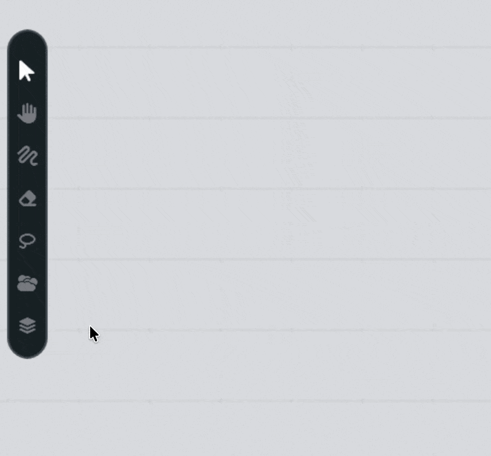
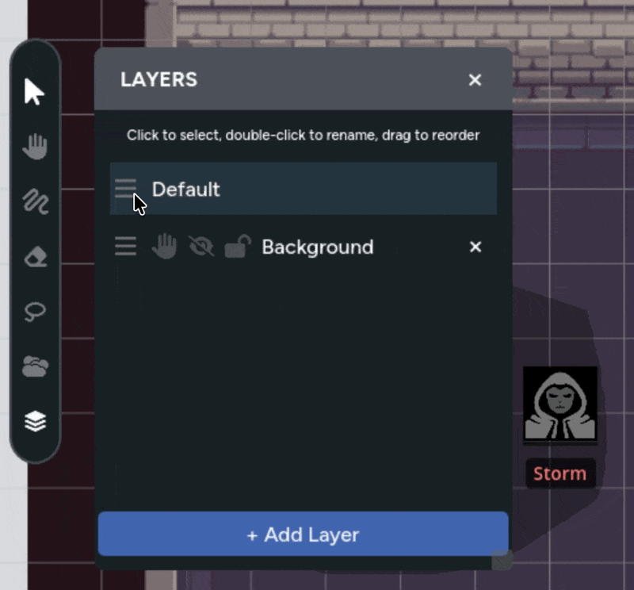
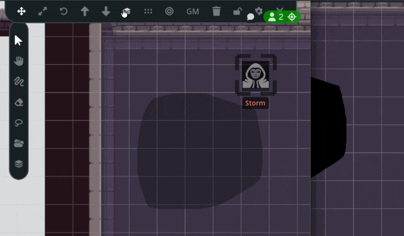
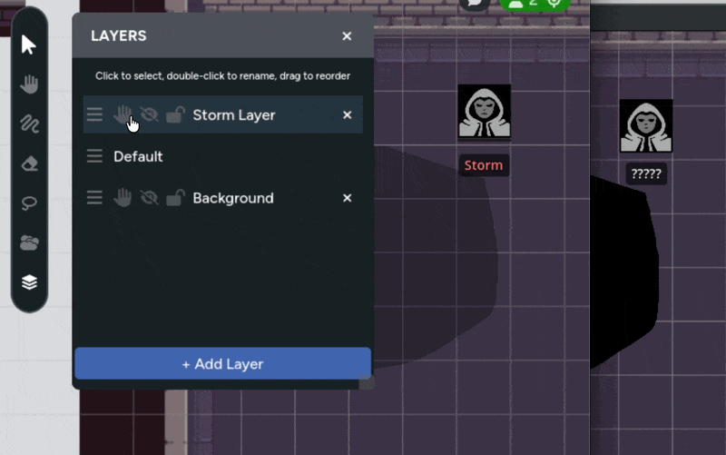

Layers separate a map into groups you can reorder, hide, restrict, or lock. They make it easier to prepare a scene without moving finished backgrounds or revealing future encounter pieces.

Only GMs can manage layers. Players see the resulting map, not the layer panel.

## Open the Layers Panel

Select **Layers** from the map controls. Every page starts with a permanent default layer.

The default layer can't be deleted, hidden, restricted, or locked. Player-added assets go there.

## Add and Rename a Layer

1. Select **Add Layer**.
2. Double-click the new layer's name.
3. Enter a useful name and press `Enter`.

Names such as `Background`, `Furniture`, `NPCs`, or `Hidden Traps` are easier to scan during a session than numbered layers.

## Reorder Layers

Drag a layer by its handle to change its position. Layers at the top of the list render above layers below them.

A common order is:

1. Tokens
2. Props and furniture
3. Terrain
4. Background

## Choose the Active Layer

Select a layer to make it active. New assets and brush drawings go onto that layer until you choose another one.

To move existing assets:

1. Select the assets on the map.
2. Open the layer action in the asset controls.
3. Choose the destination layer.

The selected assets move together. The menu marks locked and hidden destinations and shows a mixed state when your selection spans several layers.

## Control Visibility

Each non-default layer has two visibility controls.

### Hide a Layer

Hidden layers disappear for everyone, including the GM. Their assets can't be selected or used until the layer is shown again.

### Make a Layer GM-Only

GM-only layers stay visible to the GM at reduced opacity and remain hidden from players. The GM can still select and edit their contents.

Use GM-only layers for:

- Enemies waiting for a later encounter
- Hidden traps or scene changes
- GM reference images
- Set pieces prepared for a reveal

Use [Player Preview](/docs/maps/features/gm-controls#preview-the-player-view) to check what the table receives.

## Lock a Layer

A locked layer stays visible, but its assets and drawings can't be selected, moved, resized, drawn over, or erased. Lock completed backgrounds and terrain before running the session.

Locking affects editing, not player visibility. Use the visibility controls when content should be hidden.

## Delete a Layer

Select the delete action on a non-default layer. Deleting the layer also deletes every asset and drawing assigned to it, so move anything you want to keep first.

## Layers and Fog of War

Fog of war isn't assigned to a layer. It covers the combined page after the layers render, so reordering or hiding a layer doesn't remove fog.

Use layers to organize the scene and [Fog of War](/docs/maps/features/fog-of-war) to control which parts of that scene players can see.
