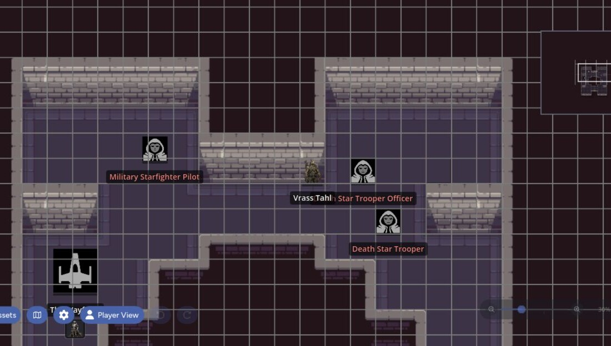
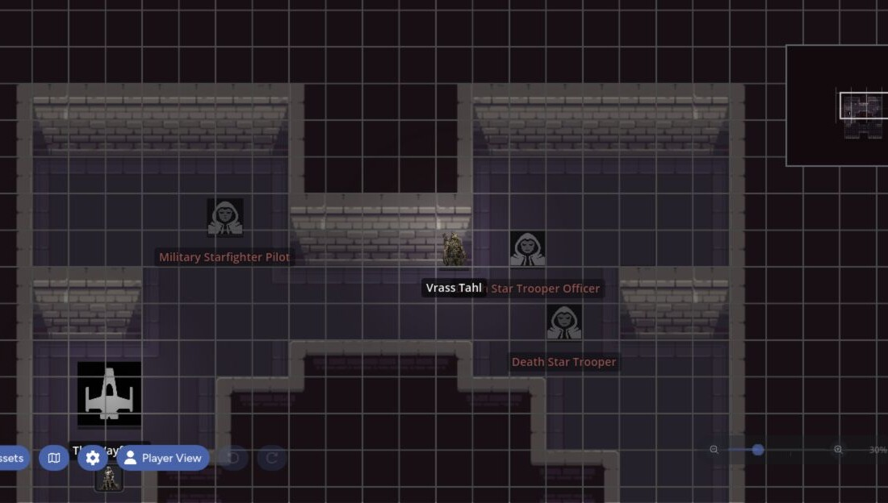
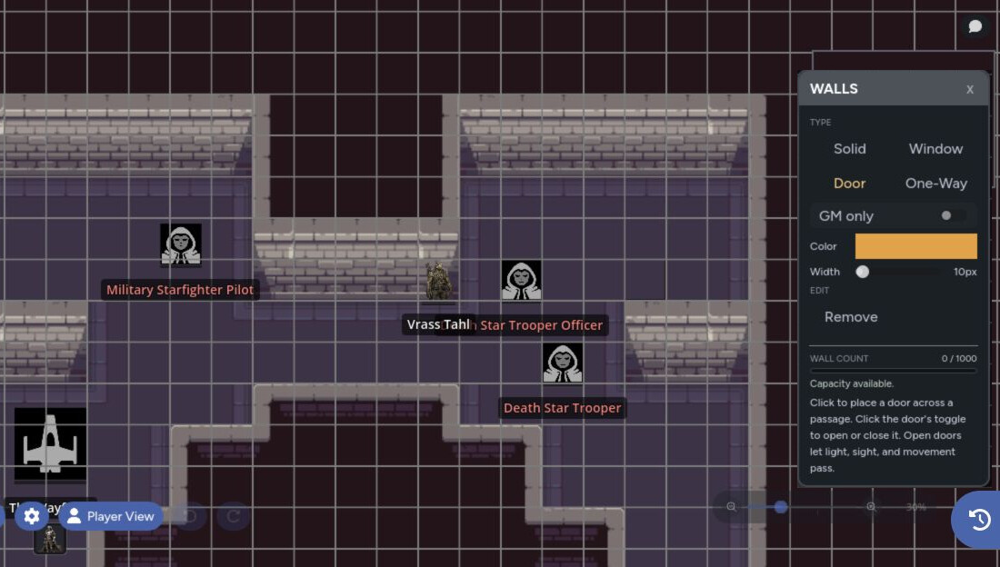

Dynamic lighting darkens the map outside token light sources. Walls shape that light, control line of sight, and can stop token movement. Exploration keeps previously visited areas visible at a lower brightness after the light moves away.

Only GMs can change lighting settings or author walls.

## Enable Dynamic Lighting

1. Open **Settings**.
2. Select the **Lighting** tab.
3. Enable **Dynamic Lighting**.
4. Set the light radius and darkness levels.
5. Save Settings.

The page stores its own lighting configuration. One map can use full darkness while another stays fully lit.

| Dynamic lighting off | Dynamic lighting on |
| --- | --- |
|  |  |

## Lighting Settings

The Lighting tab includes:

- **Light Radius** for the default distance around light-emitting tokens
- **Shadow Darkness** for unexplored or unlit areas
- **Explored Area Darkness** for places the party has already seen
- **NPC Tokens Emit Light** to include eligible NPC tokens
- **NPC Visibility in Shadow** to control names, opacity, or full concealment
- **Prevent Movement Through Walls** for all tokens or player tokens only
- **GM Lighting View (Self Only)** to show full, lessened, or disabled darkness on your screen
- **Disable Shadows (Performance)** for a lighter rendering mode
- **Ignore Walls When I Move (Self Only)** for your own GM movement
- **Clear Exploration Data** to reset what the page has revealed

The GM-only view settings affect your screen. Shared lighting, exploration, and collision settings affect the table.

## Token Light Sources

Player character tokens emit light by default. NPC tokens follow the page's NPC light setting.

Select an asset and open its settings to override the page defaults. A token can:

- Inherit the normal light rule
- Always emit light
- Never emit light
- Use a custom radius
- Use a custom color
- Add a flicker effect

Hidden or concealed tokens don't emit visible light, even if their override is set to always on. This keeps a hidden actor from revealing its position through its glow or shadow.

## Exploration

As eligible player tokens move, they reveal cells inside their light radius when a clear line of sight exists. Walls stop exploration from revealing rooms the token can't see.

Exploration is saved per page. Select **Clear Exploration Data** when you want to return the page to a fully unexplored state.

## Open the Wall Tool

Dynamic lighting must be enabled before the Wall tool is available. Select Walls from the toolbar or press `W`.

The wall panel lets you choose a wall type and a placement mode. A page can hold up to 1,000 authored wall segments, and the panel shows the current count.

## Wall Types

| Type | Light and Sight | Movement |
|------|-----------------|----------|
| Solid | Blocks light, sight, and exploration | Blocks movement |
| Window | Lets light and sight through | Blocks movement |
| Door | Blocks while closed and opens for travel | Blocks only while closed |
| One-Way | Lets light and sight through from one side | Blocks movement from both sides |

One-way walls show their direction while editing. Use the flip control to switch the see-through side.

## Place Walls

Choose one of these placement modes:

- **Line**: Click to place connected points. Double-click to finish.
- **Box**: Click two opposite corners. Hold `Shift` for a square.
- **Circle**: Click the center, then set the radius.
- **Curve**: Click the start and end, then set the bend.
- **Trace**: Select an asset and build walls around its visible shape.
- **Remove**: Click or drag across walls to delete them.

Right-click finishes or cancels an active placement. When you aren't placing a wall, right-click removes the wall under the cursor.

Traced walls stay linked to their source asset. Moving, rotating, or resizing that asset updates its generated walls, and deleting the asset removes them.

## Doors

Doors get an in-world toggle at their midpoint. A closed door behaves like a solid wall. An open door allows light, sight, exploration, and movement through the opening.

The GM can make a door GM-only. Players see a lock instead of an open control.

A GM-only door can also be disguised. Players see what looks like a normal door until someone tries it. The failed attempt reveals the lock to everyone without opening the door.

Door color and thickness are chosen before placement and stay with that door.

## Check the Player Result

Turn on [Player Preview](/docs/maps/features/gm-controls#preview-the-player-view) to test darkness, concealed NPCs, windows, doors, and one-way walls from the player side.

If lighting causes a slow frame rate, use [Performance Mode](/docs/maps/features/settings-and-performance#performance-mode) or disable shadows before removing authored walls.
