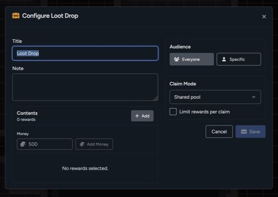

A loot drop attaches a game-table loot box to a placed map asset. The asset can represent a chest, body, crate, terminal, hidden cache, or anything else the group can search.

Only GMs can create or edit map loot. Players can discover and claim drops allowed by their character and the drop settings.

## Configure a Loot Drop

1. Select the asset that should hold the loot.
2. Open its settings.
3. Select the **Loot Drop** tab.
4. Choose a discovery mode and reveal radius if needed.
5. Select **Configure Contents**.
6. Build the loot box in the RPG Sessions dialog.
7. Select **Save** in the loot builder.

The builder can include library items, money, a title, and a note.

## Choose the Audience

Loot can be available to everyone or targeted to one player character.

A targeted private drop is shown and claimable only through that character. For proximity discovery, only the target character's tokens can reveal it.

## Choose a Claim Mode

The loot builder supports:

- **Single winner**: The first successful claim takes the available rewards.
- **Shared pool**: Claimed rows leave the shared pool for everyone.
- **Copy for each character**: Each eligible character gets its own claim state.

You can also limit how many reward rows a character can take in one claim.

## Discovery Modes

- **Visible** shows the loot icon whenever the asset is visible.
- **Proximity** reveals the icon when an eligible token enters the configured radius.
- **GM Only** keeps the drop hidden until the GM changes it.

Proximity uses grid spaces when a grid is active and pixels when the page has no grid.

The asset still needs to be perceivable. Fog, hidden assets, GM-only layers, and other visibility rules can keep a loot icon concealed.

## Preview the Reveal Radius

While editing a proximity drop, the GM can preview the reveal area around the asset. The preview disappears when the settings panel closes, saves, or cancels.

Use Player Preview with a test token to confirm that the icon appears at the distance you expect.

## Claim Loot

When a player selects a visible loot icon, the claim dialog opens on the game table. The player chooses an eligible character and the rewards they want to claim.

Claimed items and money move through the normal game-table inventory flow. The drop updates for everyone after the claim.

## Hide or Clear a Drop

From the asset's **Loot Drop** settings, a GM can:

- Change discovery settings
- Reconfigure its contents
- Select **Hide From Players** after a proximity drop has been revealed
- Clear the drop from the asset

Select **Clear Drop**, then **Confirm Clear**, to remove the loot configuration from the asset. The map asset itself stays in place.

## Saved Library Maps

Map-library snapshots include loot placements. If a saved loot item can't be shared with the imported map, Maps preserves the placement safely without exposing private library content.

Review imported loot before using the map in a different game.
