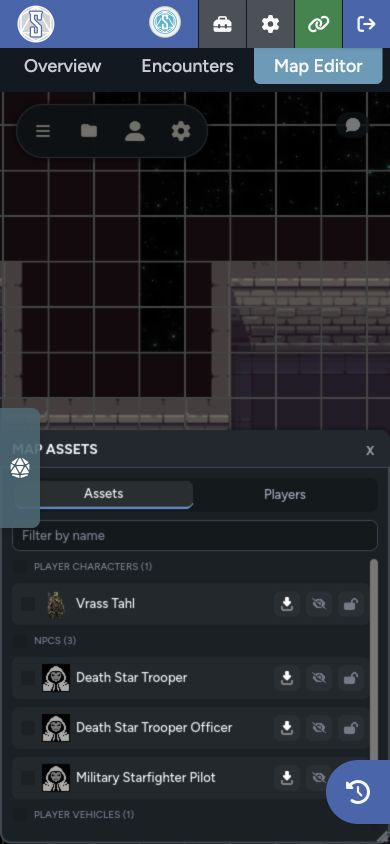

The Map Assets panel gives you a searchable list of named character and vehicle tokens. Players can use it to find visible actors. GMs get bulk asset controls and a Players tab for moving the group through the map.

## Open Map Assets

Select **Map Assets** from the toolbar. On mobile, open it from the top-bar menu.

The panel has an **Assets** tab for everyone and a GM-only **Players** tab.

## Find a Token

The Assets tab groups named tokens on the current page. Use the name filter to narrow the list, then select a row to move the camera to that token.

Players see only tokens they are allowed to perceive. Hidden actors, fog, layers, and other map visibility rules still apply.

## Select Assets from the List

The checkboxes in Map Assets mirror the selection on the canvas. This gives you a precise way to select tokens when they overlap or sit far apart.

GMs can select a full group, then use bulk actions to:

- Hide or show the selection
- Lock or unlock the selection
- Delete the selection

These actions follow the same permissions and confirmation rules as the map toolbar.

## Manage Connected Players

Open the **Players** tab to see connected users. Each row shows whether that player is on the current page or another named map.

From here, a GM can:

- Jump the camera to a player's token
- Summon a player's view to the GM's current page and camera position
- Bring the player's token to the GM's current view
- Select several players and bring their tokens together

Cross-map actions switch the token's page before placing it near the current view.

## Bring Selected Players Here

1. Open the Players tab.
2. Select the players you want to move.
3. Position your camera where the tokens should arrive.
4. Select **Bring Selected Players Here**.
5. Select the point on the map where they should arrive.

Maps spaces the arriving tokens around the selected point so they don't all land on the same position.

## Summon a View or Move a Token

These are separate actions:

- **Summon** changes the player's page and camera view. It doesn't move their token.
- **Bring Here** moves the player's token to the GM's current page and location.

Use Summon when you only need everyone looking at the same scene. Use Bring Here when the characters have actually moved to that location.

The [GM Controls guide](/docs/maps/features/gm-controls#summon-players) also covers the presence indicator's group summon.
