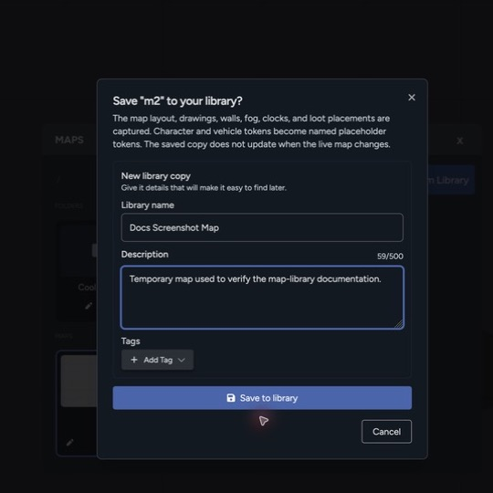
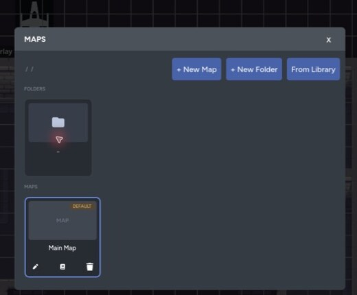

The Maps section of the Data Library lets you reuse a prepared location without rebuilding it for every game. A saved map keeps the scene layout and GM-authored map data while replacing campaign-specific actors with placeholders.

## Save a Map to the Library

1. Open the **Maps** panel.
2. Find the page you want to save.
3. Select **Save to library**.
4. Add a name, description, and tags.
5. Confirm the save.

The library copy includes:

- Backgrounds and placed assets
- Layers
- Drawings and map lines
- Grid settings
- Fog of war
- Walls and doors
- Clocks and counters
- Loot drop placements

Character and vehicle tokens become named placeholders. The saved map doesn't keep a live connection to those campaign actors.

Cross-page portals can't keep their destinations in a reusable map. Repoint them after adding the map to another game.

## Add a Saved Map to a Game

You can add a map from either side of the workflow:

- In Maps, open the **Maps** panel and select **From Library**.
- In the Data Library, open **Maps**, choose a saved map, and select **Add to Game**.

Choose the game and destination folder. Maps creates a new page with the saved layout and placeholder tokens.

## Relink Actor Placeholders

Placeholders keep the original actor's name and token footprint so the prepared layout still makes sense.

Select a placeholder to link it to a character or vehicle in the current game. You can search for the matching actor, choose a different one, or delete the placeholder if it isn't needed.

Relinking replaces the placeholder with the live actor token. The new token follows that actor's current portrait, stats, visibility, and permissions.

## Update a Linked Library Map

A page imported from the library shows a **Linked** badge in the Maps panel. Use **Manage library copy** to choose what happens next:

- **Update "Map Name"** saves the current page over its linked library map when you own that library item.
- **Create a separate library copy** saves a new library map and links the page to it.
- **Replace current map with library copy** refreshes the page from the linked library copy.

Refreshing a page replaces its reusable map content, including the layout, drawings, walls, fog, clocks, and loot drops. Live character and vehicle tokens already placed on the page stay in place.

A library update can also affect people using a shared map or kit. Check the confirmation before replacing an existing copy. Save a separate copy when your version has become specific to one campaign.

## Review a Library Map

The map detail page shows its preview, description, tags, and counts for **Layers**, **Assets**, **Tokens**, **Walls**, **Lines**, **Fog**, **Clocks**, and **Loot Drops**. The **Unlinked Tokens** section lists the actor placeholders you will need to relink after importing. Check these details before adding a shared map to a game.

For page creation, folders, previews, and deletion, see [Map Management](/docs/maps/features/map-management).
