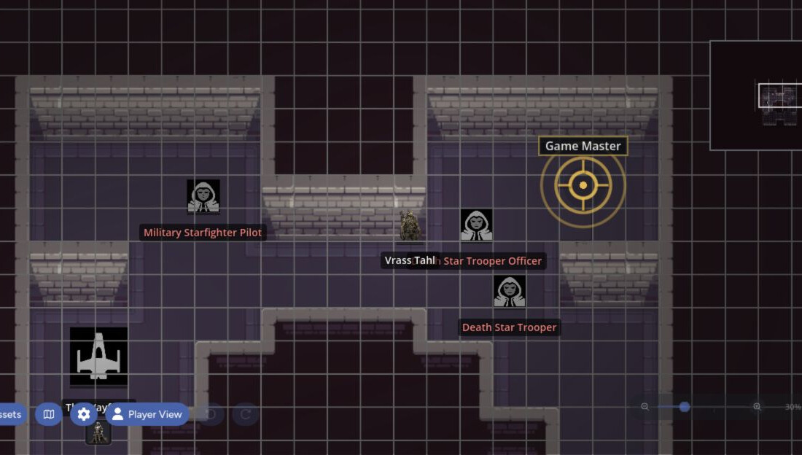
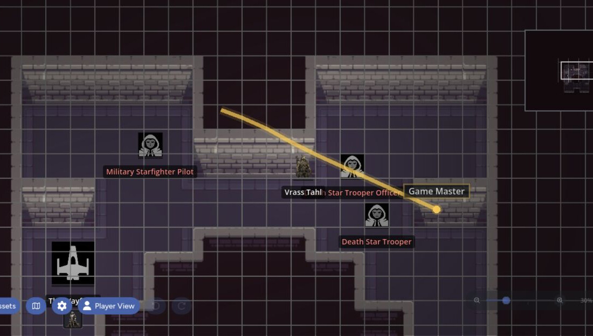

Pings are temporary and meant for the current conversation. Notes stay on the map and work better for labels, clues, reminders, and session prep.

## Point Pings

Use a point ping when you need everyone to look at one location.

- Press `P` to ping the position under your cursor.
- Hold `Alt` and click to ping without changing tools.
- Select the Ping tool, then click the map.

The ping shows your display name. Remote pings use separate colors, and an off-screen indicator points toward a ping outside the current view.

## Tracer Pings

Hold `Alt` and drag to draw a temporary route. Everyone connected to the map sees the trace animate along the path.

Use traces for:

- Showing a movement route
- Pointing out a wall or boundary
- Marking a patrol path
- Explaining an area-of-effect shape

You can also switch the Ping tool to Trace mode and drag normally.

Pings and traces disappear on their own. They aren't saved with the map.

| Point ping | Tracer ping |
| --- | --- |
|  |  |

## Choose Your Display Name

Open **Settings > General > Display as** to choose which available identity appears on your pings and presence information.

## Place a Note

1. Select the Note tool or press `N`.
2. Click the map.
3. Type into the new note.

The tool returns to Pointer mode after placement. Notes are normal map assets, so you can move, resize, copy, layer, hide, and delete them.

## Edit Note Text

Select a note and edit its text directly. The note saves after you finish editing and updates for connected users.

Use the Note Settings panel to change:

- Background color
- Text color
- Font size
- Whether the background is shown

Removing the background works well for room labels and map annotations that should look like text drawn directly on the scene.

## Private and GM-Only Notes

The note's creator can open its context menu and choose **Make Private**. A private note is visible only to its creator.

GMs can also hide a note from all players with the note toolbar or normal asset visibility controls. Maps labels these notes as GM-only in the GM view.

Private and hidden notes stay concealed in [Player Preview](/docs/maps/features/gm-controls#preview-the-player-view).

## Useful Patterns

- Use a private note for a personal reminder.
- Use a hidden note for encounter instructions only the GM needs.
- Use a public note with no background for a room or district label.
- Use a public colored note for clues, objectives, or shared status.
