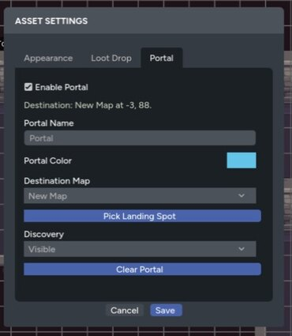

A portal turns a placed asset into a travel point between map pages. Use one for stairs, doors, elevators, hyperspace routes, trapdoors, or any other transition where a token should arrive at a specific location.

Only GMs can create or edit portals. Players can use portals they are allowed to discover.

## Create a Portal

1. Place or select the asset that should act as the portal.
2. Open the asset settings.
3. Select the **Portal** tab.
4. Enable **Enable Portal**.
5. Give it a name and color.
6. Choose a destination map page.
7. Select **Pick Landing Spot**.
8. Maps opens the destination page. Select the arrival position.

Choosing the landing spot saves the portal and returns you to the source page. Use **Save** in Asset Settings only when you change its name, color, discovery mode, or other fields later.

## Discovery Modes

Choose how players find the portal:

- **Visible** shows the portal whenever the underlying asset is visible.
- **Proximity** reveals it when an eligible player token reaches the configured radius.
- **GM Only** keeps the portal unavailable to players.

Proximity uses grid spaces when a grid is active and map pixels when there is no grid. The settings panel explains the current unit next to the reveal radius.

Map visibility still applies. A portal on a hidden asset, under fog, or on a GM-only layer won't reveal itself to players.

## Travel as a Player

Select the portal icon and confirm the destination. If you control more than one eligible token, choose which token travels.

The selected token moves to the saved landing spot on the destination page, and your view follows it.

## Travel as a GM

The GM portal prompt first offers:

- **Move Self**
- **Move Party (GM)**

Choose **Move Party (GM)** to open the travel list and choose specific player and NPC tokens.

This is useful when a doorway or scene transition should move several actors together without dragging each token across map pages.

## Names and Colors

Portal names appear in the travel prompt. Colors tint the portal icon and dialog so linked locations are easier to recognize.

Use matching names or colors for paired routes, such as **North Lift** and **South Lift**, or use distinct colors for different travel networks.

## Save Portals in a Library Map

Portals that point to another map page are saved disabled because that destination won't exist in a different game.

After importing the map, open each disabled cross-page portal and choose its new destination and landing spot.

See [Maps in the Data Library](/docs/maps/features/map-library) for the full save and import workflow.
