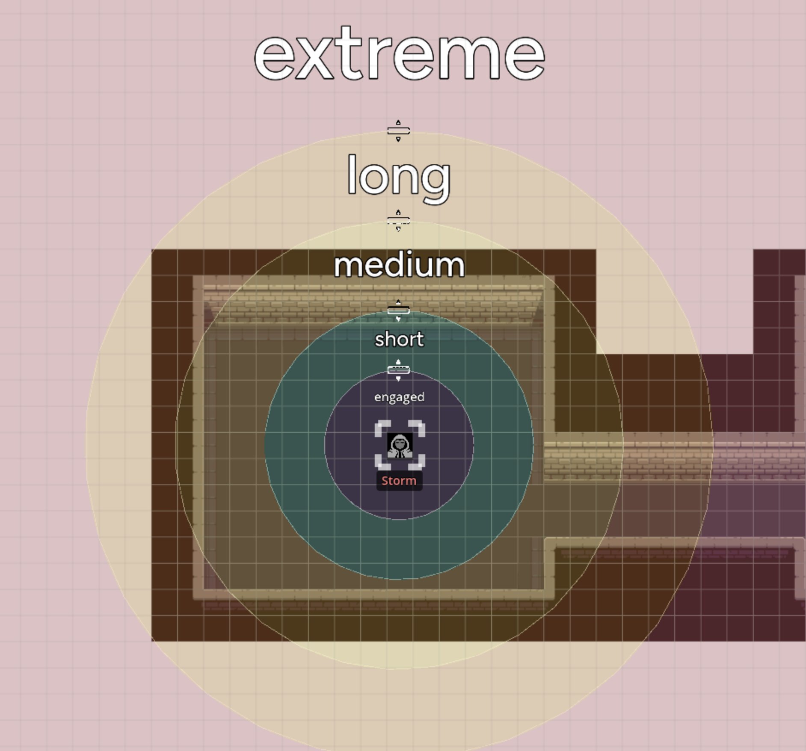
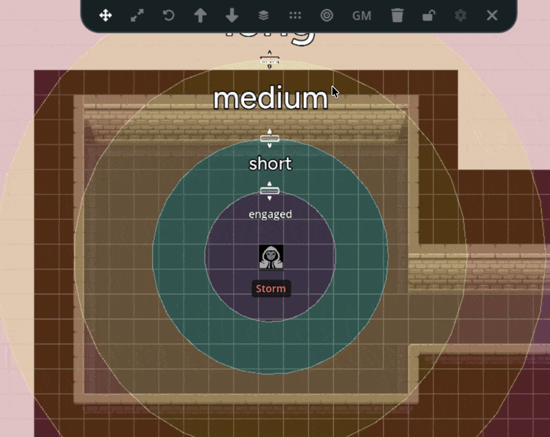

Range bands are colored circular overlays that appear around tokens to represent
combat distances. Instead of counting squares or measuring exact distances, range
bands let you eyeball relative positioning: is that enemy within short range or
medium range? Are your allies close enough to be engaged?

This is the approach used by narrative-focused systems like Genesys and the FFG
Star Wars RPGs, where distances are described in broad categories rather than
precise measurements.

Range band settings are per-map, so all tokens on a map share the same ring
configuration. This keeps distances consistent across the entire encounter.

## The Ring System

Range bands display as five concentric zones around a token, from innermost to
outermost:

| Zone         | Color  | Description                                          |
|--------------|--------|------------------------------------------------------|
| **Engaged**  | Blue   | The innermost area, melee range                      |
| **Short**    | Green  | Close combat, thrown weapons                          |
| **Medium**   | Yellow | Typical ranged combat                                |
| **Long**     | Orange | Long-range weapons, distant spells                   |
| **Extreme**  | Red    | Maximum effective range                               |

Each zone is semi-transparent so you can still see the map and other tokens
underneath. Labels appear within each ring so you can tell at a glance which
zone a target is standing in.

## Enabling Range Bands on a Token

To display range bands on a token:

1. **Select a token** on the map
2. Click the **Range Band** button in the token's control panel

The range band overlay appears centered on the token. You can enable range bands
on multiple tokens, but only the currently selected token's range bands are
visible at a time.

## Adjusting Ring Sizes

Each ring has a draggable handle that lets you resize it. This is how you
calibrate the range bands to match your map's scale and your system's distance
categories.

When you drag a handle:

- **Dragging the Short ring** (the innermost) scales all outer rings
  proportionally, keeping the relative spacing between zones consistent
- **Dragging an outer ring** adjusts that ring and pushes any rings beyond it
  outward if they would overlap

The rings enforce a minimum spacing between each other so they never collapse
into an unreadable mess, and there's a maximum size limit to prevent rings from
extending far beyond the visible map area.

## Saving and Syncing

Range band configurations are saved automatically. When you adjust the rings:

1. The new sizes are saved to the current map page
2. All connected players see the updated rings in real-time
3. The configuration persists between sessions

Since range bands are page-level settings, adjusting the rings on one token
updates the ring sizes for every token on that page. This means you only need to
calibrate once per map page, and all tokens share the same distance scale.

## Removing Range Bands

To remove range bands from a token:

1. **Select the token** with range bands enabled
2. Click the **Delete Range Bands** button in the token's control panel

This removes the overlay from that token. Other tokens with range bands enabled
are unaffected.

## When to Use Range Bands

Range bands are most useful when your game system uses narrative or abstract
distances rather than precise grid-based measurement.

**Good fit for range bands:**
- **Genesys / FFG Star Wars**: These systems define combat ranges as Engaged,
  Short, Medium, Long, and Extreme, which map directly to the five ring zones
- **Other narrative systems**: Any game that describes distance in broad
  categories rather than exact feet or meters
- **Theater-of-the-mind with a visual aid**: When you want a general sense of
  positioning without the precision of a tactical grid

**Better served by the grid:**
- **D&D / Pathfinder tactical combat**: If your system measures movement in 5ft
  squares or 1m hexes, the [grid system](/docs/maps/features/grid-system) with
  snapping gives you the precision you need
- **Exact range calculations**: When you need to know that an enemy is exactly
  30ft away, a grid with cell counting is more reliable

You can have both a grid and range bands active at the same time. Some GMs use
the grid for movement and range bands as a quick visual reference for ability
ranges or zone effects.

## Tips

- **Calibrate early in your session**. Before combat starts, enable range bands
  on a token and adjust the rings to match your map's scale. Once they're set,
  every token on the page uses the same configuration.
- **Use the Short ring as your anchor**. Since dragging the Short ring scales
  all others proportionally, start by setting it to whatever "close range"
  means in your system, then fine-tune the outer rings individually if needed.
- **Combine with fog of war**. Range bands respect [fog of war](/docs/maps/features/fog-of-war)
  visibility. You can use fog to hide parts of the map while still using range
  bands to gauge distances in the revealed areas.
- **Don't overthink precision**. Range bands are intentionally approximate.
  They're a visual guide, not a ruler. If a token is clearly within a ring, it's
  in that range category. If it's right on the border, make a judgment call,
  that's the narrative spirit of these systems.
