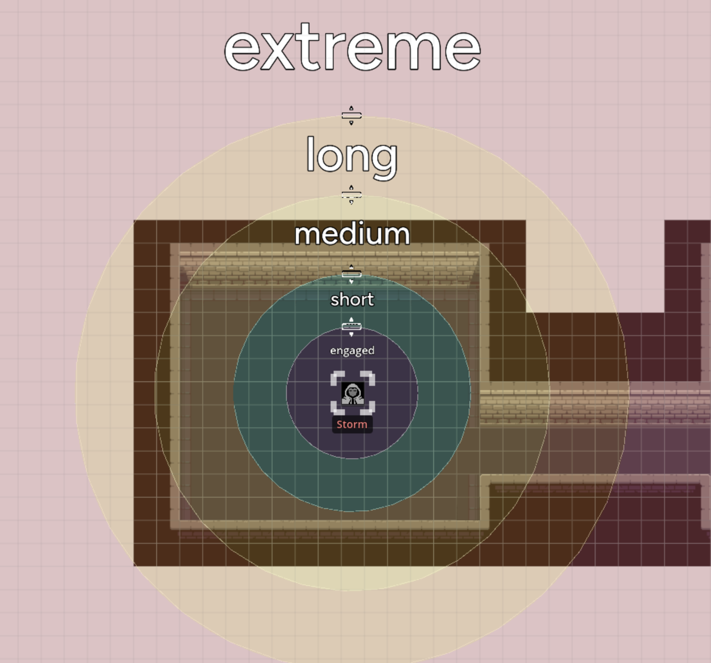
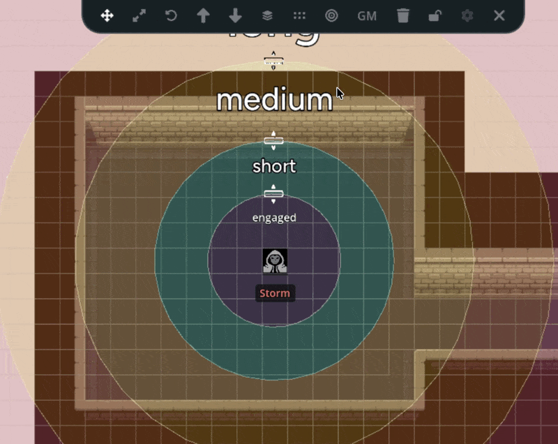

Range bands show Engaged, Short, Medium, Long, and Extreme distance around a token. They work well for Genesys, FFG Star Wars, and other games that use broad distance categories instead of exact measurements.

The band sizes are saved for the current map page. Every token on that page uses the same scale.

## Show Range Bands

1. Select a token.
2. Select **Range Bands** in its controls.

The rings appear around that token. You can enable range bands on several tokens, but Maps only displays them for the current selection.

| Band | Color | Typical Use |
|------|-------|-------------|
| Engaged | Blue | Melee and direct interaction |
| Short | Green | Close attacks and thrown weapons |
| Medium | Yellow | Common ranged attacks |
| Long | Orange | Distant attacks |
| Extreme | Red | Maximum practical range |

## Set the Scale

Drag a ring's handle to resize it.

- Dragging the Short ring scales the outer rings with it.
- Dragging an outer ring changes that band and pushes later rings outward when needed.

Set the Short band first, then adjust the other ranges to match the map.

Changes save automatically and update for connected players. Because the sizing belongs to the page, you only need to calibrate it once for that map.

## Remove Range Bands

Select the token, then select **Delete Range Bands**. Other tokens with range bands stay unchanged.

## Range Bands or a Grid

Use range bands when the exact distance matters less than the category. Use the [Grid System](/docs/maps/features/grid-system) when movement or attacks depend on a specific number of cells.

Both can be active at the same time. A table might use the grid for movement and range bands as a quick check for abilities or weapon distance.
