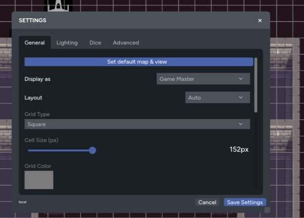
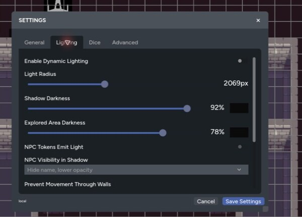
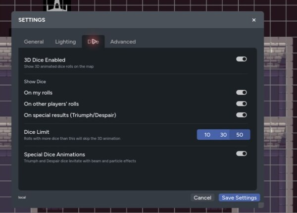
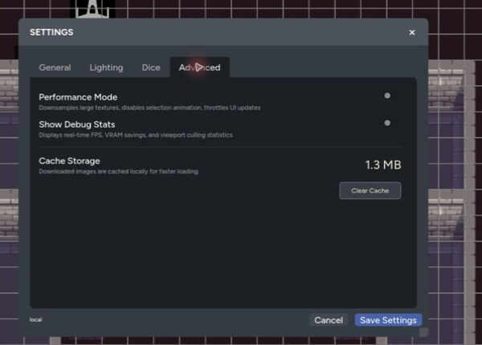

Map settings control how the current game looks and behaves on your device. Shared map settings, such as the grid and dynamic lighting, affect the table. Display and performance settings help you tune your own view.

Open **Settings** from the map controls. The panel is split into General, Lighting, Dice, and Advanced tabs.

| General | Lighting |
| --- | --- |
|  |  |
| Dice | Advanced |
|  |  |

## General Settings

The General tab includes:

- **Set default map & view** to save the starting page and camera position
- **Display as** for pings and other table activity
- **Layout**: Auto, Desktop, or Mobile
- **Grid Type**, **Cell Size (px)**, and **Grid Color**
- Background color
- **Background Image** selection and scale
- **Show Character Name Labels**
- **Quick Character/Vehicle Sheets**
- **Mini Map**
- **Zoom Indicator**
- **Initiative Tracker**
- **Greyscale Defeated Tokens**
- **Restrict Token Movement to Owners**

Choose **Auto** unless you need to force a layout. Mobile keeps the map canvas available while moving its main tools into a touch-friendly bottom bar.

## Lighting Settings

The Lighting tab controls dynamic lighting, token light, exploration, shadows, and wall collision. These settings change what the table can see, so test them with Player Preview before a session.

See [Lighting and Walls](/docs/maps/features/lighting-and-walls) for the full setup.

## Dice Settings

Turn on **3D Dice Enabled** to animate rolls on the map. You can choose whether animations appear for:

- Your own rolls
- Other players' rolls
- Rolls containing a Triumph or Despair

The dice limit sets the largest pool that will animate. Larger rolls still resolve, but skip the 3D animation. Lower the limit if dice animations cause a frame-rate drop.

**Special Dice Animations** adds extra effects to qualifying results. Performance Mode temporarily disables 3D dice without changing your saved dice preference.

## Performance Mode

Performance Mode lowers the cost of rendering a busy map. It:

- Downsamples large textures
- Disables selection animations
- Reduces the rate of some interface updates
- Disables 3D dice while active

Turn it on when a large background, many animated assets, or dynamic lighting makes the map feel slow. You can turn it off again without rebuilding the page.

## Debug Stats

Enable **Show Debug Stats** to display the current frame rate, memory use, viewport culling, and estimated texture savings. This is useful when you're comparing settings or reporting a performance problem.

Debug stats only describe your current device and map view. Other players may get different results from the same page.

## Clear the Asset Cache

Maps caches downloaded images so revisiting a page is faster. If an updated image still shows its old version, open the Advanced tab and select **Clear Cache**.

The asset is downloaded again the next time the map needs it. Clearing the cache doesn't delete anything from the game or your Asset Library.

## Quick Troubleshooting

- If the map is slow, turn on Performance Mode and lower the 3D dice limit.
- If lighting is the main cost, disable shadows or reduce other lighting effects.
- If an image looks out of date, clear the asset cache.
- If controls feel cramped, switch between Auto, Desktop, and Mobile layouts.
- If players can move the wrong tokens, enable owner-restricted movement and check the actor permissions.

For hidden content and player testing, see [GM Controls](/docs/maps/features/gm-controls).
