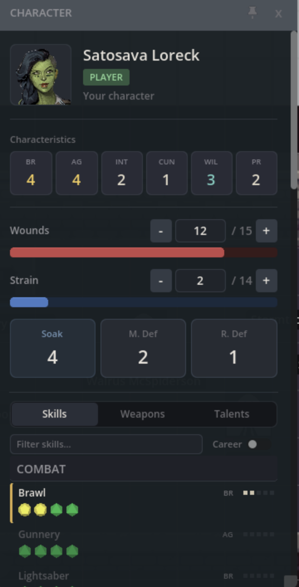
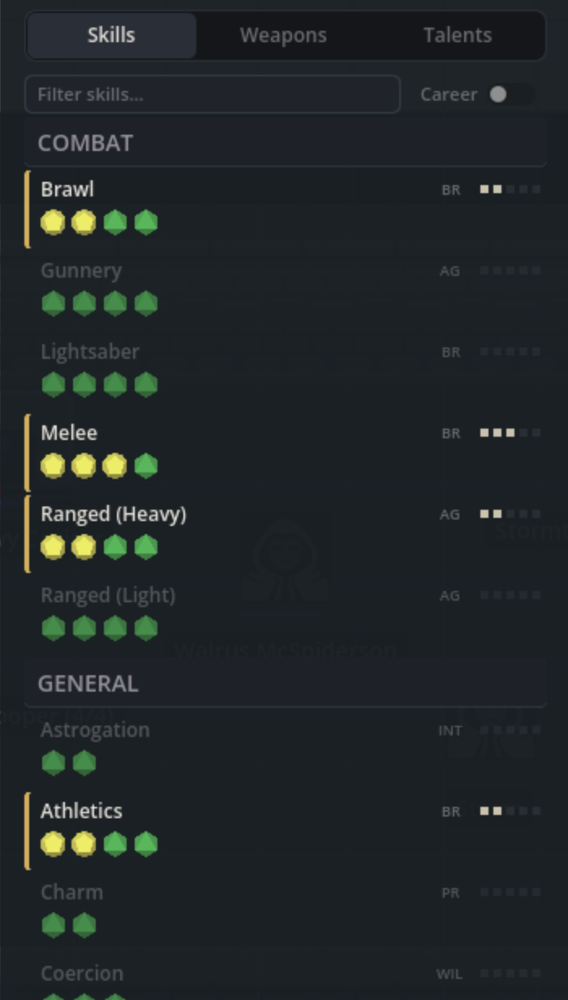
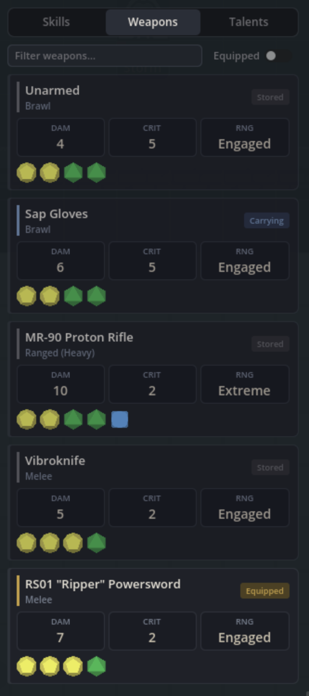
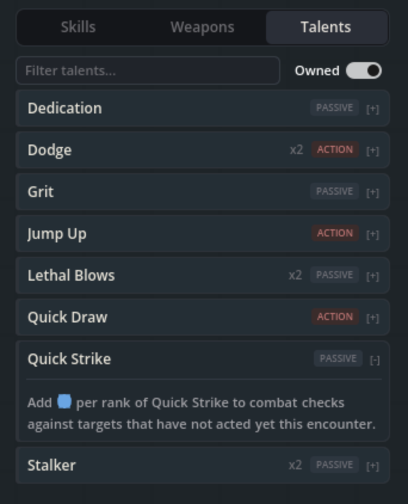
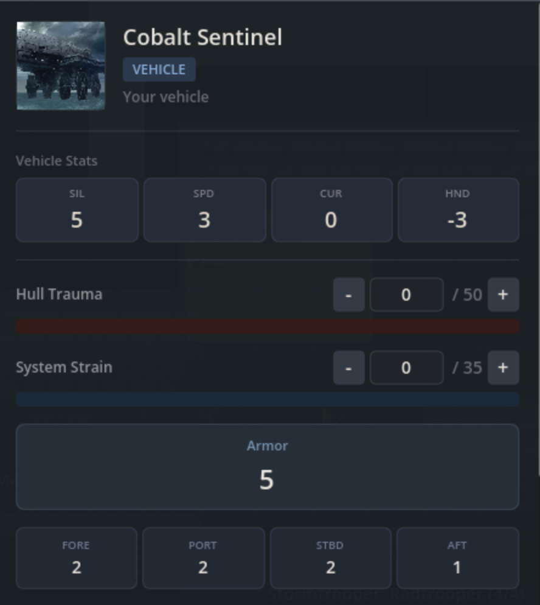

Selecting a character or vehicle token on the map opens a side panel with a focused view of that token's stats. You can check characteristics, browse skills and weapons, and edit wounds or hull trauma without leaving the map.

## Opening the Panel

Select any character or vehicle token on the map. The panel slides in from the right edge of the screen.

To close the panel, click the **x** button in its top-right corner, click empty space on the map to deselect, or select a non-character/vehicle asset.

### Layout Modes

The panel supports two layout modes:

- **Pinned** (default): Docked to the right edge of the screen at full height. Drag the left edge to resize the width.
- **Floating**: A freely draggable window you can position anywhere on screen. Drag the bottom-right corner to resize.

Click the pin icon in the panel header to toggle between modes. Your layout preference and panel size are saved between sessions.

## Character Sheets

When you select a character token, the panel displays the character's full stat block.

### Portrait and Identity

At the top of the panel you'll see:

- **Character portrait** pulled from the character's profile image
- **Character name**
- **Type badge** showing the character's role: Player, NPC, Nemesis, Rival, or Minion

### Characteristics

A six-column grid displays the character's core attributes:

| BR | AG | INT | CUN | WIL | PR |
|---|---|---|---|---|---|
| Brawn | Agility | Intellect | Cunning | Willpower | Presence |

The highest values are highlighted to make them easy to spot at a glance.

### Wounds and Strain

Below the characteristics, progress bars show current wounds and strain against their thresholds. If you have [edit permission](#who-can-edit), each bar includes:

- **[-] and [+] buttons** to step the value down or up by 1
- **Direct input** where you can click the number, type a new value, and press Enter

Changes sync immediately to the token's health bars and to every other player at the table.

#### Rapid Edits

If you click [+] or [-] several times quickly, the panel batches your changes. It waits briefly after you stop clicking, then saves the final value to the database in a single write. This keeps the interface responsive even when applying large amounts of damage.

### Defense and Soak

The panel shows defense and durability stats as individual cards:

- **Soak** value
- **Melee Defense**
- **Ranged Defense**

### Force Rating

For Force-sensitive characters, the panel displays the character's Force rating along with the number of committed Force dice. If you have edit permission, stepper controls let you adjust the committed count.

### Adversary Level

For NPC adversaries, GMs see an adversary level badge on the panel. This is only visible to GMs.

### Minion Groups

When you select a minion group token, the panel shows an additional counter below the defense values:

> 3 / 5 alive

The wounds and strain bars scale to the group's total capacity. A group of 5 minions with wound threshold 5 shows wounds out of 25. As you increase wounds, the minion counter updates to match.

### Skills Tab

The Skills tab lists all of the character's skills, grouped by type: Combat, General, Magic, Social, Knowledge, and Other.

Each skill row shows:

- **Career indicator** (a warm amber border on the left for career skills)
- **Skill name** and linked characteristic abbreviation
- **Rank pips** showing the skill's rank out of 5
- **Dice pool** icons showing the assembled pool for that skill

Use the **Career toggle** at the top to filter down to career skills only. This defaults to on for NPCs and off for player characters.

**Click any skill** to open a dice roll for it in the game table.

### Weapons Tab

The Weapons tab displays the character's weapons as cards, each showing:

- **Weapon name** with a color-coded accent for carry state
- **Stat pills** for Damage (DAM), Critical rating (CRIT), and Range (RNG)
- **Dice pool** icons for the attack roll
- **Weapon qualities** listed below the stats

Use the **Equipped toggle** to filter to equipped weapons only (on by default).

**Click a weapon** to open an attack roll for it in the game table.

### Talents Tab

The Talents tab lists the character's talents, grouped by name. Each entry shows:

- **Talent name** with rank indicator if ranked
- **Activation badge** color-coded by type: Passive, Action, Maneuver, or Incidental
- **Expandable description** (click to reveal the full text)

Special talent types have distinct accent colors. Force talents appear with a violet-blue accent and Conflict talents appear with a crimson accent.

Use the **Owned toggle** to show only purchased talents (on by default). Unpurchased talents appear faded. A **search filter** lets you find talents by name or description text.

## Vehicle Sheets

When you select a vehicle token, the panel switches to a vehicle-specific layout. Vehicle tokens appear in the **At the Table** section of the asset manager under separate "Player Vehicles" and "NPC Vehicles" groups.

### Vehicle Characteristics

A four-column grid displays the vehicle's core attributes:

| SIL | SPD | CUR | HND |
|---|---|---|---|
| Silhouette | Max Speed | Current Speed | Handling |

Handling can be a negative number for less maneuverable vehicles.

### Hull Trauma and System Strain

These work the same way as character wounds and strain. Progress bars show the current values against their thresholds, with editable stepper controls if you have permission.

- **Hull Trauma** tracks physical damage to the vehicle
- **System Strain** tracks stress on the vehicle's systems

### Armor and Defense Zones

Unlike characters (which have melee and ranged defense), vehicles use directional defense zones:

- **Armor** (read-only)
- **Fore** defense
- **Port** defense
- **Starboard** (Stbd) defense
- **Aft** defense

### Vehicle Weapons

Below the defense section, the panel lists the vehicle's installed weapons. Each weapon card shows:

- **Weapon name**
- **Stat pills** for Damage (DAM), Critical rating (CRIT), and Range (RNG)
- **Fire arc tags** indicating which direction the weapon covers

Vehicle weapons are displayed as read-only. There are no Skills or Talents tabs for vehicles.

## Related Features

- **[Character Tokens](/docs/maps/features/character-tokens)**: How tokens link to characters and display stats on the map
- **[GM Controls](/docs/maps/features/gm-controls)**: Visibility settings and other GM-only features
