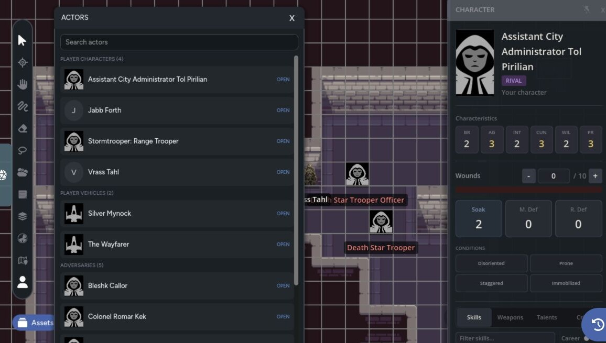
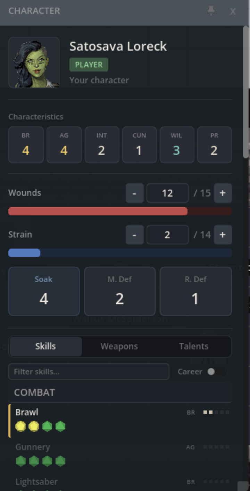
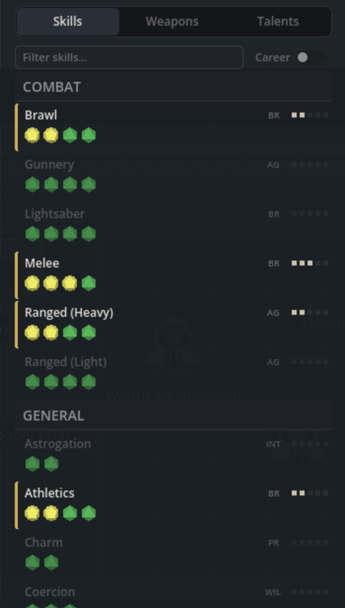
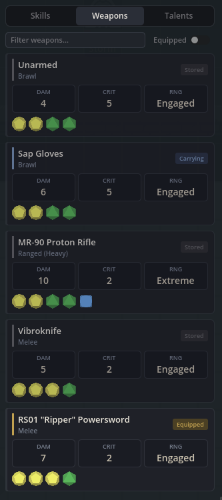
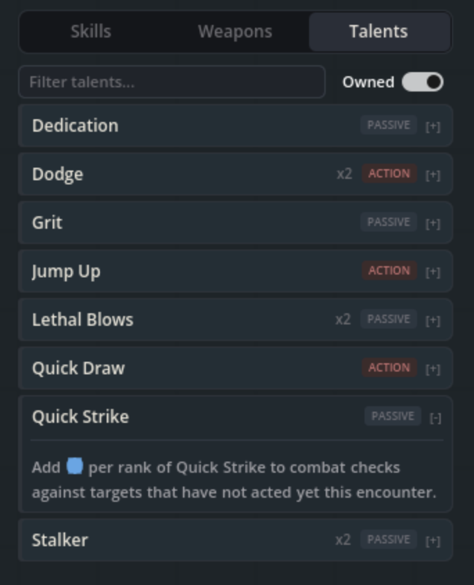
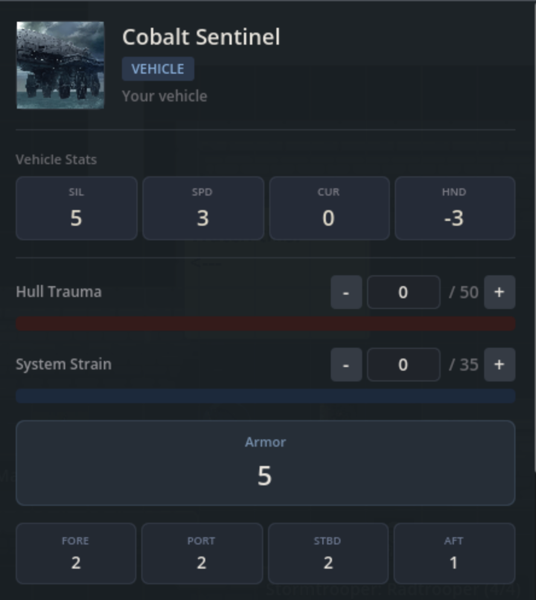

Select a linked character or vehicle token to open its quick sheet. The panel keeps the information you need during play close to the map, including damage, defenses, skills, weapons, talents, spells, critical injuries, vehicle crew, and deck plans.

## Open and Position the Panel

The panel has two layouts:

- **Pinned** attaches to the right edge of the map. Drag its left edge to change the width.
- **Floating** becomes a movable window. Drag its corner to resize it.

Use the pin button in the header to switch layouts. Maps saves your choice and panel size for the next session.

Close the panel with its `x` button. On desktop, select the same token and use the Sheet action in the selected-asset toolbar to reopen it.

The **Quick Character/Vehicle Sheets** setting controls whether selecting a token opens the panel automatically.

Select **Actors** from the map controls to open the game roster without placing a token. Search for an actor, then select **Open** to show its quick sheet.

## Who Can Edit

You can edit a player character you own. GMs can edit NPCs, vehicles, and other actors they manage. Viewers without edit permission get the same sheet without the edit controls.

Actor visibility still applies. A player may see only the actor's name, or may not have access to the full sheet at all. The GM can change NPC visibility from the quick sheet.

## Character Overview

The top of a character sheet includes:

- Portrait, name, and actor type
- Brawn, Agility, Intellect, Cunning, Willpower, and Presence
- Wounds, strain, and soak
- Melee and ranged defense
- Force rating and committed Force dice when used
- Adversary level for GMs
- Remaining count for minion groups

Editable wound, strain, and committed Force values use step buttons and direct number entry. Rapid clicks are grouped into one saved update after you stop.

## Skills

Skills are grouped by Combat, General, Magic, Social, Knowledge, and Other. Each row shows:

- Career status
- Linked characteristic
- Skill ranks
- The assembled dice pool

Use the **Career** filter to hide non-career skills. Select a skill to open its dice pool in the game table.

## Weapons and Targeting

Weapon cards show damage, critical rating, range, qualities, and the attack dice pool. Use the **Equipped** filter to focus on carried weapons.

Selecting a weapon starts a map targeting flow when a valid attacker token is on the map. Pick a target to add map context such as range and line of sight before the attack moves to the game table. Cancel targeting with `Escape`.

## Talents

The Talents tab groups repeated and ranked talents, then shows their activation type and description. Use the **Owned** filter to hide unpurchased tree entries, or search by talent name and description.

Force and Conflict talents use separate accents so they stand out from regular talents.

## Spells

Characters with the spellbook feature enabled get a Spells tab. Spell cards can show:

- Spell action and magic skill
- Range and strain cost
- Concentration requirement
- Qualities and additional effects
- The full dice pool
- Description and mechanical effect

Select the dice pool to open the spell builder on the game table. The roll starts with the spell's current difficulty and the character's magic skill.

## Critical Injuries

The Crits tab keeps active and healed critical injuries together. Active injuries appear first, while healed entries move into Recovered History.

If you can edit the character, you can:

- Choose an enabled critical table
- Add a manual modifier in steps of 10
- Roll a new critical injury
- Mark an injury healed or active
- Delete an entry

Viewers without edit permission can still read criticals allowed by the actor's visibility.

## Vehicle Overview

A vehicle sheet replaces character stats with:

- Silhouette, speed, current speed, and handling
- Hull trauma and system strain
- Armor
- Fore, Port, Starboard, and Aft defense
- Installed weapons and fire arcs
- Vehicle critical hits
- Assigned crew

Handling can be negative. Current speed, hull trauma, and system strain can be edited when you have permission.

Vehicle criticals use the same roll, heal, restore, and delete workflow as character criticals, but they use the game's enabled vehicle critical tables.

## Crew and Deck Plans

Assigned crew appear below the vehicle portrait and under the token. Select an identified crew portrait to switch the quick sheet to that character.

Vehicles with a deck plan get an **Open Deck Plan** button. The deck view shows areas, crew, actions, weapons, and the vehicle layout. See [Vehicle Deck Plans](/docs/maps/features/vehicle-deck-plans) for the full workflow.

When a character is assigned to a vehicle area, their own sheet gets a **Crewing** section with that area's actions and weapons. This lets the player roll vehicle actions without leaving the character sheet.

## Live Updates

Sheet changes update the map token and other connected clients. If another player changes the same actor through the game table, the open quick sheet refreshes without forcing you back to the top of the panel.

Use [Character and Vehicle Tokens](/docs/maps/features/character-tokens) for token placement, visibility, and movement rules.
