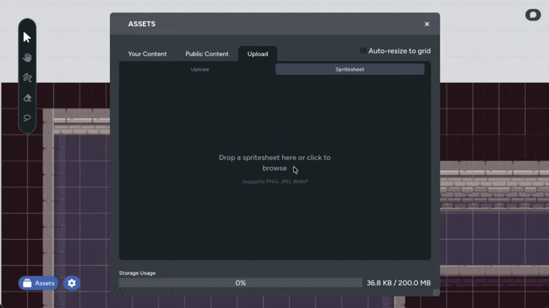

If you work with tiled map art, you've probably downloaded spritesheet images
where dozens of tiles are packed into a single file. Rather than cutting them
apart in an image editor, you can import spritesheets directly in Maps and
split them into individual assets automatically.

## Opening the Spritesheet Tool

The spritesheet importer lives in the asset manager:

1. Open the **Asset Manager** panel
2. Navigate to the **Upload** tab
3. Switch to the **Spritesheet** sub-tab

You'll see a drop zone prompting you to select an image.

## Selecting a Spritesheet Image

Click the drop zone or the **Choose Image** button to open a file picker,
then select a spritesheet image.

Once loaded, the tool displays a preview of your spritesheet with a grid
overlay showing where the tiles will be cut.

## Configuring the Grid

The configuration controls let you tell the tool how your spritesheet is
laid out. Adjust these until the grid overlay lines up with the tiles in
your image.

- **Tile Width / Tile Height**: The pixel dimensions of each tile. Changing
  these automatically recalculates the number of columns and rows.
- **Columns / Rows**: The number of tiles across and down. Changing these
  automatically recalculates the tile dimensions.
- **Spacing**: The pixel gap between tiles in the spritesheet. Some
  spritesheets have padding between tiles; set this to match. Defaults to 0.

Tile dimensions and column/row counts stay in sync. Change one pair and the
other updates to match. The grid overlay on the preview updates in real time
as you adjust these values, so you can visually confirm the grid lines up
with your tiles.

### Skip Transparent Tiles

The **Skip Transparent Tiles** checkbox (enabled by default) tells the
importer to ignore tiles that are completely transparent. This is useful for
spritesheets that have empty slots, since you probably don't want blank
images cluttering your asset library.

A tile is only skipped if every single pixel in it is fully transparent.
Tiles with even partial content are kept.

## Previewing Tiles

Below the configuration controls, a tile preview grid shows thumbnails of
each tile that will be imported. The preview updates as you change the grid
settings, so you can confirm everything looks right before uploading. If
your spritesheet has more than 200 tiles, the preview shows the first 200.
The full set still uploads correctly; the limit only applies to the preview.

A label below the previews shows how many tiles are ready to upload. If
transparent tile skipping is enabled, it also shows how many empty tiles
were excluded.

## Choosing a Folder

By default, tiles are uploaded to your **My Assets** folder. To choose a
different destination, click the **folder button** and select from your
existing asset folders.

## Uploading

Click **Upload** to start importing. Each tile is extracted from the
spritesheet, converted to PNG, and uploaded to your asset library. The
button shows upload progress as each tile is processed.

Once all tiles finish uploading, the asset library refreshes automatically
and you're returned to the browse view where you can start placing your new
tiles on the map.

## Tips

- **Optionally match tile size to your grid**: If you're building tiled maps, set your
  [grid cell size](/docs/maps/features/grid-system#cell-size) to match the
  tile dimensions from your spritesheet, for the best view. However, if the size is too
  small, combine it with the [auto-resize to grid](/docs/maps/features/grid-system#auto-resize-to-grid)
  feature and each tile will fit perfectly into a cell as you place it.
- **Check spacing carefully**: If tiles appear slightly offset in the
  preview, your spritesheet likely has spacing between tiles. Increase the
  spacing value until the grid lines up.
- **Organize with folders**: Create a folder for each tileset before
  importing. This keeps your asset library tidy when you're working with
  multiple spritesheets.
