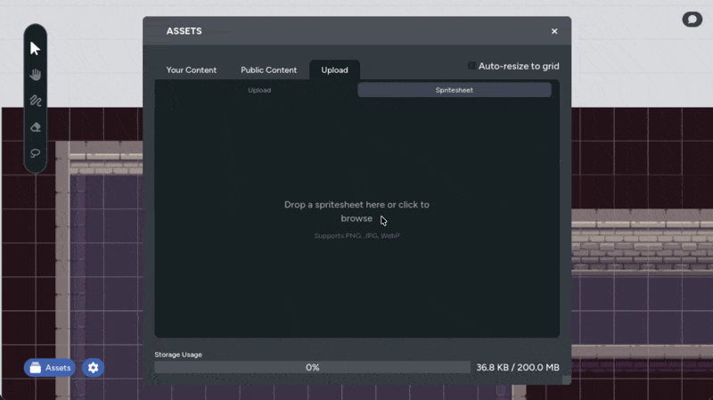

The spritesheet importer cuts a packed image into separate tiles and uploads them to your Asset Library. Use it for terrain sets, token sheets, and other art that would otherwise need to be split in an image editor.

## Open the Importer

1. Open **Assets**.
2. Select **Upload**.
3. Open the **Spritesheet** tab.
4. Choose an image.

The importer shows the image with a cutting grid and a preview of the resulting tiles.

## Align the Cutting Grid

Set the values that match the source image:

- **Tile Width** and **Tile Height** set each tile's pixel dimensions.
- **Columns** and **Rows** set how many tiles the image contains.
- **Spacing** accounts for gaps between tiles and defaults to `0`.

Changing the tile dimensions recalculates the row and column counts. Changing the counts recalculates the dimensions. Use the preview grid to check the result before uploading.

## Skip Empty Tiles

**Skip empty tiles** is enabled by default. It excludes a tile only when every pixel in that tile is fully transparent.

The preview shows up to the first 200 tiles. This preview limit doesn't reduce the number uploaded.

## Choose a Destination

Use the folder control to choose an Asset Library folder. Without a selection, the new tiles go to **My Assets**.

Create a folder before importing when you want the full set kept together.

## Upload the Tiles

Select **Upload**. Maps extracts each tile as a PNG, uploads it, and reports progress. When the upload finishes, the Asset Library refreshes with the new images.

## Use the Tiles on a Grid

For a tiled map:

1. Set the [grid cell size](/docs/maps/features/grid-system#choose-a-grid) to match the tile scale.
2. Enable auto-resize for newly placed assets.
3. Place the tiles from their folder.
4. Use grid duplication to build repeated rows or columns.

If the preview cuts through the artwork, check the tile size and spacing before changing the map grid.
