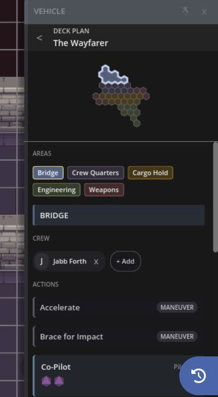

Vehicle deck plans turn a vehicle sheet into a playable station layout. Each colored area can hold crew, weapons, actions, and other vehicle options, so everyone can see where they are working and what they can do there.

## Open a Deck Plan

1. Open a vehicle's quick sheet.
2. Select **Open Deck Plan**.
3. Select an area on the plan to inspect its crew and options.

The plan opens inside the vehicle sheet. Select the back control to return to the main vehicle details.

If a vehicle doesn't have a deck plan in its map details, the **Open Deck Plan** button isn't shown.

## Read the Plan

Deck plan cells use each area's assigned color. Selecting an area highlights its cells and opens its details.

The area can show:

- Assigned crew
- Vehicle weapons
- Actions
- Maneuvers
- Incidentals

Weapon and action cards can start their checks from the deck plan. Maneuvers and incidentals are shown as reference information.

## Assign Crew

The GM can add or remove eligible characters from an area. A character can serve in one vehicle area at a time.

Crew members also get a vehicle section on their own quick sheet. It identifies the vehicle and assigned area, then shows the actions and weapons available from that station. This lets a player work from their character sheet without keeping the full deck plan open.

Masked or unidentified crew follow the same visibility rules used elsewhere on the map. Their private identity isn't exposed through the deck plan or vehicle token.

## Make Vehicle Checks

Select a weapon or action to open its check. The roller uses the acting crew member, vehicle data, station options, and current effects when building the pool.

If an option needs a target, select the target on the map before rolling. The normal quick-sheet result and effect controls apply after the roll.

## Defense Arcs and Crew Portraits

Selecting a vehicle can show its defense arcs around the token: Fore, Starboard, Aft, and Port. The stronger the defense value, the brighter that arc appears.

Crew portraits appear under the vehicle token. Select an identified portrait to open that character's quick sheet. These portraits give the table a quick view of who is aboard without opening the deck plan.

For the rest of the vehicle sheet, see [Character and Vehicle Sheets](/docs/maps/features/sheets#vehicle-overview).
