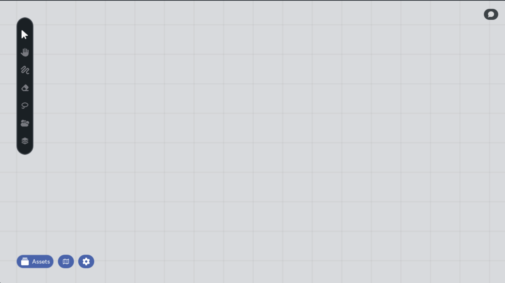
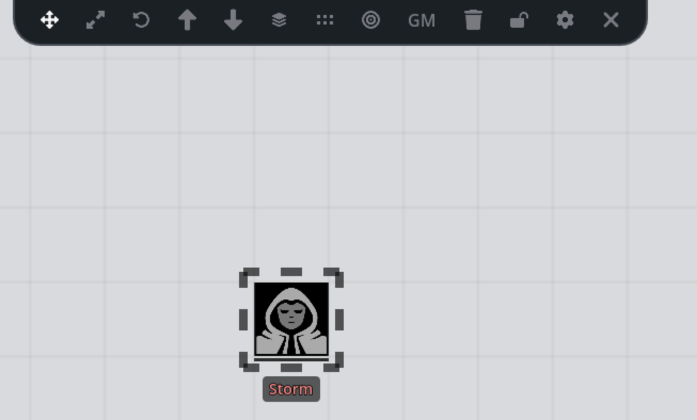
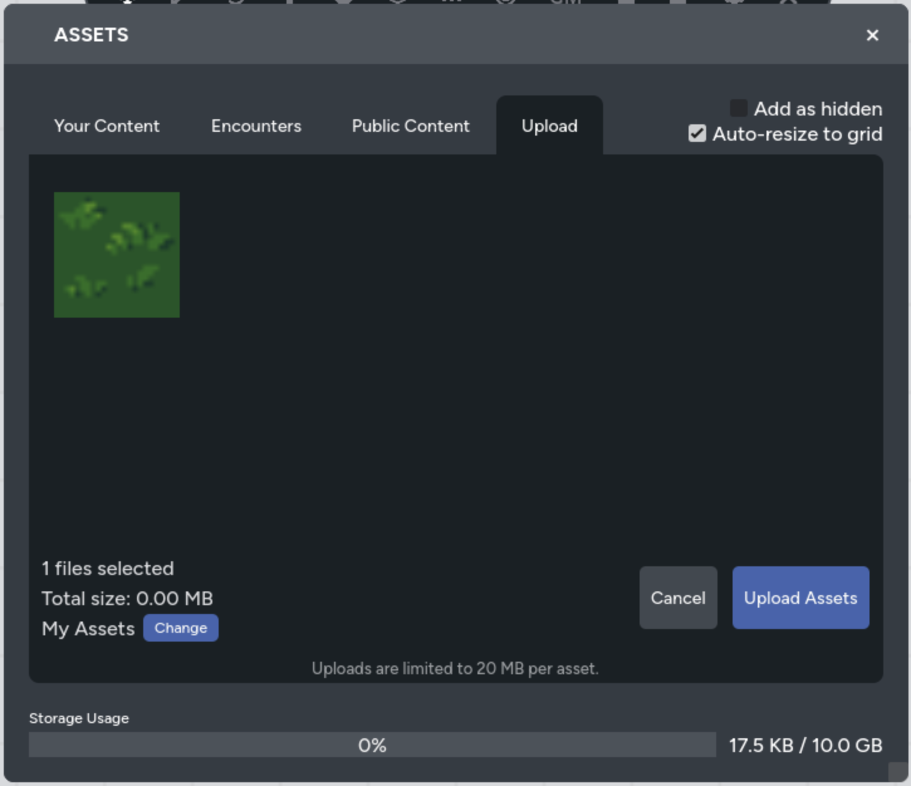

Sessions Maps is a browser-based tool that runs inside the RPG Sessions website.
You don't need to install anything. Open your game, click into Maps, and you're
ready to go! Everything happens in real-time: when the GM places a token or 
reveals an area, every connected player sees it instantly.

This guide walks you through accessing Maps for the first time, understanding the
interface, and getting your first map set up.

## Accessing Maps

Maps are accessed through the RPG Sessions website. You'll need an RPG Sessions
account and membership in a game that has Maps enabled.

1. Go to [rpgsessions.com](https://rpgsessions.com) and log in
2. Open your game table
3. Click into the Maps section

The map loads directly in your browser. Authentication happens automatically — you
don't need to log in a second time.

:::note[Patreon Required]
Sessions Maps requires an **Adventurer tier or higher** Patreon subscription, or
a game table with an Adventurer-tier table token assigned. [Support us on
Patreon](https://www.patreon.com/rpgsessions) to unlock Maps.
:::

### First Load

When you open Maps for the first time:

- **If you're the GM** and no maps exist yet, a default map is created for
  you automatically. You'll land on an empty canvas ready for assets.
- **If you're a player**, you'll see whatever map page the GM has set as the
  default view. If the GM hasn't set one yet, you'll see the first available page.

## The Interface

The Maps interface is designed to stay out of your way until you need it. Here's
what you'll find on screen.

### Left Toolbar

The vertical toolbar on the left side of the screen holds your tools. From here
you can switch between the pointer, hand (pan), draw, eraser, lasso select, and
other tools. Clicking a tool activates it, and some tools open additional options
in a side panel.

You don't need to memorize all the tools right away. The two you'll use most
when starting out are the **Pointer** (for selecting and moving assets) and the
**Hand** tool (for panning around the map).

### Bottom-Left Panel

Three buttons sit in the bottom-left corner:

- **Asset Library** — Opens the panel where you browse and add images, tokens,
  and character assets to the map
- **Map Management** — Browse and switch between map pages and folders
- **Settings** (gear icon) — Opens the settings panel for grid configuration
  and other options

### Top Asset Controls

When you select one or more assets on the map, a control bar slides down from
the top of the screen. This gives you quick access to move, resize, rotate, lock,
hide, and delete the selected assets. It only appears when something is selected,
so it won't clutter your view otherwise.

### Home Button

The infinite scroll map makes it easy to get lost. If you've panned far from 
your starting position, a home button appears on screen on the bottom left. 
Click it to smoothly animate back to the default view position and zoom.

### Presence Indicator

When multiple people are connected to the same map, a green indicator appears
in the upper-right showing how many users are online. Hover over it to see a
list of who's connected and whether they're on the same map page as you. GMs
also see a summon button here to bring all players to their current view.

## Navigating the Map

Before adding anything, get comfortable moving around the canvas.

### Panning

Move your view across the map using any of these methods:

- **Hand tool**: Select the Hand tool (`H`) and click-drag to pan
- **Middle mouse button**: Hold and drag to pan, works with any tool active
- **Space bar**: Hold Space and move your mouse to pan, works with any tool active
- **Two-finger drag**: On touch devices, drag with two fingers to pan

### Zooming

Zoom in and out to get the right level of detail:

- **Scroll wheel**: Scroll up to zoom in, scroll down to zoom out
- **Keyboard**: `Cmd/Ctrl` + `+` to zoom in, `Cmd/Ctrl` + `-` to zoom out,
  `Cmd/Ctrl` + `0` to reset to default zoom

## Adding Your First Map Image

An empty canvas isn't very useful. Let's add a background map image.

1. Click the **Asset Library** button in the bottom-left to open the asset panel
2. Upload a map image (a dungeon layout, a tavern floor plan, a wilderness scene —
   whatever your session calls for)
3. Click the uploaded image to save it to your assets
4. Click on the asset to add it to the map

The image appears on the canvas. You can now:

- **Move it** by selecting it with the Pointer tool and dragging
- **Resize it** by selecting it and using the resize control in the top toolbar
- **Lock it in place** by selecting it and clicking the lock button in the top
  toolbar, so nobody accidentally drags it during play

:::tip
Lock your background map image after positioning it. This prevents anyone from
accidentally moving it when they're trying to interact with tokens on top 
of it. You can learn more about locking in the [GM Controls](../features/gm-controls.md) overview.
:::

## Adding Tokens

With a map image in place, you'll want to add tokens for characters and NPCs.

### Character Tokens

The asset library has an **At the Table** section that shows all characters in
your current RPG Sessions game. Click a character to add their token to the map.

Character tokens are special — they're linked to the character data from your game:

- **Name labels** appear below the token automatically
- **Wound and strain bars** display below the token and update in real-time as
  characters take damage through the bot or website
- **Minion groups** show an elimination counter (e.g., "Stormtroopers 3/5")

For more details on how character tokens work, see
[Character Tokens](/docs/maps/features/character-tokens).

### Image Assets

You can also add plain images as tokens or scenery. Upload any image through the
asset library and click it to place it on the map. These work well for:

- Terrain pieces and props
- Custom token art not linked to a character
- Environmental markers and decorations

## Basic Asset Controls

Once assets are on the map, here are the essentials for working with them.

### Selecting

Click an asset with the Pointer tool (`V`) to select it. Click empty space to
deselect. Hold `Shift` and click to add assets to your selection, or use the
Lasso tool (`L`) to draw a freeform selection area around multiple assets.

### Moving

With an asset selected, drag it to reposition. If a grid is enabled, you can also
use **arrow keys** to move assets one grid cell at a time, or **Shift + arrow
keys** to move five cells at a time.

### Resizing and Rotating

Select an asset and use the **Resize** or **Rotate** buttons in the top control
bar. You can also press `Z` for resize mode or `R` for rotate mode, then drag
on the asset.

### Copy and Paste

- `Cmd/Ctrl` + `C` to copy selected assets
- `Cmd/Ctrl` + `V` to paste them

### Undo and Redo

- `Cmd/Ctrl` + `Z` to undo
- `Cmd/Ctrl` + `Shift` + `Z` to redo

## Setting Up the Grid

If your game uses tactical movement, you'll want to configure the grid overlay.

1. Open **Settings** (gear icon in the bottom-left)
2. Choose your grid type: **Hexagonal**, **Square**, **Hexagonal Rotated**, or
   **None**
3. Adjust the **cell size** slider to match your map image's scale
4. Pick a **grid color** that's visible against your map

When the grid is active, assets can snap to grid positions using the **Align to
Grid** button in the asset controls. Arrow key movement also follows the grid.

## Saving and Default View

Your work saves automatically. Every change — moving an asset, drawing a line,
placing fog — is saved to the server the moment it happens. There's no save button
to remember and no risk of losing work if you close the browser.

### Setting the Default View

As a GM, you can set the camera position and zoom that players see when they first
load the map:

1. Navigate your camera to the position and zoom level you want
2. Open **Settings** (gear icon)
3. Click **Set current view as default**

This also marks the current page as the starting page for the game. When anyone
opens Maps, this is where they'll land.

## What's Next

You now have a map with a background, tokens, and a grid. From here, you can
explore the features that make Sessions Maps a full tactical tool:

- **[Fog of War](/docs/maps/features/fog-of-war)**: Hide parts of the map and
  reveal them as players explore
- **[Character Tokens](/docs/maps/features/character-tokens)**: Deep dive into
  linked tokens, visibility levels, and minion groups
- **[Grid System](/docs/maps/features/grid-system)**: Advanced grid configuration
  and alignment tools
- **[GM Controls](/docs/maps/features/gm-controls)**: Asset visibility, player
  summoning, map management, and encounters
- **[Layers](/docs/maps/features/layers)**: Organize assets across multiple
  layers with per-layer visibility and locking
- **[Keyboard Shortcuts](/docs/maps/reference/keyboard-shortcuts)**: Full
  reference for all available shortcuts

Need help? Join our [community Discord](https://discord.gg/DfEkRzUbjk) for
support and tips from other users.
