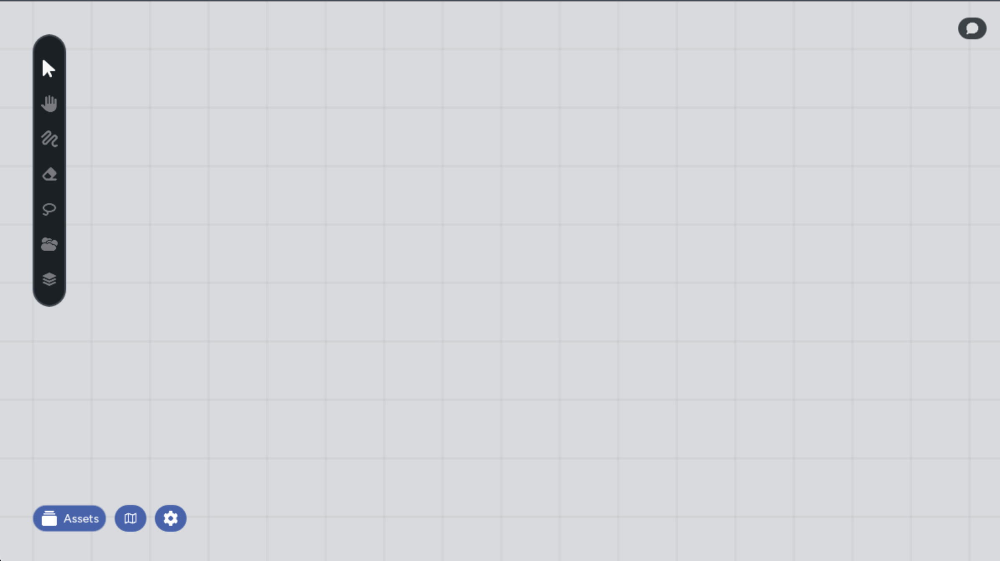
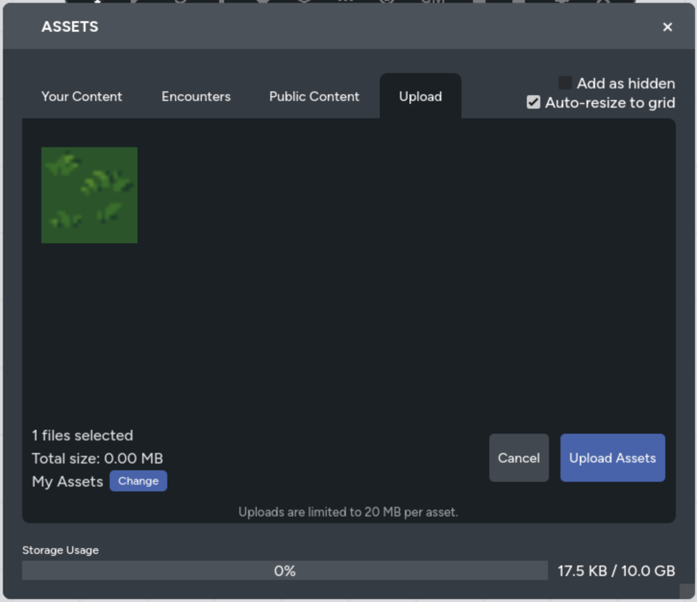
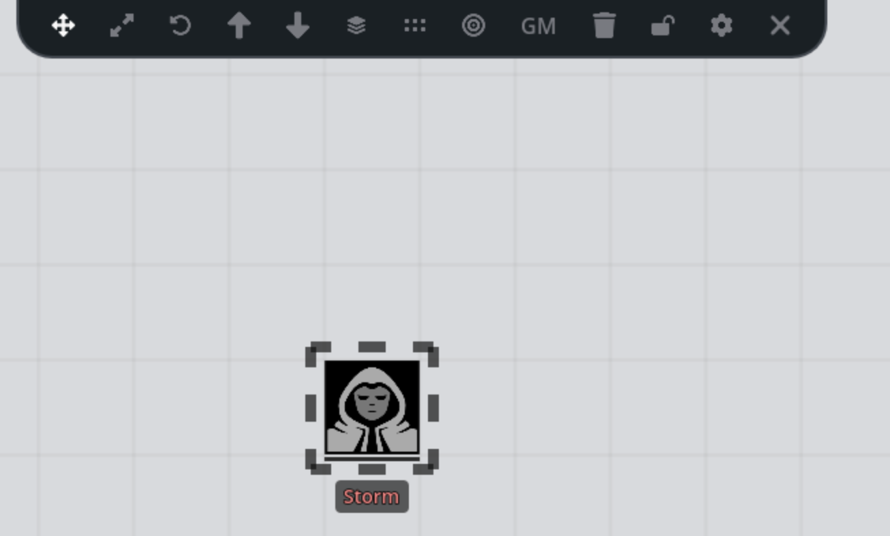
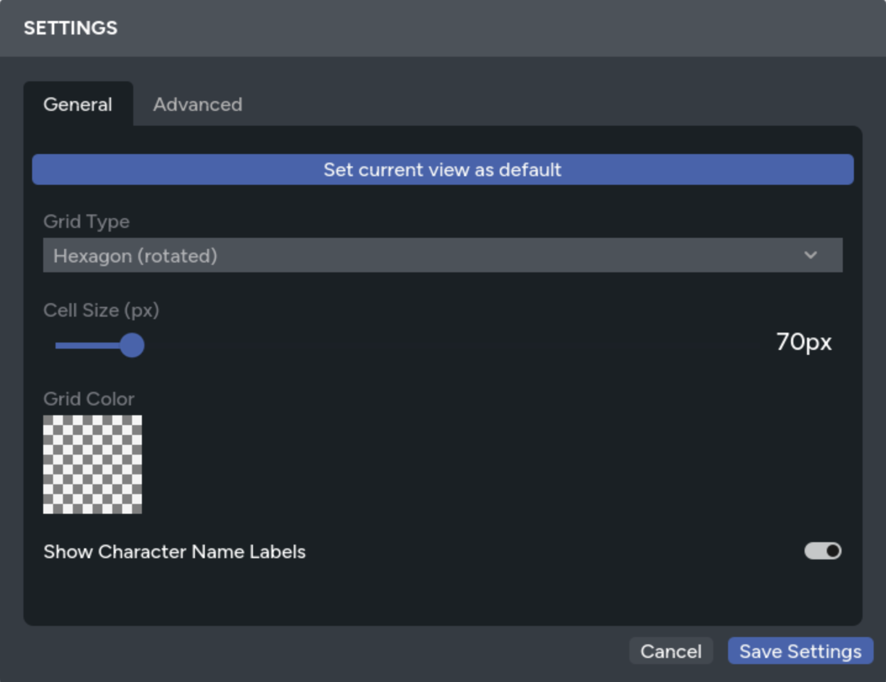

If you're opening Maps for the first time, start with a background, one character token, and a grid. That gives you enough to learn the controls without setting up every feature at once.

## Before You Start

You'll need:

- An RPG Sessions account
- Membership in an RPG Sessions game
- A game with Maps access through a Patreon subscription or table token
- GM access if you want to create pages, upload assets, or change map settings

## Open Maps

1. Sign in at [rpgsessions.com](https://rpgsessions.com).
2. Open your game table.
3. Select **Map Editor**.

Maps loads inside the game table and uses your existing session. You don't need to sign in again.

If the game doesn't have a map yet, the GM gets an empty page to start from. Players open on the game's default map page.

## Learn the Main Controls

The desktop layout keeps map tools along the left side. The controls that open larger panels sit around the map edge. On a phone or narrow tablet, those actions move into a top bar and floating tool menu.

### Left Toolbar

The toolbar includes:

- **Pointer** for selecting and moving assets
- **Ping** for marking locations and tracing routes
- **Hand** for panning
- **Brush** and **Eraser** for drawing
- **Lasso** for selecting several assets
- **Fog** for covering and revealing areas
- **Walls** for lighting, line of sight, doors, and movement blocking
- **Notes** for placing editable text
- Panel buttons for layers, clocks, map assets, and other map tools

You don't need all of these for your first map. Start with the Pointer and Hand tools.

### Map Panels

The main panels cover different jobs:

- **Assets** holds uploaded images, actors, encounters, and public content.
- **Maps** holds map pages and folders.
- **Map Assets** lists named characters and vehicles on the current page.
- **Settings** controls the grid, background, display options, dice, lighting, and performance.

Panels can overlap on a large screen. Maps keeps the active panel in front, and most panels can be moved or resized.

## Move Around the Map

### Desktop

- Select the **Hand** tool or press `H`, then drag.
- Hold the middle mouse button and drag with any tool selected.
- Hold `Space` for a temporary Hand tool.
- Use a mouse wheel or trackpad gesture to zoom.
- Use `Cmd/Ctrl` + `=`, `Cmd/Ctrl` + `-`, and `Cmd/Ctrl` + `0` for keyboard zoom controls.

### Touch

- Drag empty map space with one finger when the active tool allows it.
- Use two fingers to pan and zoom without drawing or moving an asset.
- Open **Settings > General > Layout** if you need to force the mobile or desktop layout.

The Home button returns you to the page's saved default view if you lose your place.

## Add a Background

There are two useful background workflows.

### Place a Full Map Image

Use this for a dungeon, town, ship, or other complete battle map.

1. Open **Assets**.
2. Select **Upload** and choose the image.
3. Add the uploaded image to the map.
4. Resize and position it.
5. Lock it or move it to a locked background layer.

Placed backgrounds behave like other assets, which means you can rotate them, move them between layers, or copy them.

### Use a Repeating Background

Use this for paper textures, water, grass, stars, or another image that should repeat across the whole canvas.

1. Open **Settings**.
2. Under **General**, find **Background Image**.
3. Choose an image from your asset library.
4. Adjust its scale.
5. Save the settings.

The [Asset Library and Backgrounds guide](/docs/maps/features/asset-library-and-backgrounds) covers folders, animated GIFs, spritesheets, and background choices in more detail.

## Add a Character or Vehicle

Open **Assets** and select **Your Content**. Characters and vehicles already in the game appear above your uploaded assets, grouped by actor type:

- Player Characters
- Player Vehicles
- NPCs
- NPC Vehicles

Select an actor to place its linked token on the current page.

If the actor isn't listed, add it to the game table first. Return to Maps and reopen **Your Content** to place it.

Linked tokens can show names, wound or strain bars, hull or system strain, and minion counts. Select one to open its [quick sheet](/docs/maps/features/sheets).

## Work with Assets

### Select and Move

- Click an asset with the Pointer tool.
- Hold `Shift` and click to add or remove assets from the selection.
- Use the Lasso tool to select a group.
- Drag selected assets to move them.
- With a grid enabled, use arrow keys to move one cell or `Shift` + arrow keys to move five cells.

### Resize, Rotate, and Copy

- Press `Z` for Resize mode.
- Press `R` for Rotate mode.
- Use `Cmd/Ctrl` + `C` and `Cmd/Ctrl` + `V` to copy and paste.
- Use `Cmd/Ctrl` + `Z` to undo and `Cmd/Ctrl` + `Shift` + `Z` to redo.

The action bar for a selected asset also includes visibility, locking, layer movement, sheet access, and other actions that apply to that asset type.

## Set Up the Grid

1. Open **Settings**.
2. Choose **Square**, **Hexagon**, **Hexagon (rotated)**, or **None**.
3. Set the cell size to match the map art.
4. Choose a grid color that stands out against the background.
5. Save the settings.

Hold `Shift` while dragging or resizing to snap an asset to the grid. The [Grid System guide](/docs/maps/features/grid-system) covers alignment tools and tiled-map workflows.

## Save the Starting View

Maps saves map changes as you work. You don't need a page-level save button.

As a GM, you can also choose where everyone starts:

1. Move and zoom the camera to the view you want.
2. Open **Settings**.
3. Select **Set default map & view**.

This page becomes the game's starting map, and the saved camera position becomes its default view.

## Try These Next

- Use [Fog of War](/docs/maps/features/fog-of-war) to hide rooms and reveal them with a brush.
- Open [Player Preview](/docs/maps/features/gm-controls#preview-the-player-view) before a session to check what the group can see.
- Add [Lighting and Walls](/docs/maps/features/lighting-and-walls) for line of sight, exploration, doors, and token lights.
- Set up [Portals](/docs/maps/features/portals) between map pages.
- Save the finished page to your [Map Library](/docs/maps/features/map-library) so you can reuse it in another game.

For every desktop key combination, see [Keyboard Shortcuts](/docs/maps/reference/keyboard-shortcuts).
