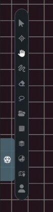

Maps disables keyboard shortcuts while a text field is focused, so typing in a note, search box, or form won't switch tools.

## Tool Selection

| Key | Tool | What It Does |
|-----|------|--------------|
| `V` | Pointer | Select and move assets |
| `Z` | Resize | Resize the selected assets |
| `R` | Rotate | Rotate the selected assets |
| `B` | Brush | Draw lines and markers |
| `E` | Eraser | Remove drawings |
| `H` | Hand | Pan the map |
| `L` | Lasso | Select several assets with a freeform area |
| `W` | Walls | Open the GM wall tool while dynamic lighting is enabled |
| `N` | Notes | Place a sticky note |
| `P` | Ping | Ping the position under your cursor |

## Pings

| Shortcut | What It Does |
|----------|--------------|
| `P` | Ping the current cursor position without changing tools |
| `Alt` + click | Ping a location |
| `Alt` + drag | Draw a temporary tracer path |

You can also select the Ping tool and click the map. The tool returns to Pointer mode after a point ping.

## Camera and Navigation

| Shortcut | What It Does |
|----------|--------------|
| Hold `Space` and drag | Temporarily pan the map |
| Hold middle mouse and drag | Pan without switching tools |
| `Cmd/Ctrl` + `=` | Zoom in |
| `Cmd/Ctrl` + `-` | Zoom out |
| `Cmd/Ctrl` + `0` | Reset zoom to 100% |
| Mouse wheel or trackpad gesture | Pan or zoom based on the input device |

## Copy, Paste, Undo, and Redo

| Shortcut | What It Does |
|----------|--------------|
| `Cmd/Ctrl` + `C` | Copy selected assets |
| `Cmd/Ctrl` + `V` | Paste copied assets |
| `Cmd/Ctrl` + `Z` | Undo |
| `Cmd/Ctrl` + `Shift` + `Z` | Redo |
| `Cmd/Ctrl` + `Y` | Redo on Windows and Linux |

Undo and redo cover common map edits, including movement, drawing, deletion, pasting, fog changes, and wall state changes.

## Asset Manipulation

| Shortcut | What It Does |
|----------|--------------|
| `Shift` + `F` | Flip the selection horizontally |
| `Shift` + `V` | Flip the selection vertically |
| Arrow keys | Move the selection one grid cell |
| `Shift` + arrow keys | Move the selection five grid cells |
| Hold `Shift` while dragging | Snap the selection to the grid |
| Hold `Shift` while resizing | Resize in grid-sized steps |

Grid movement and snapping require an active [grid](/docs/maps/features/grid-system).

## Drawing Modifiers

| Shortcut | What It Does |
|----------|--------------|
| `R` while placing a marker | Rotate the marker 45 degrees clockwise |
| `Shift` + `R` while placing a marker | Rotate the marker 45 degrees counter-clockwise |
| Hold `Shift` while drawing a line | Constrain the line angle |

## Wall Modifiers

| Shortcut | What It Does |
|----------|--------------|
| Hold `Shift` while placing a box | Make it a square |
| Right-click while placing | Finish or cancel the current wall placement |
| Right-click while not placing | Remove the wall under the cursor |

## General

| Shortcut | What It Does |
|----------|--------------|
| `Escape` | Cancel the current action or clear the selection |

When Rotate mode is active, `Escape` returns to the Pointer tool instead of clearing the selection.

On macOS, use `Cmd`. On Windows and Linux, use `Ctrl`.
