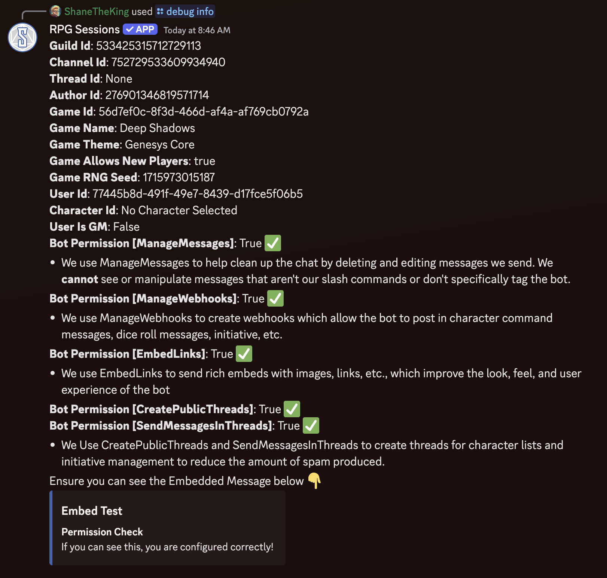

The debug subcommands exist for troubleshooting problems in the Discord Bot. They're not pivotal or super useful for normal gameplay, but are useful while setting up the bot.

### Subcommands

Below is a list of subcommands available under `/debug`:

- **[`/debug info`](#debug-info)**
- **[`/debug disconnect`](#debug-disconnect)**

## `/debug info`

### Overview

The `/debug info` subcommand provides detailed information about the current state of the RPG Sessions bot within the server. This includes information on the current game, user details, bot permissions, and the channel settings. It is a helpful tool for diagnosing any issues with the bot and making sure it has the correct permissions to function properly.

### Information Provided

Upon running `/debug info`, the bot will respond with the following information:

- **Guild ID**: The unique identifier for the server.
- **Channel ID**: The unique identifier for the channel.
- **Thread ID**: If in a thread, the thread ID; otherwise, "None".
- **Author ID**: The unique identifier of the user who issued the command.
- **Game Details**: Including the Game ID, Name, Theme, whether it allows new players, and RNG Seed.
- **User Details**: Including User ID and whether the user is currently set as a Game Master.
- **Character ID**: The ID of the user's currently selected character, if applicable.
- **Bot Permissions**: Information about the bot's permissions in the server. The command will check if the bot has permissions such as:
  - **Manage Messages**: To clean up chat by deleting/editing bot messages.
  - **Manage Webhooks**: To create webhooks for posting in-character messages, dice rolls, etc.
  - **Embed Links**: To send rich embeds that contain images, links, etc.
  - **Create Public Threads** and **Send Messages In Threads**: To manage threads for game activities such as initiative rolls.

It will also do an embed test to make sure the bot can properly embed messages and that you can see them. Many users have embeds disabled without realizing it, so this is useful for troubleshooting some unexpected issues.

### Example Output

Upon execution, you might receive an output like:

### Important Notes

- If you see **False** next to any of the required bot permissions (e.g., Manage Webhooks or Embed Links), make sure the bot has those permissions to function properly.
- The command also provides links to resources for troubleshooting or taking action if something isn’t configured correctly.
  
### Additional Information

- This command is mainly used by server admins and GMs to ensure everything is working correctly.
- Always ensure that you have all required bot permissions enabled to allow for smooth functioning of the RPG Sessions bot.

## `/debug disconnect`

### Overview

The `/debug disconnect` subcommand is used to disconnect your Discord account from your RPG Sessions account. This command requires user confirmation to proceed with the disconnection, ensuring that accidental unlinks do not occur. It helps users who no longer want their Discord linked with RPG Sessions, or have accidentally linked an RPG Sessions account that they lost access to.

### Command Flow

- **Initial Confirmation**: When the command is used, the bot will prompt the user with a confirmation dialog. This dialog will provide two options:
  - **Yes, unlink my account**: Confirms that the user wishes to disconnect their account.
  - **No, keep my account linked**: Cancels the action, maintaining the account link.

- **Unlink Action**: If the user confirms the disconnection, their Discord account will be unlinked from RPG Sessions, and a success message will be displayed.

### Example Usage

- `/debug disconnect` - This command will trigger the unlink process, asking for user confirmation before proceeding.

### Important Notes

- **Confirmation Required**: To prevent accidental disconnections, the bot requires user confirmation before unlinking.
- **Re-linking**: Once the account is unlinked, users can still re-link their Discord account to RPG Sessions if needed, though it may be slightly inconvenient.
