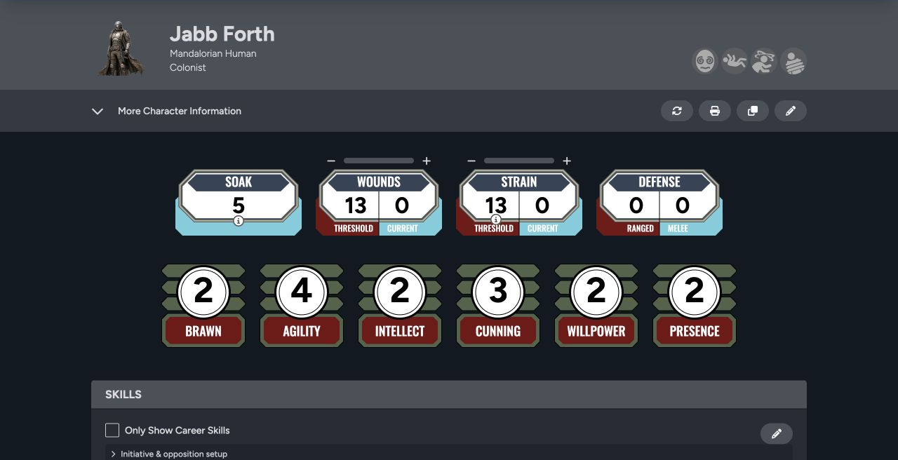

Your character sheet keeps check values, resources, equipment, injuries, progression, and notes together. Player characters and adversaries share the same basic layout, while the game theme and character type decide which fields you see.

## Sheet header

The top of the sheet shows the portrait, name, descriptive details, and system markers. Depending on your access, the action buttons let you update, print, clone, or edit the sheet.

Open **More Character Information** for identity, background, motivation, and the other descriptive fields supported by the theme.

## Core play values

- **Soak, wounds, and strain** track durability and current damage.
- **Defense** separates melee and ranged defense where the system uses both.
- **Characteristics** set the base values for skill checks.
- **Skills** show ranks, career status, and the linked characteristic.

Select a skill to begin a roll from the sheet. See [Characteristics and Rolls](/docs/rpg-sessions/characters/rolls-and-characteristics).

## Equipment and progression

Farther down the sheet you can manage weapons, armor, gear, attachments, encumbrance, critical injuries, talents, XP, credits, notes, and system-specific narrative mechanics. The exact set depends on the game theme and the optional mechanics selected when the character was created.

[Health, Equipment, and Progression](/docs/rpg-sessions/characters/health-equipment-and-progression) explains how these sections work together.

## Player characters and adversaries

The character type is chosen during creation:

- **Player** is the full player-character workflow.
- **Minion** supports grouped adversaries.
- **Rival** represents a capable adversary without the full player-character structure.
- **Nemesis** supports major adversaries with the broadest adversary tracking.

Use the type that matches the rules your group applies. Character type affects how the actor is presented in the Library, encounters, game table, and Maps.

## Connected surfaces

The same sheet can appear in your Library, one or more games, the Game Table, and Sessions Maps. When you update wounds, strain, the name, the portrait, or another shared value, every one of those views reads the change from the same source sheet.

To create or import a character, start in the [Library](/docs/rpg-sessions/library).
