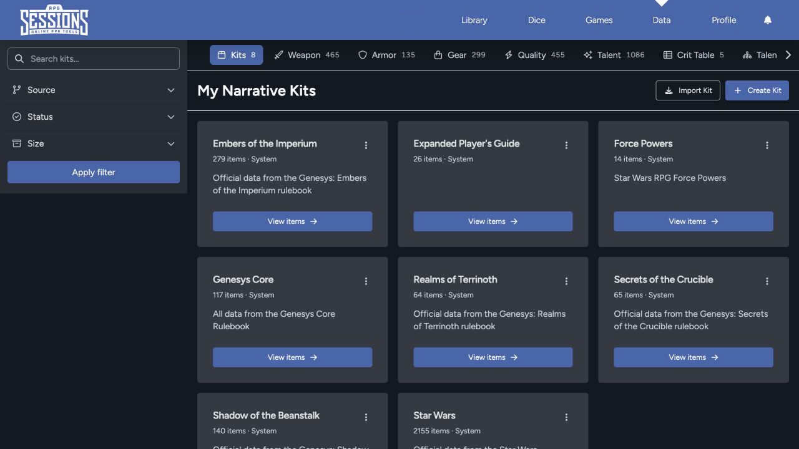

Use the Data Library for game content you want to reuse. Instead of rebuilding the same weapon, talent, or critical table on every sheet, find it once and add it where you need it.

## Browse by category

The category tabs include:

- Kits
- Weapons
- Armor
- Gear
- Qualities
- Talents
- Critical tables
- Talent trees
- Attachments
- Spells
- Vehicle actions
- Encounters
- Maps

Use the horizontal category bar to reach items that are off screen.

## Search and filter

Search within the current category, then narrow the results by source, status, size, or the other filters available for that item type. Choose the values and select **Apply filter**.

The result count beside a category helps confirm whether a filter is active. Clear filters when an expected item doesn't appear.

## Understand sources and status

Data can come from system collections, other users, imports, or your own entries. Check the source and status before you add anything to a sheet. Two entries with similar names can still come from different rulebooks, settings, or homebrew versions.

## Kits

A kit groups many data items into one collection. It's useful for a rulebook, setting, campaign pack, or curated character loadout.

[Kits and Sheet Items](/docs/rpg-sessions/data-library/kits-and-items) explains how to inspect a kit and use its entries.

## Data and Library are different

The Data Library holds reusable building blocks. Your [Library](/docs/rpg-sessions/library) holds complete character, adversary, and vehicle sheets. Encounters and Maps can live in Data too, but you'll still use them from a game when play begins.

Creation, sharing, import, and export controls depend on the item type, your role, ownership, and current feature access. See [Create, Share, and Import Data](/docs/rpg-sessions/data-library/create-share-and-import) for the safe workflow.
