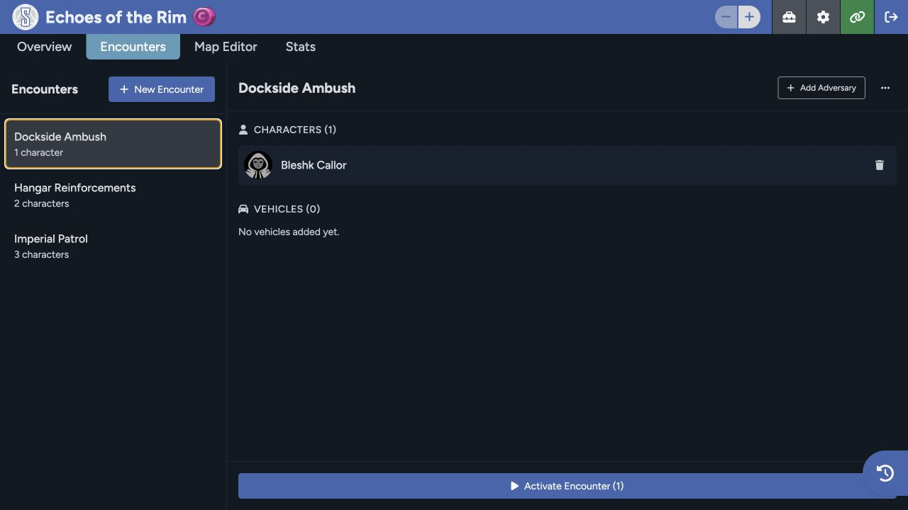

Use encounters to prepare groups of adversaries and vehicles before you need them. Use statistics when you want a separate view of the player rolls recorded for the game.

## Create an encounter

1. Open the Game Table and select **Encounters**.
2. Select **New Encounter**.
3. Give the encounter a recognizable name.
4. Add the adversaries needed for the scene.
5. Add vehicles when the scene uses them.
6. Save and reselect the encounter to confirm its roster.

Names such as a location, faction, or scene purpose are easier to scan than a generic numbered encounter.

## Review encounter details

Select an encounter from the left list. The detail area separates its characters and vehicles, shows the current members, and lets you add or remove them.

The encounter stores a prepared roster. It doesn't replace the source adversary or vehicle sheets in the Library.

## Activate an encounter

1. Select the encounter.
2. Review the characters and vehicles shown in its details.
3. Choose **Activate Encounter**.
4. Return to **Overview** and confirm the expected actors are in the active roster.
5. Open chat and initiative if the scene begins structured play.

The encounter panel changing doesn't prove the activation worked. Open **Overview** and check the roster.

## Edit or remove an encounter

Use the encounter overflow menu for the available management actions. Removing an actor from an encounter doesn't delete its source sheet. Deleting an encounter removes the prepared group, so make sure it isn't still needed for a later session.

## Statistics

Open **Stats** to review the player rolls recorded for the game. The page may be empty until players make their first recorded rolls.

Statistics give you the summary. When you need one result or the context around it, search the detailed entries in chat history.

Sessions Maps also has encounter tools for placing and activating actors on a map. See [Encounters in Maps](/docs/maps/features/encounters) when your table uses the Map Editor.
