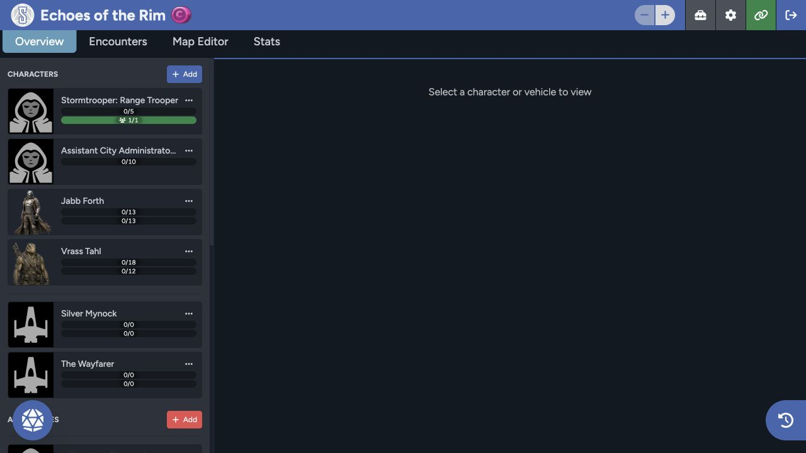

Use the Game Table as your shared workspace during a session. It brings the actor roster, sheets, dice, story points, chat, initiative, encounters, statistics, and Map Editor together.

## Header controls

The header shows the game name, shared point pool, and the controls available to your role. GMs can open their tools and settings from here. Use the link control for invitations, or the exit control to return to **Games**.

## Overview

**Overview** is where you'll spend most of the session. The left side groups characters, vehicles, and adversaries. Select an actor to open its sheet in the center, or scan the roster for its wounds, strain, hull trauma, and system strain.

Use [Roster, Dice, and Story Points](/docs/rpg-sessions/game-table/roster-dice-and-story-points) for the shared play controls.

## Encounters

Use **Encounters** to prepare groups of adversaries and vehicles. Review the members before you activate the encounter and bring those actors into play.

[Encounters and Statistics](/docs/rpg-sessions/game-table/encounters-and-statistics) covers preparation and activation.

## Map Editor

**Map Editor** opens Sessions Maps inside the Game Table. When your table has access, you'll find maps, tokens, sheets, fog, lighting, walls, range bands, initiative, loot, and the other map tools there.

See the [Sessions Maps documentation](/docs/maps) for the complete workflow.

## Stats

The **Stats** tab summarizes player roll activity recorded for the game. A new or quiet table may show that no player rolls are available yet.

## Chat and initiative

Use the round chat button in the lower corner to open the combined initiative and history panel. It stays available across the table tabs.

[Initiative and Chat](/docs/rpg-sessions/game-table/initiative-and-chat) explains messages, channels, privacy, attachments, and initiative slots.

Players and GMs don't see all of the same controls. If something is missing, check [Roles and Visibility](/docs/rpg-sessions/reference/roles-and-visibility) before assuming the table is broken.
