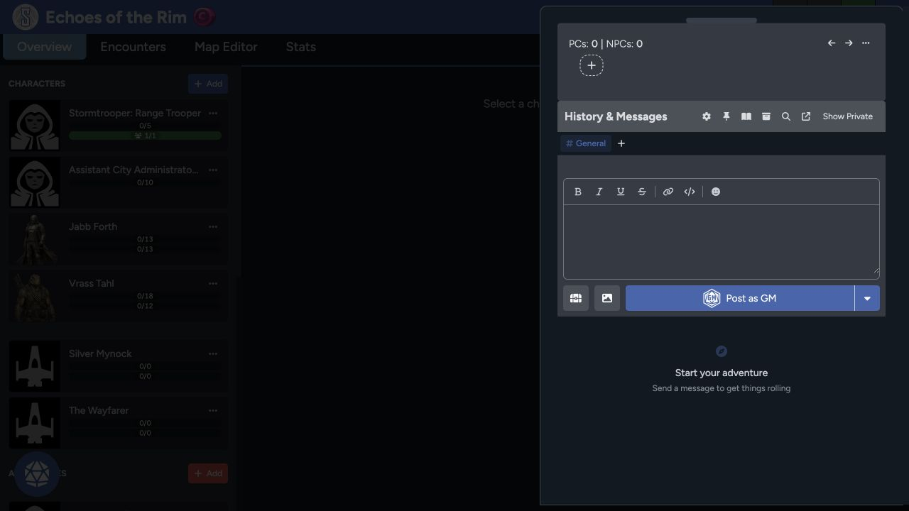

Open the chat drawer with the round button in the lower corner of the Game Table. It keeps structured initiative beside the game's messages and roll history.

## Initiative area

The top area tracks PC and NPC initiative slots. Use the plus control to add or manage them, then assign the right actor as each turn is taken.

Initiative is a shared game resource. GMs can adjust it when an actor joins late, a rule changes the order, or a slot was entered incorrectly.

Roll initiative from the acting character's appropriate skill, then use the calculated result to create or order the slot according to your game rules.

## History and messages

The lower panel keeps table messages, dice rolls, and supported game events. Use the editor to write a message, apply basic formatting, add a link or code text, and include an emoji.

Use the posting control to choose the identity or destination. GMs can choose **Post as GM** when they don't want to post as a character.

## Channels and privacy

Use channels when the table needs to separate a conversation from **General**. **Show Private** reveals content your account can see without making it public to everyone else.

Private visibility depends on the author, recipients, and GM permissions. Don't treat a private message as a secure place for credentials or other secrets.

## Find and organize history

The toolbar can provide:

- **Settings** for chat preferences.
- **Pinned content** for important messages.
- **Chapters** for organizing a long history.
- **Search** for finding text or rolls.
- **Pop out** for opening chat separately.
- **Private-content visibility** for authorized messages.

Use chapters and pins before the history becomes difficult to scan.

## Images and table drops

The attachment controls can add an image or create a table drop. Confirm that an uploaded image is appropriate for everyone who can view the channel.

If a roll or message doesn't appear, check the selected channel, privacy state, and search filters before posting it again. Follow the [Game Table troubleshooting steps](/docs/rpg-sessions/troubleshooting#game-table-chat-and-initiative) if it's still missing.
