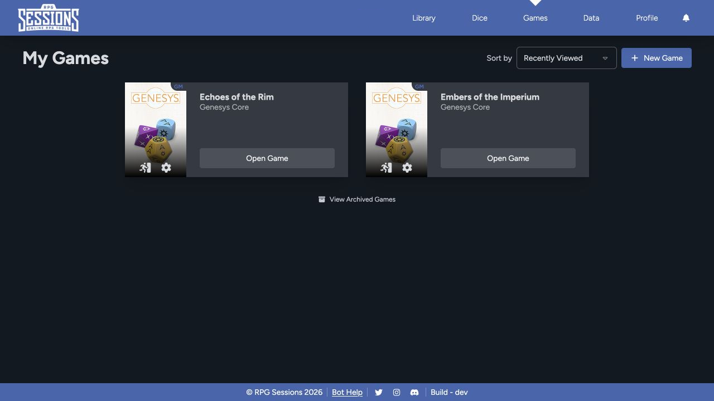

Use **Games** to find every table you've created or joined. Each card opens its Game Table and shows the actions available to your role.

## Find and open a game

Use the **Sort by** control to change the order of the list. Select **Open Game** on a card to enter the Game Table.

The game card can also show controls for settings or leaving, depending on whether you're a GM or member. The exact icons and actions follow your role in that game.

## Create a game

Select **New Game** to enter a name and choose the game and dice themes. Continue with [Creating a Game](/docs/rpg-sessions/guides/creating-a-game) for settings and invitations.

## Active and archived games

The main Games page only shows active games. As a GM, archive a game when you want it out of that list without deleting it. Open the archived-games view when you need to find or restore it later.

Archiving is different from deleting. Archive a completed or paused campaign when you may need its roster, messages, encounters, or settings again.

## Leave a game

Use the leave control on the game card when you want to leave a table. Read the confirmation first. Leaving removes your membership and table access, but it doesn't delete the sheets you own in the Library.

If you're the only GM, assign another GM before leaving or changing access. See [Members and Game Masters](/docs/rpg-sessions/games/manage-membership).

## Settings and joining

Game settings control the name, image, themes, GMs, joining, Drop-In Mode, story points, critical tables, seed, archive state, history maintenance, and table-token assignment.

[Settings, Joining, and Drop-In Mode](/docs/rpg-sessions/games/join-settings-and-drop-in) explains the current flow.
