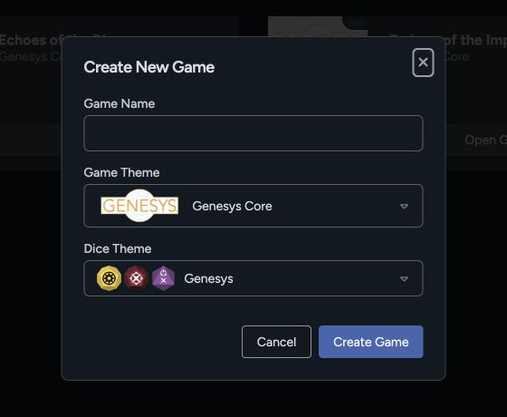

A game gives your group one roster, Game Table, chat history, initiative tracker, encounter list, and set of table settings. The same setup works for a long campaign or a one-shot.

## Create the game

1. Open **Games** from the top navigation.
2. Select **New Game**.
3. Enter a **Game Name**.
4. Choose a **Game Theme**. The theme controls the system presentation and available sheet conventions.
5. Choose a **Dice Theme**.
6. Select **Create Game**.

The creation dialog only asks for these three values. Once the game exists, use its settings to add the cover image, joining rules, game masters, critical tables, story-point style, and other options.

## Configure the table

Open the game's **Settings** control. Review these areas before sharing the game:

- **Game Masters:** Add another GM if someone else needs full table controls.
- **Appearance:** Update the game name, image, game theme, and dice theme.
- **Rules:** Configure Force dice, player and GM point styles, and the character and vehicle critical tables used by the game.
- **Joining:** Turn **Allow New Players** on when you're ready to invite the group.
- **Drop-In Mode:** Use a shared table experience with an optional password when that better fits the session.
- **Game seed:** Review the setting if your group uses seeded game data.

Settings vary with the game theme and the table's access. If you don't see an option from this guide, check your role and the table's current access.

## Invite players

1. Make sure **Allow New Players** is enabled.
2. Copy the game link using the link control in the game header.
3. Send that link to the players.
4. Ask each player to open it while signed in and choose **Join Game**.

Players join through the game link. They don't need a separate game code.

## Prepare the roster

From the **Overview** tab, add the characters and vehicles that should be available at the table. You can also prepare adversaries and group them into [encounters](/docs/rpg-sessions/game-table/encounters-and-statistics) before play.

## Next steps

- [Manage game masters and membership](/docs/rpg-sessions/games/manage-membership)
- [Review joining, settings, and Drop-In Mode](/docs/rpg-sessions/games/join-settings-and-drop-in)
- [Run your first session](/docs/rpg-sessions/guides/your-first-session)
