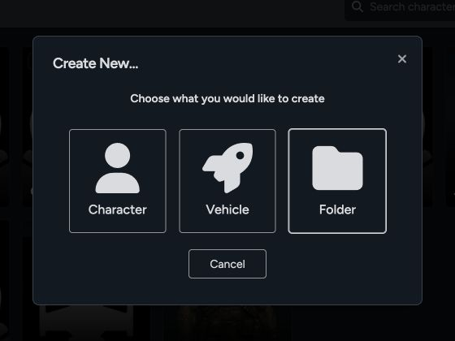
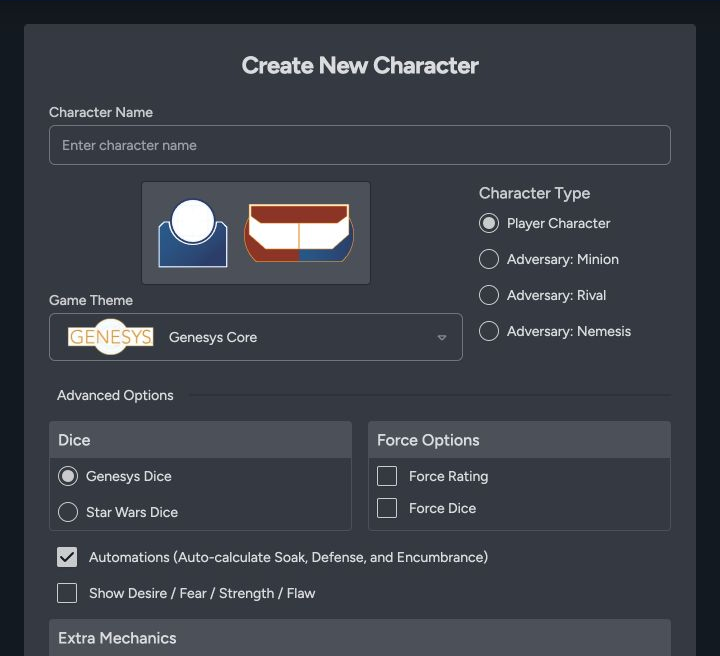
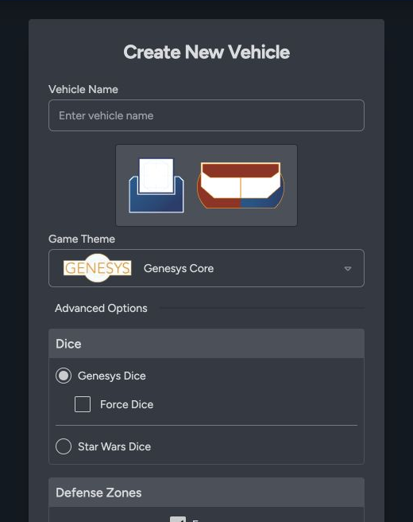

Use **Create New** in the Library when you want to build an actor or vehicle from scratch. You can add the finished sheet to a game later.

## Choose what to create

1. Open **Library**.
2. Select **Create New**.
3. Choose **Character**, **Vehicle**, or **Folder**.

## Create a player character or adversary

Choose **Character** for both player characters and adversaries.

1. Enter the character name.
2. Choose the game theme.
3. Choose the character type: **Player**, **Minion**, **Rival**, or **Nemesis**.
4. Choose the dice style used by the sheet.
5. Configure Force options and optional mechanics when they apply to the theme.
6. Review the available automation settings.
7. Create the character, then fill in characteristics, skills, equipment, talents, narrative mechanics, and notes.

Choose **Player** for a player sheet. Choose **Minion**, **Rival**, or **Nemesis** for an adversary. The type changes how the sheet handles adversary rules and how that actor works at the Game Table.

## Create a vehicle

1. Choose **Vehicle** from the New dialog.
2. Enter the vehicle name.
3. Choose the game theme and dice style.
4. Configure Force dice and defense-zone options when they apply.
5. Create the vehicle, then add stats, damage thresholds, weapons, cargo, crew, attachments, vehicle actions, and deck plans.

## What to do after creation

- Open the edit control on the sheet to fill in its core values.
- Add reusable equipment or talents from the [Data Library](/docs/rpg-sessions/data-library/kits-and-items).
- Add the sheet to a game when it's ready for play.
- Use the clone control when a similar actor or vehicle is faster to build from an existing sheet.

If you've already built the sheet somewhere else, check [Import Sheets](/docs/rpg-sessions/library/imports) before entering it by hand.
