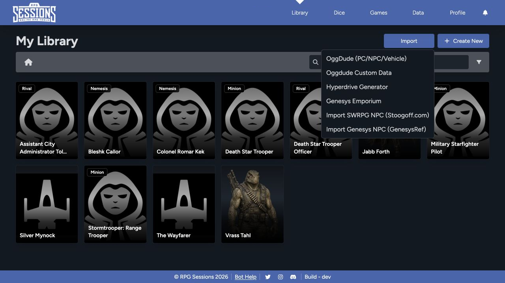

If you've already built a character, adversary, or vehicle in another supported tool, import it instead of rebuilding it by hand. Start with the tool that created your file or link.

## Choose the matching importer

- **OggDude (PC/NPC/Vehicle):** Import a supported player character, adversary, or vehicle exported by OggDude's generator.
- **OggDude Custom Data:** Bring supported custom data into RPG Sessions.
- **Hyperdrive Generator:** Import content produced by the Hyperdrive Generator workflow.
- **Genesys Emporium:** Import supported Genesys Emporium content.
- **Import SWRPG NPC:** Import an NPC from Stoogoff.com.
- **Import Genesys NPC:** Import an NPC from GenesysRef.

Pick the importer that matches both the source and the sheet type. A player-character export won't work in the NPC importer, and a vehicle won't work in the character importer.

## Import a file or record

1. Open **Library**.
2. Select **Import**.
3. Choose the importer that matches the source.
4. Follow the prompt to provide the exported file, text, or source reference requested by that importer.
5. Review any warnings before confirming.
6. Open the imported sheet and compare its main values with the source.

## Verify the result

Check more than the name and portrait. For characters, review characteristics, skills, wounds, strain, talents, weapons, armor, gear, XP, credits, narrative mechanics, and notes. For vehicles, review silhouette, speed, handling, defense, armor, hull trauma, system strain, weapons, attachments, cargo, and crew-related fields.

Some source-specific data doesn't have a matching RPG Sessions field. If the importer skips something important, record it in the sheet's notes.

## Troubleshooting imports

- Export a fresh copy from the source tool and try once more.
- Confirm that you chose the correct source and content type.
- If a custom-data dependency is missing, import that data before importing the sheet that uses it.
- Keep the original export until you've checked the imported sheet.

See [Import Troubleshooting](/docs/rpg-sessions/troubleshooting#imports) if the import fails or the result is incomplete.
