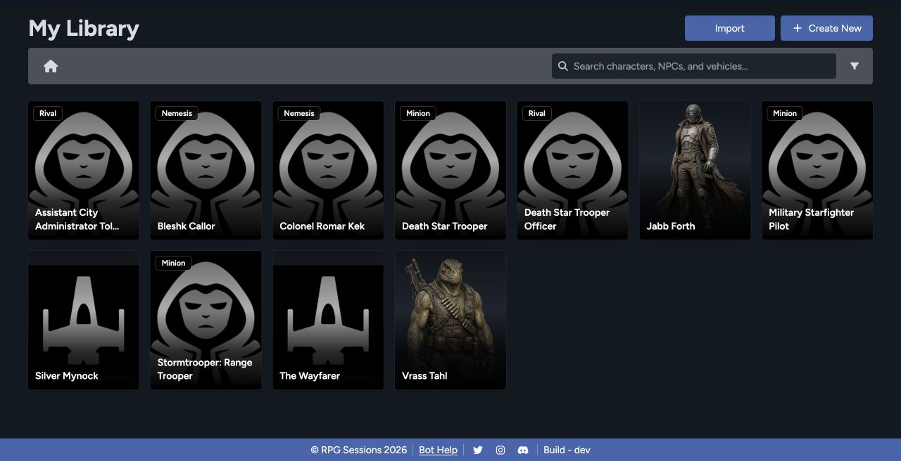

Use the Library to manage your player characters, adversaries, vehicles, and folders. Your sheets live outside any one game, so you can prepare them first and add them to a table when you're ready.

## Find a sheet

Search by any part of a sheet name. If your Library is getting crowded, narrow it by sheet type or game theme. The folder list and current path show you where you're browsing.

The Library can contain:

- **Player characters** for people at the table.
- **Adversaries** built as minions, rivals, or nemeses.
- **Vehicles** for ships, speeders, walkers, and other craft.
- **Folders** for organizing a campaign, setting, group, or archive.

## Create new content

Select **Create New**, then choose **Character**, **Vehicle**, or **Folder**. Character creation covers both player characters and adversaries, based on the character type you choose.

[Create a sheet](/docs/rpg-sessions/library/create-sheets)

## Import existing content

Select **Import** to see the supported character, NPC, vehicle, and custom-data importers. Choose the importer that matches both the exporting tool and your file type.

[Import sheets](/docs/rpg-sessions/library/imports)

## Use sheets in games

A sheet doesn't need to belong to a game. When you're ready to play, add it to that game's roster. It stays in your Library, and your edits carry through to the Game Table.

You can also open a sheet directly from the Library to edit, clone, update, or print it. The controls shown depend on your permissions for that sheet.

## Library and Data are different

Use **Library** for complete actors and vehicles. Use the [Data Library](/docs/rpg-sessions/data-library) for reusable items such as weapons, armor, gear, talents, qualities, critical tables, and kits.

See [Manage Sheets](/docs/rpg-sessions/library/manage-sheets) for folders, duplication, printing, game membership, and deletion guidance.
