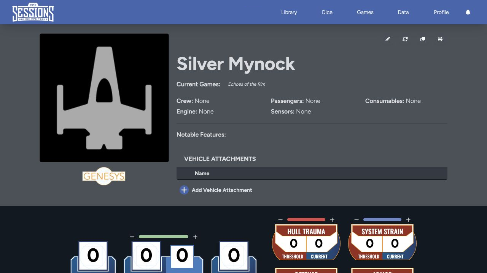

Use a vehicle sheet to track both the craft's rules and the places where its crew can act. It covers movement, defenses, damage, weapons, cargo, crew, attachments, actions, and optional deck plans.

## Header and identity

The header shows the vehicle image, name, current games, crew, passengers, consumables, engine, sensors, and notable features. If you have the right access, you can also edit, update, clone, or print the sheet from here.

Vehicle attachments appear below the overview. Use them for installed upgrades or modifications associated with the craft.

## Vehicle statistics

The main statistics area gives you silhouette, speed, handling, armor, defense zones, hull-trauma threshold, and system-strain threshold. The defense layout follows the options chosen when the sheet was created.

[Operate and Repair](/docs/rpg-sessions/vehicles/operate-and-repair) covers movement, checks, damage, and critical hits.

## Equipment and internal spaces

Farther down the sheet you can manage:

- Vehicle actions and checks.
- Mounted weapons and their qualities.
- Customizations and available hard points.
- Cargo and encumbrance.
- Crew and passengers in games that use the vehicle.
- Deck plans and named deck areas.
- Notes and descriptive details.

[Crew, Weapons, and Deck Plans](/docs/rpg-sessions/vehicles/crew-weapons-and-deck-plans) explains these connected workflows.

## Vehicles in games

The vehicle stays in its owner's Library, even when it belongs to one or more games. Crew assignments belong to a specific game, while the vehicle's stats stay on the source sheet.

When the vehicle is at a Game Table, its hull trauma and system strain appear in the roster. Maps can also use the vehicle, its token, and its deck plans when those tools are available to the table.

Create a vehicle from [Library > Create New](/docs/rpg-sessions/library/create-sheets), or choose the matching [vehicle importer](/docs/rpg-sessions/library/imports) for an existing export.
